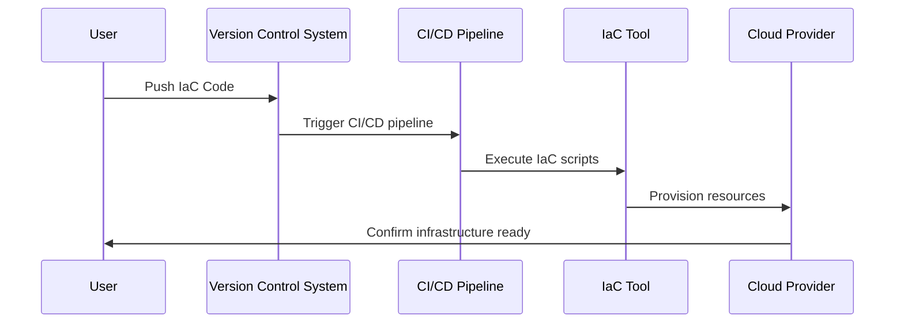
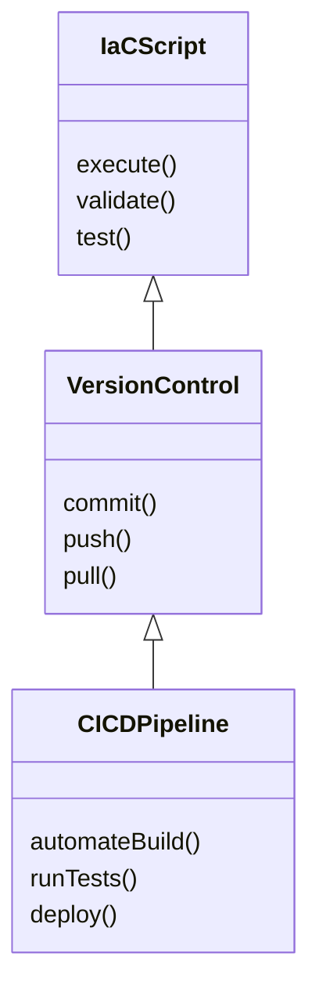

---

linkTitle: "Infrastructure as Code for Recovery"
title: "Infrastructure as Code for Recovery: Reprovisioning Infrastructure Quickly from Code"
category: "Resiliency and Fault Tolerance in Cloud"
series: "Cloud Computing: Essential Patterns & Practices"
description: "Explore the Infrastructure as Code for Recovery pattern that facilitates quick reprovisioning of cloud infrastructure using code-based automation to enhance resiliency and fault tolerance."
categories:
- Resiliency
- Fault Tolerance
- Cloud Computing
tags:
- Infrastructure as Code
- Resiliency
- Disaster Recovery
- Cloud Automation
- Fault Tolerance
date: 2024-07-07
type: docs

canonical: "https://softwarepatternslexicon.com/18/21/30"
license: "© 2024 Tokenizer Inc. CC BY-NC-SA 4.0"
---

## Introduction

In the dynamic environment of cloud computing, ensuring that infrastructure can be reprovisioned quickly and accurately is crucial for maintaining availability and resiliency. The Infrastructure as Code for Recovery pattern leverages Infrastructure as Code (IaC) principles to automate the provisioning and deployment process, enabling efficient disaster recovery and fault tolerance.

By maintaining infrastructure configurations as code, organizations can quickly recreate their environments in response to outages or failures without manual interventions, reducing downtime and improving resilience.

## Detailed Explanation

### Design Pattern Overview

Infrastructure as Code for Recovery involves scripting the entire infrastructure configuration using code languages and frameworks. This pattern realizes the potential for automated recovery by allowing cloud resources to be described declaratively. By doing so, organizations can recreate environments quickly in the event of a failure, ensuring business continuity and minimizing recovery times.

### Architectural Approach

This pattern follows a declarative approach where the desired state of infrastructure is described using code. It typically employs infrastructure provisioning tools like Terraform, AWS CloudFormation, Azure Resource Manager, or Google Cloud Deployment Manager to automatically handle resource management.

#### Key Components

1. **Version-controlled Codebase**:
   - Store IaC scripts in version control systems (like Git) for transparency and traceability of infrastructure changes.
   
2. **Scalable Provisioning Scripts**:
   - Use modular and reusable code to define resources, allowing scalability in infrastructure management.

3. **Automated Pipelines**:
   - Integrate IaC with CI/CD pipelines to automate the deployment process and reduce manual errors.

4. **Environment Consistency**:
   - Ensure identical infrastructure environments across development, testing, and production to facilitate seamless recoveries.

### Best Practices

- **Maintain Code Hygiene**: Regularly update and test IaC scripts to ensure they reflect the latest infrastructure requirements.
- **Automate Testing**: Implement automated tests for infrastructure configurations to validate and ensure correctness before deployment.
- **Secure Secrets Management**: Utilize secret management tools to keep sensitive information encrypted and secure within IaC scripts.
- **Regular Backups**: Back up state files and configurations to prevent data loss during recovery.
- **Documentation & Training**: Document procedures and provide training to teams to efficiently use IaC tools and scripts.

## Example Code

Below is a sample Terraform script to provision an AWS S3 bucket:

```hcl
provider "aws" {
  region = "us-west-2"
}

resource "aws_s3_bucket" "recovery_bucket" {
  bucket = "my-recovery-bucket"

  versioning {
    enabled = true
  }

  tags = {
    Name        = "RecoveryBucket"
    Environment = "Production"
  }
}
```

## Diagrams

### Sequence Diagram

Here is a sequence diagram illustrating the process of infrastructure reprovisioning using IaC:



### Class Diagram



## Related Patterns

- **Immutable Infrastructure**: Ensures infrastructure components are replaced rather than modified for updates, complementing the IaC recovery process.
- **Disaster Recovery as a Service (DRaaS)**: Provides comprehensive recovery processes from failures to mitigate risks.
- **Auto-scaling**: Works alongside IaC to adjust resources dynamically, managing loads efficiently during recovery operations.

## Additional Resources

- [Terraform by HashiCorp](https://www.terraform.io/)
- [AWS CloudFormation Documentation](https://aws.amazon.com/cloudformation/)
- [Azure Resource Manager Templates](https://docs.microsoft.com/en-us/azure/azure-resource-manager/templates/overview)
- [Google Cloud Deployment Manager](https://cloud.google.com/deployment-manager)

## Summary

The Infrastructure as Code for Recovery pattern is a vital strategy in cloud architecture to achieve resilient system designs capable of quick recovery from failures. By scripting infrastructure setups and automating their deployment, organizations can significantly reduce downtime and support high availability in their operations. Leveraging IaC tools not only simplifies infrastructure management but also ensures consistent and secure deployment practices.

Understanding and adopting this pattern prepares cloud architects and administrators to handle disaster recovery adeptly, facilitating a robust and dependable cloud environment.
