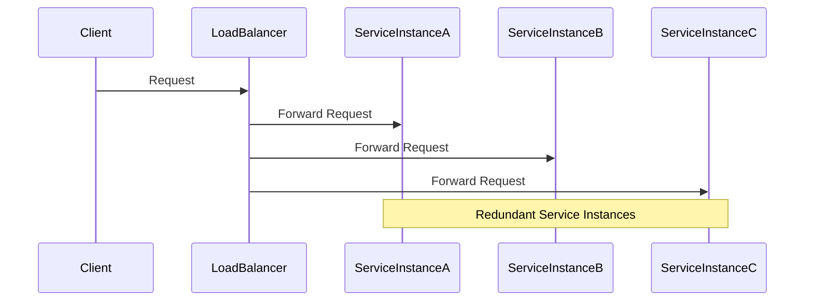

Microservices Redundancy is a crucial design pattern in cloud computing that emphasizes the replication of microservices instances. This pattern enhances the resiliency and fault tolerance of a system by ensuring that failures in individual service instances do not compromise the entire application.

## Detailed Explanation

### Architectural Overview

In a microservices architecture, each service can be independently deployed and scaled. This flexibility allows developers to focus on replication strategies that improve service availability and fault tolerance. The redundancy pattern generally involves deploying multiple instances of microservices across various nodes or regions within a cloud environment.

### Key Components

- **Service Instance Replication**: Creating multiple instances of each microservice ensures that if one instance fails, others can continue to provide the needed functionality.
  
- **Load Balancers**: Directs traffic among service instances, ensuring that requests are distributed optimally across all available instances.

- **Health Checks**: Continuously monitor the status of each microservice instance to detect and route around failures proactively.

- **Auto-scaling**: Cloud-native feature that dynamically adjusts the number of service instances based on current load and resource usage.

### Best Practices

- **Design for Failure**: Assume that individual components will fail and design the system to handle such failures gracefully.
  
- **Stateless Services**: Ensure that microservices are stateless, or that state is easily recoverable, to facilitate seamless failover between redundant instances.

- **Distributed Configuration**: Use a distributed configuration management system to ensure all instances share the same configuration and consistent access to dependencies.

- **Observability and Monitoring**: Implement comprehensive monitoring and logging to quickly identify and respond to service disruptions.

### Example Code

Here's a simple example using Kubernetes to deploy a microservice with redundancy:

```yaml
apiVersion: apps/v1
kind: Deployment
metadata:
  name: my-microservice
spec:
  replicas: 3
  selector:
    matchLabels:
      app: my-microservice
  template:
    metadata:
      labels:
        app: my-microservice
    spec:
      containers:
        - name: my-microservice-container
          image: my-microservice-image:latest
```

### Diagrams



### Related Patterns

- **Service Discovery**: Essential for locating and routing to available service instances, particularly in dynamic environments.
  
- **Circuit Breaker**: Protects services from cascading failures by temporarily blocking calls to failing services.

- **Bulkhead Isolation**: Limits the spread of failure by partitioning service resources.

### Additional Resources

- [Google Cloud Service Reliability](https://cloud.google.com/architecture/application-layer-stability)
- [AWS Well-Architected Framework - Reliability Pillar](https://docs.aws.amazon.com/wellarchitected/latest/reliability-pillar/welcome.html)
- [Azure Resiliency Patterns](https://docs.microsoft.com/en-us/azure/architecture/patterns/category/resiliency)

## Summary

Microservices Redundancy reinforces system resilience by replicating service instances, thus safeguarding against single points of failure. By leveraging cloud-native tools for load balancing, auto-scaling, and health monitoring, organizations can build robust systems that maintain high availability even in the face of individual instance failures. This pattern aligns with best practices for designing fail-proof cloud architectures and ensures an optimal user experience despite backend disruptions.
