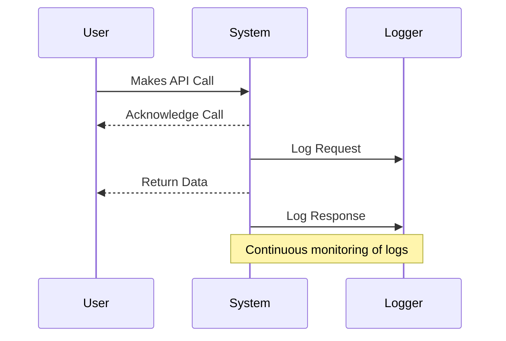

## Overview

Continuous Resilience Improvement (CRI) is an ongoing practice designed to enhance the fault tolerance capabilities of cloud-based systems. By adopting an iterative approach, organizations can incrementally improve their system's ability to withstand faults and minimize downtime. This pattern is particularly crucial in environments that demand high availability, reliability, and quick recovery times.

## Design Pattern Explanation

### Architectural Approach

At the core of CRI is the proactive identification and mitigation of potential failure points within your system. The architectural approach involves several key components:

- **Monitoring and Logging:** Continuously observe system performance and capture logs to understand the system's behavior under different loads and conditions.
  
- **Controlled Testing and Chaos Engineering:** Intentionally introduce failures in a controlled manner to test the resilience of your system. Chaos Engineering tools such as Gremlin or Chaos Monkey can be utilized to simulate unexpected outages or degrade services to observe how systems respond.

- **Automated Recovery Mechanisms:** Implement automated routines for detecting failures and initiating recovery processes without human intervention. Techniques such as circuit breakers, retries, and fallbacks are often used.

- **Incremental Improvement:** Regularly review and analyze data from tests and real outages to identify areas for improvement. These insights are used to tweak or overhaul existing processes and strategies.

### Key Paradigms and Best Practices

- **Iterative Feedback Loops:** Use feedback loops from monitoring and testing to continuously refine the resilience strategies. Include post-incident reviews to gather insights into system weaknesses.
  
- **Redundancy and Replication:** Deploy redundant resources and replicate data across multiple zones and regions to prevent data loss and service unavailability during outages.

- **Scalability Considerations:** Design systems that can gracefully scale up or down in response to changing demands, thereby maintaining performance without compromising on resilience. 

- **Cloud Provider Features:** Leverage built-in features and services from cloud providers like AWS Availability Zones, GCP’s Live Migration, or Azure Site Recovery to bolster resiliency.

## Example Code

Here is a conceptual example using a circuit breaker pattern in a microservices architecture with Kotlin and Resilience4j:

```kotlin
import io.github.resilience4j.circuitbreaker.CircuitBreaker
import io.github.resilience4j.circuitbreaker.CircuitBreakerConfig
import io.github.resilience4j.circuitbreaker.CircuitBreakerRegistry
import java.time.Duration

fun main() {
    // Create a CircuitBreakerConfig
    val circuitBreakerConfig = CircuitBreakerConfig.custom()
        .failureRateThreshold(50f)
        .waitDurationInOpenState(Duration.ofSeconds(30))
        .permittedNumberOfCallsInHalfOpenState(3)
        .minimumNumberOfCalls(5)
        .build()

    // Create a CircuitBreakerRegistry with the custom global configuration
    val circuitBreakerRegistry = CircuitBreakerRegistry.of(circuitBreakerConfig)

    // Get or create a CircuitBreaker from the CircuitBreakerRegistry
    val circuitBreaker = circuitBreakerRegistry.circuitBreaker("myService")

    // Decorate your call to include circuit breaker logic
    val decoratedSupplier = CircuitBreaker.decorateSupplier(circuitBreaker) {
        // Your function call goes here
        fetchDataFromRemoteService()
    }

    // Use the decorated supplier
    try {
        val result = decoratedSupplier.get()
        println("Service call succeeded with result: $result")
    } catch (ex: Exception) {
        println("Service call failed due to: ${ex.message}")
    }
}

fun fetchDataFromRemoteService(): String {
    // Simulate method that might fail
    return "Data from service"
}
```

## Diagrams



## Related Patterns

- **Circuit Breaker:** Prevents system overload by restricting access to a failing service.
  
- **Bulkhead:** Isolates components to prevent system-wide failures.

- **Retry:** Automatically reattempt failed operations to allow transient issues to resolve.

## Additional Resources

- "Chaos Engineering: Building Confidence in System Behavior through Experiments" by Casey Rosenthal and Nora Jones
- AWS Well-Architected Framework - Reliability Pillar
- Google's Site Reliability Engineering practices

## Summary

Continuous Resilience Improvement is about fostering a culture of resilience within cloud-based systems through iterative testing, monitoring, analyzing, and adapting. By incorporating controlled failure simulations and proactive responses, organizations can fortify their systems against inevitable disruptions, ensuring smoother operations and a dependable user experience.
