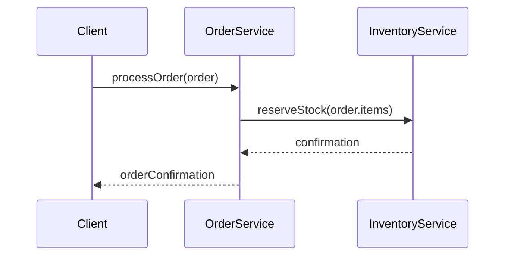

## Introduction

The **Bulkhead Isolation** pattern takes inspiration from the bulkheads used in ships to prevent water from flooding the entire vessel in case of a breach. Similarly, in cloud-based systems, the technique involves dividing a system into isolated partitions to avoid cascading failures. By confining faults to individual components, the overall system resilience is improved, supporting the system's ability to withstand partial failures.

## Design Pattern Detail

### Architectural Approaches

- **Isolated Pools:** Utilize separate thread, connection, and resource pools for different services or functions to prevent a resource-hungry service from depleting resources for other critical services.
- **Service Segmentation:** Partition services into distinct segments or microservices that can operate independently. If one segment fails, others can continue to function normally.
- **Circuit Breakers & Rate Limiters:** Use circuit breakers and rate limiters within each isolated segment to automatically limit failures and calls to degraded services.

### Advantages

- **Improved Stability:** Limits the impact of failures and provides more predictable system behavior.
- **Scalability:** Allows different components to scale independently based on their usage patterns and needs.
- **Cost Efficiency:** By preventing failure propagation, unnecessary expenses for downtime and recovery are minimized.

### Disadvantages

- **Complexity:** Introducing isolation in a system can increase architectural complexity.
- **Resource Underutilization:** Isolated components may lead to resource wastage if segments are not appropriately sized.

## Best Practices

- **Define Clear Boundaries:** Clearly delineate the boundaries of each isolation unit based on functionality and failure domains.
- **Monitor Each Segment:** Continuously monitor the health of each partition and adaptively manage resource allocation.
- **Prioritize Critical Services:** Designate prioritized resources for critical components to ensure important functions remain operational under stress.

## Example Code

### Example Using Kotlin and Spring Boot

```kotlin
@Service
class OrderService {

    @Autowired
    lateinit var inventoryService: InventoryService

    @Bulkhead(name = "inventoryServiceBulkhead", type = Bulkhead.Type.THREADPOOL)
    fun processOrder(order: Order) {
        // Processing order logic
        inventoryService.reserveStock(order.items)
    }
}
```

In this Kotlin example, we use a thread pool bulkhead to isolate the InventoryService call to ensure failures in inventory management don't propagate to the OrderService.

## Diagrams

### UML Sequence Diagram



## Related Patterns

- **Circuit Breaker:** A related pattern that works well with Bulkhead Isolation by providing a fallback strategy for failed services.
- **Retry Pattern:** Used in combination with Bulkhead for handling transient failures, especially within isolated service segments.
- **Timeouts and Caching:** Offers supporting strategies for optimizing isolated service interactions during peak loads.

## Additional Resources

- [The Open Group: Bulkhead Pattern](https://www.opengroup.org/)
- [Microsoft Azure Architecture Center: Bulkhead Pattern](https://docs.microsoft.com/en-us/azure/architecture/patterns/bulkhead)
- [Book: "Release It!" by Michael Nygard](https://pragprog.com/titles/mnee2/release-it/)

## Summary

The Bulkhead Isolation pattern in cloud architecture is essential for building resilient systems capable of withstanding partial failures. By preventing malicious interactions between components and ensuring that the workload of one service doesn't negatively impact the others, Bulkhead Isolation facilitates robust, fault-tolerant, and sustainable systems. It is pivotal to balance complexity with modularity, scalability, and efficiency for optimal system performance.
