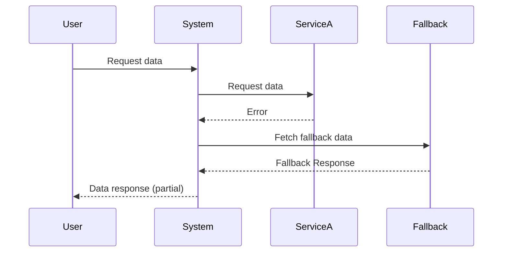

## Introduction

In cloud computing, system failures are an inevitable reality due to the complexity and distribution of components. The **Graceful Degradation** pattern is pivotal in ensuring systems can sustain partial functionality even when some parts of the system fail. This pattern contributes to a better user experience by maintaining essential operations, thereby preventing a total shutdown.

## Detailed Explanation

### Architectural Approach

Graceful Degradation involves the following key strategies:

1. **Redundancy and Failover**: Design systems where multiple instances of a component exist, so if one fails, others can take over.
2. **Service Prioritization**: Implement mechanisms to prioritize and maintain critical functionalities while less critical services are degraded or disabled.
3. **Fallback Mechanisms**: Utilize alternate processes or services when the primary ones fail. This includes cache retrieval, using read replicas, and static data serving.
4. **Dynamic Scaling**: Use cloud resources' elasticity to dynamically scale up resources for critical functions during partial failures.

### Best Practices

- **Modularity**: Build systems with modular components that can be independently managed and fail without affecting the entire system.
- **Circuit Breakers**: Integrate circuit breaker patterns to prevent cascading failures for dependent services.
- **Monitoring and Alerts**: Continuously monitor system performance and set up alerts to manage failures proactively.
- **User-Centric Design**: Inform users of degraded states and offer alternative solutions or systems if necessary.

## Example Code

Here's a Java-based example using Hystrix, a library for latency and fault tolerance in distributed systems to implement a simple circuit breaker:

```java
import com.netflix.hystrix.HystrixCommand;
import com.netflix.hystrix.HystrixCommandGroupKey;

public class ExampleCommand extends HystrixCommand<String> {

    public ExampleCommand() {
        super(HystrixCommandGroupKey.Factory.asKey("ExampleGroup"));
    }

    @Override
    protected String run() {
        // Call to a service that might fail
        return someExternalService();
    }

    @Override
    protected String getFallback() {
        // Fallback logic
        return "Fallback Response";
    }
}
```

## Diagrams

### UML Sequence Diagram

Here is a sequence diagram outlining the process:



## Related Patterns

- **Circuit Breaker**: Prevents catastrophic failure by stopping the flow of requests to a failing service.
- **Bulkhead**: Isolates portions of the system to prevent failures from spreading across units.
- **Failover**: Enables automatic switching to a standby system upon the failure of the primary system.
- **Load Balancer**: Distributes traffic across multiple instances to ensure availability.

## Additional Resources

- [Designing for Resilience in Cloud Applications](https://aws.amazon.com/architecture/resilience-in-cloud-applications/)
- [Microsoft's Cloud Design Patterns](https://docs.microsoft.com/en-us/azure/architecture/patterns/)
- [The Resilience4j Library](https://resilience4j.readme.io/docs)

## Summary

The Graceful Degradation pattern is an essential component of resilient cloud architectures. By focusing on maintaining core functionality despite failures in other areas, systems can continue to provide value to users and prevent complete outages. By applying principles like redundancy, prioritization, and fallback mechanisms, architects can enhance system reliability and user satisfaction.
