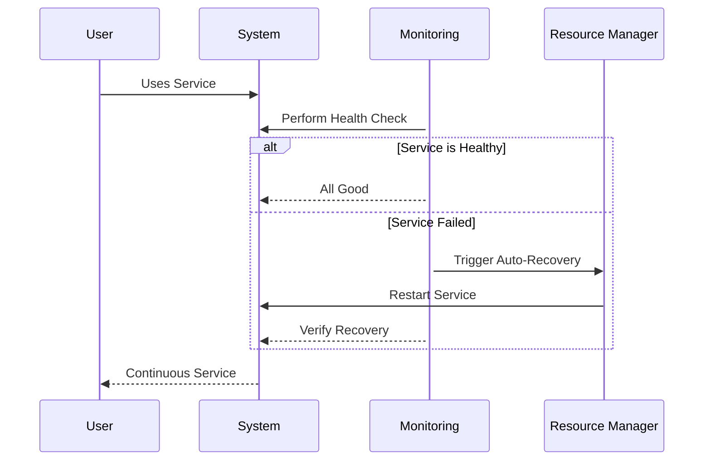

## Introduction

In cloud computing, where infrastructure is inherently distributed and resource availability can be unpredictable, ensuring continuous service availability is paramount. The **Auto-Recovery and Self-Healing** design pattern focuses on creating resilience mechanisms that enable systems to automatically manage failures, restore services, and maintain operational integrity. Implementing this pattern is crucial for organizations aiming for high availability and fault-tolerance in their systems.

## Detailed Explanation

### Key Concepts

- **Auto-Recovery**: The system's ability to automatically regain full functionality after a failure without human intervention. This includes restarting crashed services, reallocating resources, or recovering data from backups.

- **Self-Healing**: The capability of the system to detect and correct faults autonomously. It involves identifying the root cause of a problem, applying corrective actions, and ensuring robustness against similar failures.

### Mechanisms

- **Health Checks**: Regular monitoring of system components to ensure they are operational. Automated health checks can trigger recovery processes when abnormalities are detected.

- **Redundancy and Replication**: Maintaining duplicate copies of critical components or data across different locations to prevent single points of failure.

- **Scaling and Failover Strategies**: Dynamically adjusting resources and rerouting traffic to healthy instances when failures occur.

- **Circuit Breakers**: Preventing cascading failures by stopping calls to a failing service after a predetermined threshold is exceeded.

- **Rollback and Retry Policies**: Automatically reverting to a stable state or retrying failed operations after transient glitches.

### Best Practices

1. **Implement Comprehensive Monitoring**: Use monitoring tools to provide real-time insights into the health and performance of your services.

2. **Design with Redundancy**: Establish redundancy in both infrastructure (e.g., multiple availability zones) and data storage (e.g., distributed databases).

3. **Automate Failure Recovery**: Utilize orchestration tools like Kubernetes to automate the detection and recovery process.

4. **Embed Self-Healing Logic**: Design applications to detect and fix common issues without external intervention. For instance, incorporate logic to re-establish broken connections or restart services.

5. **Conduct Chaos Engineering**: Regularly simulate failures in a controlled environment to test and improve the resilience mechanisms.

### Example Code

Here's an example of an auto-healing Kubernetes pod configuration using liveness probes:

```yaml
apiVersion: v1
kind: Pod
metadata:
  name: myapp-pod
spec:
  containers:
  - name: myapp-container
    image: myapp:latest
    livenessProbe:
      httpGet:
        path: /health
        port: 8080
      initialDelaySeconds: 15
      periodSeconds: 20
```

### Diagrams

#### Sequence Diagram



## Related Patterns

- **Circuit Breaker**: Useful for improving system robustness by handling service failures gracefully.
- **Bulkhead**: Isolating system components to prevent a fault in one component from affecting the whole system.
- **Service Mesh**: Implementing network-based security, load balancing, and resilience at the infrastructure level.

## Additional Resources

- [Google Cloud: Designing Robust Systems](https://cloud.google.com/architecture/designing-robust-systems)
- [AWS Resiliency Patterns](https://aws.amazon.com/architecture/resiliency-well-architected)
- [Chaos Engineering Explained](https://principlesofchaos.org/)

## Summary

The Auto-Recovery and Self-Healing pattern is a fundamental aspect of building resilient cloud applications. By automating recovery processes and implementing self-healing mechanisms, cloud systems can ensure continuous availability and reliability, even in the face of inevitable component failures. Embracing these strategies empowers businesses to deliver seamless user experiences and maintain robust operational capabilities in dynamic cloud environments.
