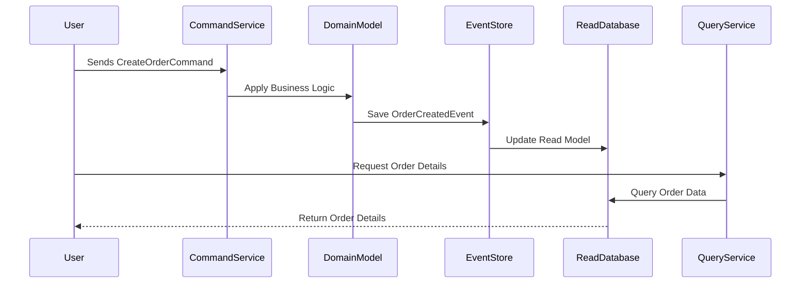

## Overview of CQRS

Command Query Responsibility Segregation (CQRS) is an architectural pattern that separates read and write operations for data, applying different models for updating versus fetching data. CQRS enables a more scalable and performant architecture by allowing these operations to be optimized individually. This pattern is frequently used in distributed systems, microservices, and event-driven architectures, offering distinct advantages in specific scenarios where demanding scalability, performance, and separation of concerns are critical.

## Detailed Explanation

### Key Concepts

1. **Separation of Concerns**: By dividing the command (write) and query (read) operations, you can optimize, scale, and develop them independently.

2. **Write Model**: Primarily focuses on the domain logic and business rules for handling commands that change state.

3. **Read Model**: Optimized for presentation and fetching data, often achieving better performance by being specialized to support particular queries.

4. **Event Sourcing**: Often used in CQRS to capture changes as a series of events, eliminating the complexity of reconciliation between the write model and the read model.

### Architectural Approach

CQRS is typically implemented using a combination of domain-driven design (DDD) practices, event sourcing, and messaging/queue systems for propagating changes from the write model to the read model.

- **Domain Events**: Represent state changes in the system and are central to the propagation of write model updates.

- **Read Model Updating**: As domain events are emitted, the read model can be updated asynchronously, maintaining eventual consistency across models.

### Best Practices

- **Decoupling**: Ensure strict separation between the command and query responsibilities to maintain clarity and improve maintainability.
- **Consistency Management**: Embrace eventual consistency instead of immediate consistency, handling trade-offs through compensation mechanisms.
- **Optimization**: Tailor the read model specifically for query performance, potentially leveraging NoSQL databases for read optimization.

## Example Code

Here's a simple illustration of the CQRS pattern using Java:

```java
// Command for writing data
public class CreateOrderCommand {
    private final String orderId;
    private final List<OrderItem> items;

    public CreateOrderCommand(String orderId, List<OrderItem> items) {
        this.orderId = orderId;
        this.items = items;
    }

    // Getters and other business logic
}

// Query for reading data
public interface OrderQueryService {
    OrderView getOrderDetails(String orderId);
}

public class OrderView {
    private final String orderId;
    private final List<OrderItem> items;
    private final OrderStatus status;

    // Constructor, getters, and setters
}
```

## Diagrams

Below is a simplified representation using UML Sequence Diagram to illustrate data flow in CQRS:



## Related Patterns

- **Event Sourcing**: Complements CQRS by persisting state as a sequence of events rather than storing the current state.
- **Event-Driven Architecture**: Enables asynchronous communication between services, enhancing the CQRS pattern with reactive stream handling.
- **SAGA Pattern**: Provides transaction management for distributed systems using CQRS, ensuring eventual consistency across distributed services.

## Additional Resources

- [CQRS and Event Sourcing with Axon Framework](https://axoniq.io/)
- [Microsoft's CQRS and Event Sourcing Documentation](https://docs.microsoft.com/en-us/azure/architecture/patterns/cqrs)
- [Martin Fowler on CQRS](https://martinfowler.com/bliki/CQRS.html)

## Summary

The Command Query Responsibility Segregation (CQRS) pattern offers an effective way to scale and optimize the performance of distributed systems and microservices by separating reading and writing concerns. By allowing individual optimization of models involved, CQRS enhances scalability, performance, and separation of concerns, particularly well-suited for complex domains and event-driven architectures. Through leveraging patterns like event sourcing and embracing eventual consistency, CQRS provides a robust framework for high-demand, scalable applications.
