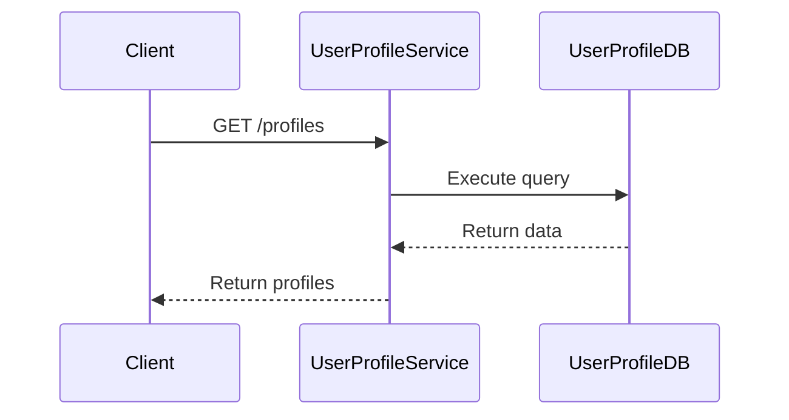
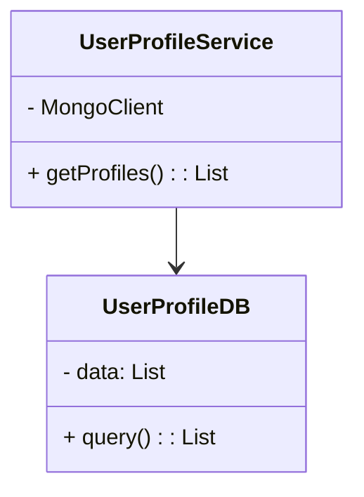

## Introduction

The **Database per Service** pattern is a pivotal architectural pattern in microservices architecture, where each service has its own database. This pattern emphasizes strong service boundaries, enhances independence, and enables independent scaling, maintenance, and development cycles for each microservice within a system.

## Detailed Explanation

### Architectural Approach

The traditional monolithic architecture often involves a single database shared across the application. In contrast, the Database per Service pattern mandates that each microservice has its own dedicated database. This separation of data stores aligns with the principles of domain-driven design, allowing each microservice to store, retrieve, and manage its own data independently.

### Key Benefits

1. **Encapsulation**: By having its own database, a microservice can enforce data a model and schema that best fits its functional needs without impacting other services.
2. **Independence**: Each microservice can use the type of database that is most suited for its data requirements, whether it's SQL, NoSQL, or in-memory databases.
3. **Scalability**: Services can be scaled independently, addressing performance bottlenecks more efficiently and minimizing the impact on other services.
4. **Resilience**: Isolating databases enhances the robustness of the service architecture as a failure in one service's database does not cascade to others.

### Challenges

1. **Data Consistency**: Maintaining data consistency across disparate databases can be complex and may require additional mechanisms like event sourcing or the Saga pattern.
2. **Increased Complexity**: This pattern introduces operational challenges in terms of managing and provisioning databases.
3. **Inter-service Communication**: Queries that require data from multiple services must be handled through orchestrated requests, potentially complicating data retrieval processes.

## Example Code

Below is a simplified example of how this might be implemented in a microservices architecture using a RESTful approach:

```typescript
// Sample Service for User Profile Data with its own database connection
import express from 'express';
import mongoose from 'mongoose';

const app = express();
const port = 3000;

// Connecting to the database specific to this service
mongoose.connect('mongodb://localhost:27017/user-profile-db', {
  useNewUrlParser: true,
  useUnifiedTopology: true,
});

const userProfileSchema = new mongoose.Schema({
  name: String,
  email: String,
  age: Number,
});

const UserProfile = mongoose.model('UserProfile', userProfileSchema);

app.get('/profiles', async (req, res) => {
  const profiles = await UserProfile.find();
  res.json(profiles);
});

app.listen(port, () => {
  console.log(`User profile service running on http://localhost:${port}`);
});
```

In the code above, a microservice for managing user profiles connects to its dedicated MongoDB instance, demonstrating the database per service pattern.

## Diagrams

### Sequence Diagram



### Class Diagram



## Related Patterns

- **Saga Pattern**: A sequence of local transactions allows services to maintain data consistency across multiple databases.
- **CQRS (Command Query Responsibility Segregation)**: Separation of read and write models can be useful when implementing complex database queries across services.

## Additional Resources

- [Microservices.io](https://microservices.io): A comprehensive guide to microservices architecture and patterns.
- [Distributed Services Architecture](https://12factor.net): The Twelve-Factor App methodology, which outlines best practices for building software-as-a-service apps.

## Summary

The Database per Service pattern is essential for maintaining the independent, scalable, and resilient architecture desired in microservices. While it introduces complexities like data consistency and management, the benefits of isolation and the ability to optimize each service for individual data needs make it an indispensable pattern in modern cloud architectures.

By leveraging this pattern, organizations can build a more robust and adaptable infrastructure, setting the foundation for continuous improvement and innovation in their software applications.
