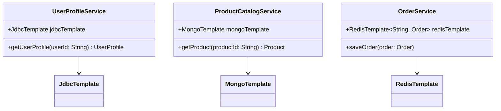

## Introduction

In today's technology landscape, where diverse applications are tightly integrated into cloud-native environments, one size does not fit all when it comes to data storage. Enter **Polyglot Persistence**, a design pattern that leverages various data storage technologies to handle distinct data requirements for different services or components within a system. This pattern is a critical aspect of building scalable, efficient, and maintainable distributed systems and microservices architectures.

## Core Idea

The fundamental principle of polyglot persistence involves using the best-suited data storage technology for a specific service based on its functional need, query pattern, and scalability requirement. Different types of workloads - whether transactional, analytical, or streaming - benefit from different database technologies designed with those particular needs in mind.

### Key Aspects:
- **Diversity of Data Models**: Use relational databases for structured data, NoSQL options for large-scale unstructured data, and specialized databases for graph, time-series, or full-text search.
- **Optimized Performance**: Tailor the choice of data storage to enhance latency, throughput, or availability as required by the service.
- **Scalability**: Employ scalable storage solutions pertinent to the service's scale requirements, facilitating horizontal scaling via distributed databases.
- **Cost Efficiency**: Leverage cost-effective technologies for different workloads while ensuring the overall cost management aligns with business goals.

## Architectural Approach

When implementing a polyglot persistence strategy, here are the architectural approaches to consider:

1. **Service-Level Isolation**: Each microservice is responsible for managing its data persistence, which is isolated from other services. This allows teams to choose the most suitable data storage technology without affecting other parts of the system.
   
2. **APIs for Interaction**: Establish clear APIs and data contracts between services, ensuring seamless interaction across diverse data storage solutions.
   
3. **Data Synchronization and Consistency**: Handle eventual consistency and define strategies for data synchronization when integrating multiple databases.
   
4. **Monitoring and Observability**: Implement comprehensive monitoring to track performance, costs, and operational insights. This includes using tools that provide observability across different storage technologies.

## Example Code

Here’s a succinct example implementing polyglot persistence using a combination of databases in a mock e-commerce solution:

```java
// User Profile Service using a relational database
public class UserProfileService {
    private final JdbcTemplate jdbcTemplate;

    public UserProfileService(JdbcTemplate jdbcTemplate) {
        this.jdbcTemplate = jdbcTemplate;
    }
    
    public UserProfile getUserProfile(String userId) {
        return jdbcTemplate.queryForObject("SELECT * FROM users WHERE id = ?", new Object[]{userId}, new UserProfileRowMapper());
    }
    
    // ... (additional CRUD operations)
}

// Product Catalog Service using a NoSQL document database
public class ProductCatalogService {
    private final MongoTemplate mongoTemplate;

    public ProductCatalogService(MongoTemplate mongoTemplate) {
        this.mongoTemplate = mongoTemplate;
    }
    
    public Product getProduct(String productId) {
        return mongoTemplate.findById(productId, Product.class);
    }
    
    // ... (additional CRUD operations)
}

// Orders Service using a distributed key-value store
public class OrderService {
    private final RedisTemplate<String, Order> redisTemplate;

    public OrderService(RedisTemplate<String, Order> redisTemplate) {
        this.redisTemplate = redisTemplate;
    }
    
    public void saveOrder(Order order) {
        redisTemplate.opsForValue().set(order.getId(), order);
    }
    
    // ... (additional operations)
}
```

## Diagrams

### System Overview UML



## Related Patterns

- **Database per Service**: Each service has its database, enabling polyglot persistence at the service level.
- **CQRS (Command Query Responsibility Segregation)**: Separates read and write workloads, leveraging different database technologies optimized for each operation type.

## Additional Resources

- Martin Fowler's article on [Polyglot Persistence](https://martinfowler.com/bliki/PolyglotPersistence.html) for foundational insights.
- AWS Architecture Center on [Choosing a Database](https://aws.amazon.com/architecture/databases/) provides guidance on selecting databases based on usage.

## Summary

Polyglot Persistence is an essential pattern for today’s complex distributed systems. By strategically choosing different storage technologies to meet specific needs, organizations can achieve greater performance, flexibility, and scalability across their services. This approach not only caters to the distinct data requirements of each service but also aligns with modern cloud computing and microservices architectures, enabling resilient and cost-effective solutions for the future.
