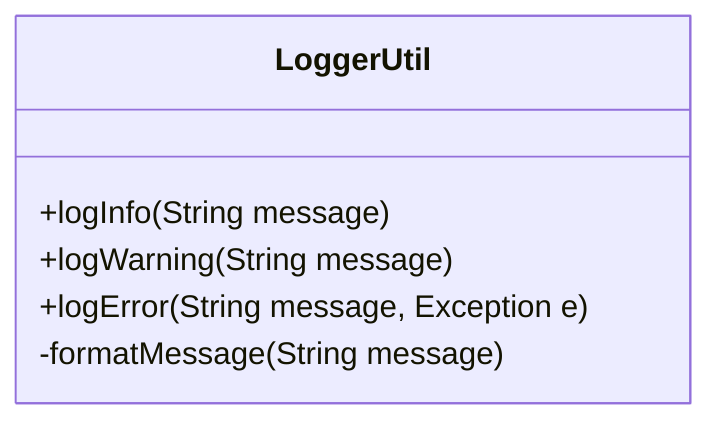

## Introduction

In a microservices architecture, services are often developed independently, which can lead to a duplication of code and inconsistent implementation of functionalities across different services. The **Shared Libraries and Tools** pattern addresses these issues by advocating the use of common libraries and utilities to promote code reuse and consistency.

## Design Pattern Explanation

### Problem

In a cloud-based microservices environment, each team may develop its own solutions for common problems such as logging, error handling, configuration management, and data transformation. This can lead to:

- **Code Duplication**: Same logic implemented in multiple services.
- **Inconsistency**: Different services handling similar tasks differently.
- **Increased Maintenance**: More code to maintain and update when requirements change.
- **Divergent Practices**: Varied developer habits leading to non-uniform solutions.

### Solution

To mitigate these challenges, the Shared Libraries and Tools pattern provides a structured approach to centralizing common functionalities:

- **Shared Libraries**: Develop libraries that encapsulate common functionalities (e.g., authentication, logging, data validation) and ensure they are dependency-compatible with the services they support.
- **Utility Tools**: Create tools for deployment, testing, and monitoring that can be used across teams to standardize processes.
- **Versioning**: Maintain versioned releases of libraries to manage backward compatibility and incremental improvements.
- **Central Repository**: Use a package manager or central repository (e.g., Maven, npm, PyPi) to store and distribute these libraries and tools.

### Architectural Approach

1. **Identify Common Needs**: Analyze existing microservices to determine common functionalities that can be abstracted into libraries.
2. **Develop Libraries**: Implement these functionalities as discrete libraries.
3. **Integrate and Test**: Use Continuous Integration/Continuous Deployment (CI/CD) pipelines to automate testing and integration of these libraries within services.
4. **Documentation**: Maintain comprehensive documentation to assist developers in leveraging shared libraries effectively.
5. **Feedback and Iteration**: Encourage feedback from consumers of libraries to evolve and enhance functionalities.

## Example Code

Below is a simplified example of a shared logging library in Java:

```java
package com.example.shared;

import java.time.LocalDateTime;
import java.util.logging.Logger;

public class LoggerUtil {

    private static final Logger logger = Logger.getLogger(LoggerUtil.class.getName());

    public static void logInfo(String message) {
        logger.info(formatMessage(message));
    }

    public static void logWarning(String message) {
        logger.warning(formatMessage(message));
    }

    public static void logError(String message, Exception e) {
        logger.severe(formatMessage(message) + " Exception: " + e.getMessage());
    }

    private static String formatMessage(String message) {
        return LocalDateTime.now() + " - " + message;
    }
}
```

## Diagrams

### UML Class Diagram



## Related Patterns

- **Service Registry**: Helps in coordinating interactions between different services, including those using shared libraries.
- **API Gateway**: Can utilize shared tools for consistent authentication and authorization across services.
- **Configuration Management**: Shared tools can manage configuration settings across environments.

## Additional Resources

- [Microservices Patterns by Chris Richardson](https://microservices.io/patterns/index.html)
- [Building Microservices: Designing Fine-Grained Systems by Sam Newman](https://www.oreilly.com/library/view/building-microservices/9781491950340/)

## Summary

The **Shared Libraries and Tools** pattern plays a crucial role in promoting reuse, consistency, and best practices in a distributed systems environment. By centralizing common functionalities, organizations can streamline development processes, reduce maintenance overhead, and ensure that microservices adhere to common standards and conventions, ultimately improving the overall quality and robustness of cloud-based applications.
