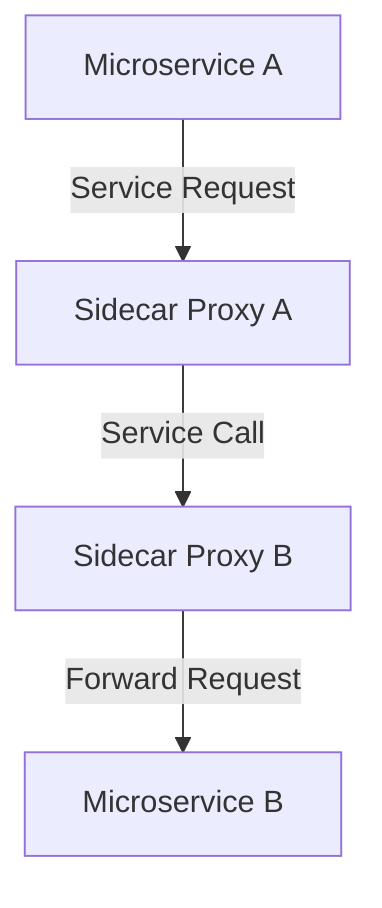

## Introduction

In modern microservices architectures, the complexity of managing service-to-service communication increases significantly as the number of services grows. The **Service Mesh** design pattern addresses this complexity by abstracting the network intricacies into a dedicated infrastructure layer. This pattern provides a suite of functionalities like load balancing, service discovery, authentication, authorization, and monitoring in an opaque manner to the application developer. Prominent implementations include Istio, Linkerd, and Consul.

## Detailed Explanation

A Service Mesh provides an infrastructure layer for controlling and monitoring internal service communication. It typically comprises a lightweight **proxy** deployed alongside each service instance. This sidecar proxy intercepts and manages all network communication between services, enabling advanced traffic management capabilities without altering service code.

### Features and Capabilities

1. **Traffic Management**: 
   - Ability to define routing rules controlling the flow of traffic and API calls between microservices.
   - Supports rolling updates, canary releases, and fault injection practices.

2. **Service Discovery**:
   - Registers services automatically and maintains a registry of available services and their instances.

3. **Load Balancing**:
   - Distributes incoming service requests across available instances dynamically for optimized resource usage and increased availability.

4. **Security**:
   - Offers mTLS (Mutual TLS) authentication and authorization policies, ensuring secure data transfer between microservices.

5. **Monitoring and Tracing**:
   - Collects metrics, logs, and traces to provide observability and insights into service performance and behavior.

6. **Resiliency**:
   - Implements retries, timeouts, and circuit breaker patterns to maintain system robustness under high load or failure conditions.

### Architectural Approach

The Service Mesh typically follows a sidecar architecture. Each microservice is accompanied by a sidecar proxy which manages all interactions with other services. This decouples service logic from network capabilities, allowing developers to focus on business logic. Communication is piped through the proxies, hence the application remains agnostic of network topologies or configurations.



The illustration above shows how service requests from Microservice A to Microservice B are managed through their respective sidecar proxies.

## Example Code

Example using Istio with Kubernetes:

```yaml
apiVersion: networking.istio.io/v1alpha3
kind: VirtualService
metadata:
  name: product-service
spec:
  hosts:
  - product-service
  http:
  - route:
    - destination:
        host: product-service
        subset: v1
      weight: 80
    - destination:
        host: product-service
        subset: v2
      weight: 20
```

This YAML snippet demonstrates traffic splitting between two versions of a microservice (`v1` and `v2`) using Istio's VirtualService.

## Related Patterns

- **Sidecar Pattern**: Utilizes a helper application for common tasks alongside the primary service in a separate process or container.
- **Circuit Breaker Pattern**: Protects services from cascading failures in unreliable networks.

## Additional Resources

- [Istio Documentation](https://istio.io/docs/)
- [Linkerd Documentation](https://linkerd.io/2/getting-started/)
- [Consul Service Mesh](https://www.consul.io/docs/connect)

## Summary

The Service Mesh pattern provides a powerful and flexible mechanism to manage microservices networking by abstracting complex network operations into a dedicated infrastructure layer. By doing so, it empowers developers to focus on implementing business logic while ensuring secure, resilient, and efficient inter-service communications. As organizations continue to adopt cloud-native technologies and microservices architectures, Service Mesh usage will likely expand, becoming an integral part of the developer's toolkit for managing distributed systems.
