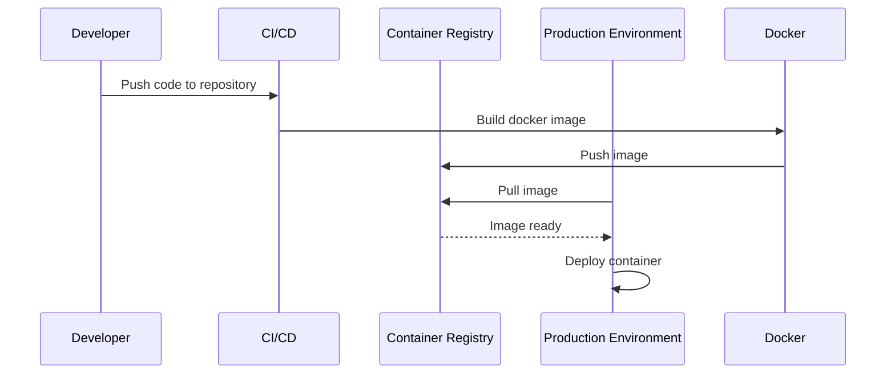

## Introduction

Containerization has revolutionized how applications are packaged and deployed, providing a consistent environment for development, testing, and production. This pattern is especially beneficial in microservices architectures, allowing services to run in isolated environments that mimic production systems closely, regardless of the underlying infrastructure.

## Key Concepts

- **Container Technology**: Containers encapsulate all application components, including code, runtime, system tools, libraries, and settings, ensuring that software runs the same, irrespective of the environment.
- **Isolation**: Containers provide a lightweight isolation, utilizing system resources more efficiently compared to virtual machines (VMs).
- **Immutability**: Once a container image is created, it doesn't change, making deployments predictable and scalable.

## Architectural Approaches

1. **Docker**: The most popular container platform. Docker provides containerization, image management, and orchestration through Docker Compose and native Swarm.
2. **Kubernetes**: An orchestration system for automating deployment, scaling, and management of containerized applications. It handles features like load balancing, rollouts, rollbacks, and self-healing.
3. **Container Registries**: Services like Docker Hub or Google Container Registry store container images, enabling easy distribution and deployment across multiple environments.

## Best Practices

- **Small and Single Responsibility Containers**: Ensure containers do one thing well to simplify maintenance and enhance scalability.
- **Versioning Images**: Always tag images with version numbers to keep track of updates and avoid 'latest' in production.
- **Resource Management**: Use Kubernetes to enforce resource limits on CPU and memory for containers.
- **Monitoring and Logging**: Integrate tools like Prometheus for monitoring and ELK stack for logging.

## Example Code

Here's a basic `Dockerfile` for a simple Node.js application:

```dockerfile
FROM node:14

WORKDIR /usr/src/app

COPY package*.json ./

RUN npm install

COPY . .

EXPOSE 8080

CMD ["node", "app.js"]
```

Using Kubernetes, you can deploy this container with a simple `Deployment` configuration:

```yaml
apiVersion: apps/v1
kind: Deployment
metadata:
  name: node-app
spec:
  replicas: 3
  selector:
    matchLabels:
      app: node-app
  template:
    metadata:
      labels:
        app: node-app
    spec:
      containers:
      - name: node-app
        image: node-app:1.0
        ports:
        - containerPort: 8080
```

## Diagrams

### Containerization Sequence Diagram



## Related Patterns

- **Service Mesh**: An additional infrastructure layer for managing service-to-service communication, offering load balancing, failure recovery, and observability.
- **Serverless Functions**: Allows the running of services without the need for explicit server management.

## Additional Resources

- Docker Official Documentation: [docker.com](https://www.docker.com/resources/what-container/)
- Kubernetes Official Guide: [kubernetes.io](https://kubernetes.io/docs/home/)
- Container Best Practices: [Best Practices for Building Containers](https://cloud.google.com/architecture/best-practices-for-building-containers)

## Summary

Containerization of services liberates applications from the constraints of their operating environments, fostering an infrastructure-agnostic model. By allowing developers to break applications down into microservices, containers facilitate easier scaling, accelerated deployment cycles, greater resource efficiency, and enhanced isolation, making them a cornerstone for modern cloud-native applications.
