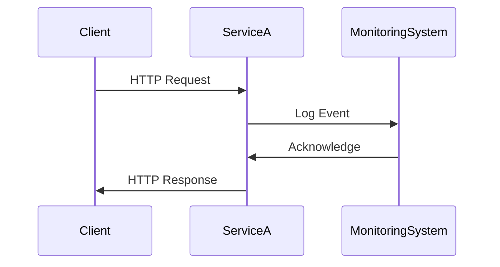

## Introduction

In the cloud era, particularly with distributed systems and microservices architectures, robust logging and monitoring are vital to maintain the system's health and performance. These practices help track service operations, detect anomalies, and facilitate efficient troubleshooting.

## Pattern Overview

**Logging and Monitoring** refers to collecting and analyzing data about system operations and performance metrics. Logging focuses on recording events happening in the system, while monitoring involves tracking resource use and performance metrics over time. This pattern is crucial in cloud environments for operational excellence and real-time system performance analysis.

### Log Aggregation

Logs generated by individual services are aggregated into a centralized system, allowing for holistic analysis and troubleshooting. Tools like ELK Stack (Elasticsearch, Logstash, Kibana) or Fluentd facilitate log collection, indexing, and visualization.

### Metrics Gathering

Metrics, such as response times and error rates, are collected to monitor service health and performance. Prometheus, combined with Grafana for visualization, is commonly used for metrics storage and dashboarding.

### Alerts and Notifications

Based on logs and metrics, automated systems trigger alerts to inform operations teams of issues. Implementing reliable alerting prevents downtime and ensures timely incident response.

## Architectural Approaches

### Centralized Logging

Centralizing logs in a distributed system simplifies analysis by providing a single pane of glass for all logging data. This approach utilizes frameworks and protocols that ensure log consistency and integrity across microservices.

### Service-Level Monitoring

Each microservice is equipped with monitoring capabilities that track its specific KPIs (Key Performance Indicators). These KPIs shed light on both system-level and business-level performance metrics.

### Tracing

Distributed tracing correlates logs across services, providing insights into service dependencies and performance bottlenecks. OpenTracing and Jaeger are popular choices for implementing tracing in microservices.

## Best Practices

- **Standardization**: Align log and metric formats to ensure consistency.
- **Granularity**: Adjust the granularity of logs and metrics based on service criticality.
- **Retention**: Implement log and metric retention policies to manage storage costs.
- **Security**: Ensure the confidentiality and integrity of logged data.

## Example Code

### Logging with Fluentd

```json
fluentd.conf
<source>
  @type forward
  port 24224
</source>

<match **>
  @type stdout
</match>
```

### Metrics with Prometheus

```yaml
scrape_configs:
  - job_name: 'example'
    static_configs:
      - targets: ['localhost:9090']
```

## Diagrams

### Sequence Diagram



## Related Patterns

- **Event Sourcing**: Complements logging by enabling a complete replay of events.
- **Circuit Breaker**: Prevents cascading failures, often monitored alongside logs and metrics.
- **Health Endpoint Monitoring**: Checks service health via specific endpoints.

## Additional Resources

- [The Log: What every software engineer should know about real-time data’s unifying abstraction](https://engineering.linkedin.com/distributed-systems/log-what-every-software-engineer-should-know-about-real-time-datas-unifying)
- [Prometheus: Monitoring system & time series database](https://prometheus.io/)
- [OpenTracing: Realtime performance monitoring](https://opentracing.io/)

## Summary

Effective Logging and Monitoring are cornerstones for maintaining robust, high-performing distributed systems and microservices architectures. This pattern helps organizations gain deep insights into their operations, optimize performance, and ensure reliability, making it indispensable in the modern cloud landscape.
