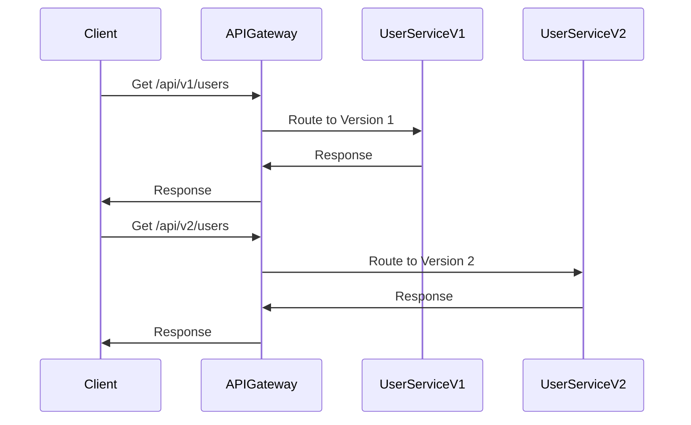

In the ever-evolving landscape of distributed systems and microservices architecture, API versioning is crucial for ensuring that changes in service interfaces don't disrupt clients and downstream systems. Proper versioning allows developers to evolve APIs without breaking existing implementations, reducing risks and enabling smoother transitions.

## Detailed Explanation of API Versioning

API versioning is a practice that involves introducing, managing, and deprecating different versions of an API to accommodate changes like enhancements, bug fixes, and modifications. It ensures backward compatibility, allowing existing consumers of the API to continue functioning with minimal disruption while new features and improvements are rolled out.

### Key Considerations

1. **Backward Compatibility**: Ensures that existing API consumers don't break with new versions.
2. **Granularity**: Deciding between versioning entire APIs or just specific endpoints.
3. **Deprecation Strategy**: Clearly communicating deprecated versions to guide clients toward new versions.
4. **Documentation**: Providing comprehensive version-specific documentation for developers.

### Versioning Strategies

1. **URI Versioning**: Including the version number in the URL path (e.g., `api/v1/resource`). This approach is intuitive and visible but can lead to cluttered URIs.
   
   Example:
   ```http
   GET /api/v1/users
   ```

2. **Query Parameter Versioning**: Specifying version information as a query parameter. This keeps the URI clean but may reduce visibility to clients inspecting URLs.

   Example:
   ```http
   GET /api/users?version=1
   ```

3. **Header Versioning**: Using custom headers to specify the API version. This approach separates versioning from the URI, offering flexibility but requiring clients to handle headers explicitly.

   Example:
   ```http
   GET /api/users
   Accept: application/vnd.yourapi.v1+json
   ```

4. **Content Negotiation**: Leveraging existing `Accept` and `Content-Type` headers to convey versioning, suited for APIs requesting different media types.

### Code Example

```java
@RestController
@RequestMapping("/api")
public class UserController {

    @GetMapping(value = "/v1/users", produces = "application/json")
    public ResponseEntity<List<User>> getUsersV1() {
        // Implementation for version 1
    }

    @GetMapping(value = "/v2/users", produces = "application/json")
    public ResponseEntity<List<User>> getUsersV2() {
        // Implementation for version 2
    }
}
```

## Architectural Approaches

- **Microservices with API Gateway**: An API Gateway can manage versioning and routing requests to the correct microservices version.
- **Backward Compatibility Testing**: Automating tests to ensure API changes don't break existing consumers is critical.
- **Continuous Integration/Continuous Deployment (CI/CD)**: Employ CI/CD pipelines to automate the deployment of API versions and manage rollbacks if needed.

## Diagrams

### UML Diagram



## Related Patterns

- **Service Registry**: Registers multiple versions of a service so that clients can discover available API versions.
- **Circuit Breaker**: Helps in gracefully handling failures in deprecated API versions.

## Additional Resources

- [API Design Guidance by Microsoft](https://docs.microsoft.com/en-us/azure/architecture/best-practices/api-design)
- [API Versioning - Best Practices by Google Cloud](https://cloud.google.com/apis/design/versioning)
- [RESTful API Versioning](https://restfulapi.net/api-versioning/)

## Summary

Versioning of APIs is indispensable in modern software architectures, allowing iterative and non-breaking changes to service interfaces. By choosing appropriate versioning strategies, implementing effective deprecation policies, and using supporting architectural patterns like API gateways and service registries, organizations can evolve their services seamlessly, ensuring uninterrupted service to consumers while paving the way for innovation and improvements.
