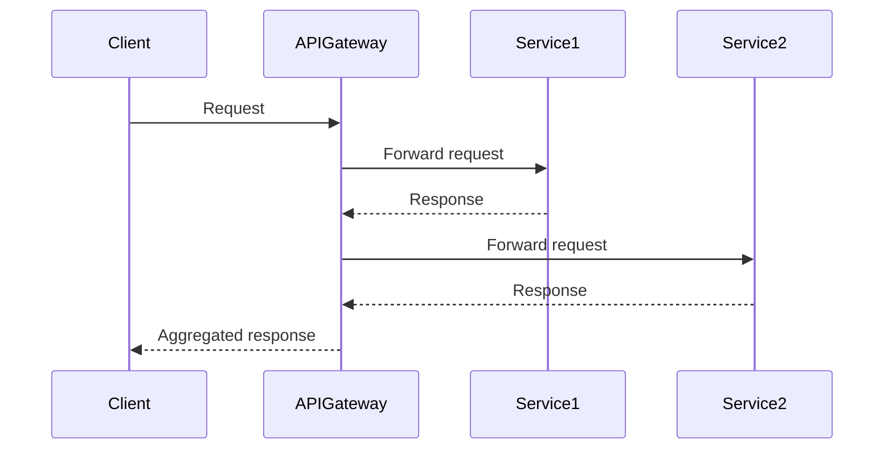

## Overview

An **API Gateway** acts as an intermediary that sits between client applications and a collection of backend services, providing a unified interface to handle requests and responses. This pattern simplifies the process of managing multiple services, especially in a distributed environment where each microservice can have its own distinct endpoint, configuration, and security requirements.

## Detailed Explanation

### Responsibilities

1. **Routing Requests**: API Gateway routes incoming client requests to the appropriate backend service based on the request path or other parameters.
2. **Protocol Translation**: It can handle protocol conversions, making it possible for clients to communicate through a uniform API, regardless of the backend service protocol intricacies (e.g., HTTP, gRPC, WebSockets).
3. **Cross-cutting Concerns**: Handles authentication, throttling, monitoring, logging, caching, request validation, and load balancing, consolidating common tasks that would otherwise need to be implemented across each service.
4. **Aggregator**: Capable of aggregating results from several services into one response if the client requires data aggregation, reducing the number of client requests.

### Example Code

Here's a simplified example of how an API Gateway might be implemented using JavaScript with Node.js and Express:

```javascript
const express = require('express');
const request = require('request');
const app = express();

// Example endpoint for routing
app.get('/api/service1/*', (req, res) => {
    const url = `http://localhost:3001/${req.params[0]}`;
    req.pipe(request(url)).pipe(res);
});

app.get('/api/service2/*', (req, res) => {
    const url = `http://localhost:3002/${req.params[0]}`;
    req.pipe(request(url)).pipe(res);
});

app.listen(3000, () => {
    console.log('API Gateway running on port 3000');
});
```

### Illustrating with Diagrams



## Architectural Approaches

- **Service Mesh**: In sophisticated networks, API Gateway can be a part of a service mesh to facilitate microservice communication with better observability and security features.
- **Decoupling Clients and Services**: By abstracting complexities, API Gateways allow teams to independently deploy and update services without affecting client interactions.

## Best Practices

- **Security First**: Incorporate robust authentication and authorization protocols.
- **Scalability**: Employ horizontal scaling to handle large volumes of requests.
- **Fault Tolerance**: Implement circuit breaker patterns to gracefully handle service failures.

## Related Patterns

- **Backend for Frontend (BFF)**: Dedicated backend for each frontend to address specific needs.
- **Service Registry**: For dynamic service discovery which helps API Gateways to manage service endpoints.

## Additional Resources

- [NGINX API Gateway Solutions](https://www.nginx.com/api-gateway/)
- [AWS API Gateway](https://aws.amazon.com/api-gateway/)
- [Kong Gateway](https://konghq.com/api-gateway/)
- [Istio Service Mesh](https://istio.io/)

## Summary

The API Gateway pattern is an essential architectural element in cloud-based and microservices ecosystems, providing a single point of access for client applications. This not only simplifies interaction with diverse backend services but also offers a robust framework for managing cross-cutting concerns efficiently. By adopting API Gateway, organizations can achieve greater control over service communications and streamline service delivery.
