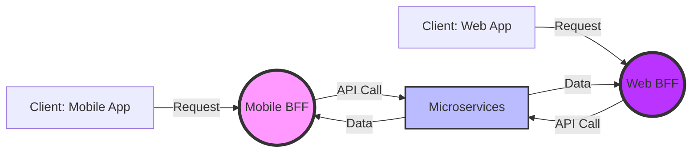

In the evolution of cloud-native architectures, the **Backends for Frontends (BFF)** pattern has emerged as a pivotal design strategy. This pattern involves creating specialized backend services tailored to the unique demands of different clients, such as mobile, web, or desktop applications. By doing so, it addresses several challenges inherent in a one-size-fits-all service layer, enhancing both the responsiveness and the maintainability of client applications.

## The Problem

In a typical service-oriented architecture, a single backend service caters to all types of clients. This universal approach, while straightforward, often results in difficulties:

- **Over-fetching/Under-fetching**: Different clients have varying needs. A desktop application might require more detailed data than a mobile app, leading to unnecessary data transfer and processing for mobile clients.
- **Performance Issues**: Diverse client environments (such as mobile versus web) demand distinct optimizations for performance, latency, and data transfer rates.
- **Complex Codebases**: Client-specific logic in a single backend increases complexity and technical debt, leading to increased difficulty in maintaining and evolving systems.

## The Solution: Backends for Frontends (BFF)

The BFF pattern proposes a solution by creating individual backend services for each distinct client type. Each BFF is responsible for handling client-specific requirements, simplifying the integration and enhancing the overall user experience.

### Architectural Approach

1. **Client-Specific Backends**: Develop a backend that serves as an intermediary for each client platform. These services handle application logic unique to the client, such as data aggregation, transformation, and pagination.

2. **Unified API Gateway**: Use an API gateway to route client requests to the appropriate BFF. This centralizes the client entry point while keeping backend operations discrete and manageable.

3. **Decoupled Architectures**: By segmenting backends, teams can evolve the backend independently for each client, reducing the risk of cross-impact changes.

### Example Code

Below is a simplified example using JavaScript and Node.js to illustrate how a BFF might be structured:

```javascript
const express = require('express');
const fetch = require('node-fetch');

const app = express();
const PORT = process.env.PORT || 3000;

// Sample BFF for a mobile client
app.get('/mobile/dashboard', async (req, res) => {
    try {
        const userData = await fetch('https://api.service.com/user/data').then(res => res.json());
        const recentActivity = await fetch('https://api.service.com/user/activity').then(res => res.json());
        
        const mobileResponse = {
            user: userData.name,
            recentActivities: recentActivity.slice(0, 5) // Limit activities to 5 for mobile
        };
        
        res.json(mobileResponse);
    } catch (error) {
        res.status(500).json({ error: 'Failed to fetch data' });
    }
});

app.listen(PORT, () => {
    console.log(`Mobile BFF listening on port ${PORT}`);
});
```

### Diagrams

#### BFF Architecture Diagram


## Best Practices

- **Ensure Scalability**: Implement robust load balancing and scaling strategies for each BFF to handle varied client loads effectively.
- **Promote Reusability**: Structure common logic as shared services or libraries to avoid duplication across BFFs.
- **Implement Security Measures**: Harden each BFF with authentication, authorization, and data validation to safeguard against security threats.

## Related Patterns

- **API Gateway**: Often used with BFF to manage and route requests effectively across different backend services.
- **Microservices**: BFF is an extension of microservices philosophy, advocating for microservices tailored to client-specific needs.

## Additional Resources

- *Microservices Patterns: With examples in Java* by Chris Richardson.
- *Building Microservices* by Sam Newman.
- Blog: [Introduction to Backends for Frontends (BFF) Pattern](https://example-blog.com)

## Summary

The Backends for Frontends (BFF) pattern delivers a strategy for creating targeted backend services optimized for specific client types. This pattern not only enhances application performance and user experience but also simplifies the management of an enterprise’s technical infrastructure. By implementing BFF, organizations can achieve greater agility and focus, adapting swiftly to evolving client requirements and technological advances.
