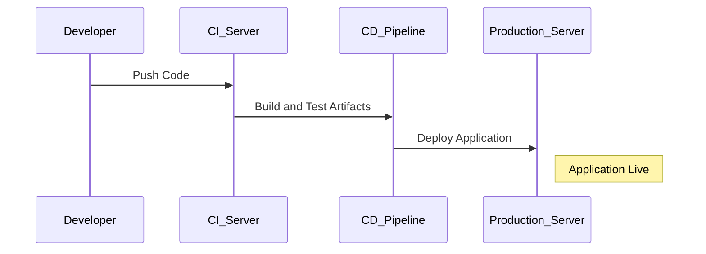

---

linkTitle: "DevOps Culture Adoption"
title: "DevOps Culture Adoption: Aligning Development and Operations for Agility"
category: "Distributed Systems and Microservices in Cloud"
series: "Cloud Computing: Essential Patterns & Practices"
description: "DevOps Culture Adoption explores the integration and alignment of development and operations teams to achieve agility, efficiency, and reliability in cloud computing environments. This design pattern emphasizes cultural transformation, collaboration, and the use of automation tools to enhance software delivery."
categories:
- DevOps
- Cloud Computing
- Continuous Delivery
tags:
- DevOps
- Agile
- Continuous Integration
- Microservices
- Cloud
date: 2024-07-07
type: docs

canonical: "https://softwarepatternslexicon.com/18/22/23"
license: "© 2024 Tokenizer Inc. CC BY-NC-SA 4.0"
---


## Introduction

The DevOps culture adoption pattern symbolizes a shift in organizational mindset, breaking down silos traditionally separating development and operations teams. The ultimate goal is to improve the ability to deliver applications and services at high velocity. This accelerated delivery speeds up time to market, meeting consumer demands more efficiently and reliably.

## Detailed Explanation

### Core Principles of DevOps

1. **Culture and Sharing**: Promoting open communication and sharing of knowledge between teams.
2. **Automation**: Using tools to automate repetitive and error-prone tasks to improve speed and quality.
3. **Lean Practices**: Minimizing waste through efficient process improvements.
4. **Measurement**: Using data and metrics to improve processes and make informed decisions.
5. **Continuous Improvement**: Iterative improvements based on feedback and experiences.

### Architectural Approach

The central premise of DevOps is fostering a collaborative environment where developers and operations work seamlessly together throughout the software development lifecycle. This collaboration is enhanced through the integration of practices like Continuous Integration (CI), Continuous Delivery (CD), Infrastructure as Code (IaC), and automated monitoring.

**Figure 1:**


### Best Practices

- **Automate Everything**: Implement widespread automation across build, test, and deployment processes.
- **Integrate Continuously**: Ensure every code change triggers automated testing to verify integration integrity.
- **Collaborate and Communicate**: Use tools and processes to encourage continuous feedback loops.
- **Monitor and Log**: Implement proactive monitoring and logging for insights into performance and issues.
- **Iterate and Improve**: Constantly collect metrics to identify opportunities for improvement.

### Example Code

Here's a snippet illustrating a CI/CD workflow using a popular DevOps tool - Jenkins:

```groovy
pipeline {
    agent any

    stages {
        stage('Build') {
            steps {
                sh 'mvn clean package'
            }
        }
        
        stage('Test') {
            steps {
                sh 'mvn test'
            }
        }

        stage('Deploy') {
            steps {
                sh 'scp target/my-app.war user@production-server:/deployments/'
            }
        }
    }
}
```

### Related Patterns

- **Continuous Integration/Continuous Deployment (CI/CD)**: Integrates automated testing and deployment to streamline delivery.
- **Infrastructure as Code (IaC)**: Allows for managing and provisioning infrastructure through code to enable automated and repeatable deployments.
- **Blue-Green Deployment**: Ensures zero-downtime deployments by running two identical production environments.

### Additional Resources

- [The Phoenix Project: A Novel About IT, DevOps, and Helping Your Business Win](https://itrevolution.com/) - A fictional yet insightful book on DevOps culture.
- [DevOps Handbook](https://www.amazon.com/DevOps-Handbook-World-Class-Reliability-Organizations/dp/1942788002) - A comprehensive guide to adopting DevOps practices.
- [Continuous Delivery by Jez Humble and David Farley](https://www.amazon.com/Continuous-Delivery-Deployment-Automation-Addison-Wesley/dp/0321601912) - A detailed introduction to CI/CD.

## Summary

Adopting a DevOps culture is pivotal for organizations aiming at agility and fast, reliable software release cycles. By integrating development and operations teams through shared practices, tools, and objectives, organizations can significantly enhance their capability to respond to market changes and customer needs, delivering more robust products efficiently.
