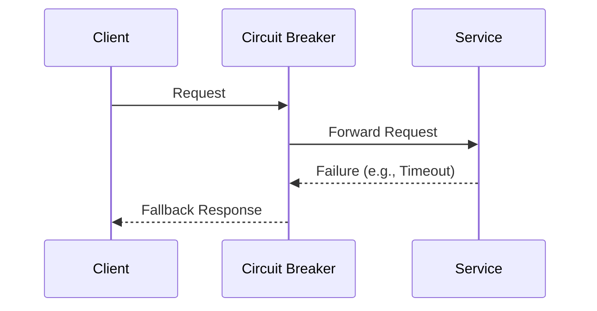

## Introduction

In modern cloud-based architectures, particularly those employing microservices, ensuring that failures in one component do not cascade to others is crucial. This pattern, known as Fault Isolation, focuses on preventing domino effects of failure through strategic partitioning and error containment. Fault Isolation is essential for building resilient, reliable, and scalable systems in cloud environments.

## Detailed Explanation

Fault Isolation is a design pattern aiming to confine the impact of failures to a limited scope within the system. By isolating faults, we ensure that problems in one component, such as a microservice or a database, do not affect unrelated parts of the system. This is achieved through:

- **Decoupling and Isolation**: Partitioning services such that a failure in one service has minimal or no impact on others.
- **Graceful Degradation**: Designing applications to maintain core functionalities even when non-critical components fail.
- **Error Containment**: Implementing error-handling mechanisms that limit the propagation of errors.

### Architectural Approaches

1. **Service Independence**: Design each service to operate independently as much as possible. Utilize techniques like circuit breakers, timeouts, and bulkheads.
   
2. **Circuit Breaker Pattern**: This acts like a switch to open up before requests pile up causing failures. It disables all requests to a service or component after detecting a failure threshold to prevent cascading failures.

3. **Bulkhead Pattern**: This involves partitioning resources into several isolated groups in order to prevent a failure in one group from bringing down the entire pool of resources.

4. **Graceful Degradation**: Implement strategies to ensure essential functions continue even if certain components are down — often through fallback processes and default behaviors.

5. **Timeouts and Retries**: Carefully configure timeouts and retries to ensure that waiting for an unresponsive service doesn’t consume unnecessary resources or lead to wider system failures.

## Best Practices

- **Automate Failover**: Use tools to automate failover in case of failure detection, ensuring that services can be rerouted or restarted automatically.
  
- **Data Replication and Consistency Models**: Choose appropriate consistency models and replicate data in a manner that supports availability even during partial outages.

- **Infrastructure Design**: Use container orchestration platforms like Kubernetes to manage service deployments and scale them effectively, maintaining isolation between containers using namespaces and resource quotas.

## Example Code

### Circuit Breaker Implementation in Java with Resilience4j

```java
import io.github.resilience4j.circuitbreaker.CircuitBreaker;
import io.github.resilience4j.circuitbreaker.CircuitBreakerConfig;
import io.github.resilience4j.circuitbreaker.CircuitBreakerRegistry;

public class FaultIsolationExample {

    public static void main(String[] args) {
        CircuitBreakerConfig config = CircuitBreakerConfig.custom()
            .failureRateThreshold(50)
            .waitDurationInOpenState(java.time.Duration.ofMillis(1000))
            .build();
          
        CircuitBreakerRegistry registry = CircuitBreakerRegistry.of(config);
        CircuitBreaker circuitBreaker = registry.circuitBreaker("myService");

        supplierCall(circuitBreaker);
    }

    private static void supplierCall(CircuitBreaker circuitBreaker) {
        Supplier<String> supplier = CircuitBreaker.decorateSupplier(circuitBreaker, () -> {
            // Simulate a call that may fail
            return "Response from service";
        });

        String result = Try.ofSupplier(supplier)
            .recover(throwable -> "Fallback method")
            .get();

        System.out.println(result);
    }
}
```

## Diagrams



## Related Patterns

- **Bulkhead**: A related pattern that involves partitioning systems to prevent failures from spreading.
- **Circuit Breaker**: Protects your system from cascading failures by halting requests before they overwhelm the services.

## Additional Resources

- [Microservices Design Patterns](https://microservices.io/patterns/index.html)
- [Resilience4j Documentation](https://resilience4j.readme.io/)
- [Kubernetes Patterns](https://learnk8s.io/kubernetes-patterns)

## Summary

Fault Isolation is an essential pattern for maintaining robustness and resilience in distributed systems and microservices architectures. By implementing strategies such as circuit breakers, bulkheads, and graceful degradation, developers can effectively contain and manage faults, minimizing their impact on the overall system. These practices help ensure that cloud-based services remain reliable and efficient, even in the face of unpredictable failures.
