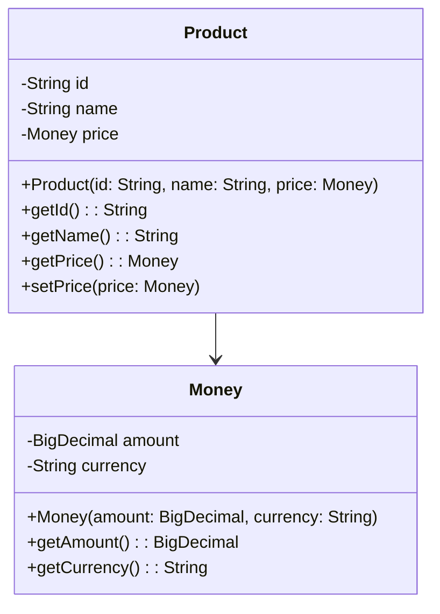

---

linkTitle: "Domain-Driven Design (DDD)"
title: "Domain-Driven Design (DDD): Structuring Services Around Business Domains"
category: "Distributed Systems and Microservices in Cloud"
series: "Cloud Computing: Essential Patterns & Practices"
description: "Domain-Driven Design (DDD) is a software design approach that focuses on modeling and structuring services around business domains to create more adaptable and maintainable systems."
categories:
- Distributed Systems
- Microservices
- Cloud Architecture
tags:
- DDD
- Microservices
- Cloud
- Domain Model
- Software Design
date: 2024-07-07
type: docs

canonical: "https://softwarepatternslexicon.com/18/22/26"
license: "© 2024 Tokenizer Inc. CC BY-NC-SA 4.0"
---

## Introduction to Domain-Driven Design (DDD)

Domain-Driven Design (DDD) is a conceptual approach to software development that emphasizes collaboration between technical and domain experts to create a model that accurately represents the core business domain. In the context of microservices and distributed systems on the cloud, DDD helps ensure that each microservice is aligned with specific business needs and handles its respective domain effectively.

## Key Concepts in DDD

1. **Ubiquitous Language**: A common language shared by developers and domain experts to facilitate clear and effective communication. It is used to create shared understanding and consistency across models and implementations.

2. **Bounded Context**: Defines the boundaries within which a particular domain model is applicable. Each microservice typically corresponds to a bounded context to ensure that its domain logic is cohesive and well-contained.

3. **Entities**: Objects that have a distinct identity that persists throughout the different states of the software. They represent core aspects of the domain.

4. **Value Objects**: Simple objects that describe certain aspects of the domain without requiring unique identities. They are immutable and represent descriptive elements of entities.

5. **Aggregates**: Groupings of entities and value objects that form a single unit of consistency. Transactions should not cross aggregate boundaries to maintain consistency.

6. **Domain Events**: Events that signify a change in the state of a domain that other parts of the system might be interested in.

7. **Repositories**: Encapsulate the logic needed to access entities and aggregates from a persistent store, ensuring proper abstraction of data operations.

8. **Factories**: Used to encapsulate the complex creation logic of aggregates and entities to ensure that they are instantiated correctly.

## Architectural Approaches

- **Microservices Aligned with Bounded Contexts**: Each microservice is designed around a single bounded context. This keeps the services decoupled and allows teams to work independently on different areas of the application.

- **Event-Driven Architecture**: DDD works well with event-driven architectures where domain events can be published and processed asynchronously, allowing different parts of the system to react to changes in the domain.

## Best Practices

- **Continuous Collaboration**: Regular interaction and feedback loops between domain experts and developers ensure that the domain model remains relevant and accurate.

- **Refactoring with Consistency**: As the business domain evolves, continuously refactor your models to ensure they accurately reflect the business processes.

- **Focus on Business Needs**: Align service development with business priorities to ensure that technical investments yield maximum business value.

## Example Code: [Java Implementation]

Here's a simple example illustrating a domain entity and a value object in Java:

```java
// Value Object
public class Money {
    private final BigDecimal amount;
    private final String currency;

    public Money(BigDecimal amount, String currency) {
        this.amount = amount;
        this.currency = currency;
    }

    public BigDecimal getAmount() {
        return amount;
    }

    public String getCurrency() {
        return currency;
    }
}

// Entity
public class Product {
    private final String id;
    private final String name;
    private Money price;

    public Product(String id, String name, Money price) {
        this.id = id;
        this.name = name;
        this.price = price;
    }

    public String getId() {
        return id;
    }

    public String getName() {
        return name;
    }

    public Money getPrice() {
        return price;
    }

    public void setPrice(Money price) {
        this.price = price;
    }
}
```

## Diagrams

### Domain-Driven Design Example



## Related Patterns

- **CQRS (Command Query Responsibility Segregation)**: This pattern complements DDD by separating command (writing data) and query (reading data) responsibilities to handle complex data operations more efficiently.

- **Event Sourcing**: Works well with DDD as it involves storing the state of a domain as a sequence of events, allowing auditing and rehydration of state.

## Additional Resources

- [Eric Evans' Book: Domain-Driven Design: Tackling Complexity in the Heart of Software](https://www.goodreads.com/book/show/179133.Domain_Driven_Design)
- [Vaughn Vernon's Book: Implementing Domain-Driven Design](https://www.goodreads.com/book/show/13541866-implementing-domain-driven-design)
- [Domain-Driven Design Community Resources](https://dddcommunity.org/)

## Summary

Domain-Driven Design (DDD) is crucial for developing complex, scalable, and maintainable software systems by aligning technical models with business domains. By implementing key DDD principles and aligning microservices with specific bounded contexts, teams can build systems that are more resilient and adaptable, making them significantly more capable of addressing evolving business needs.

---
