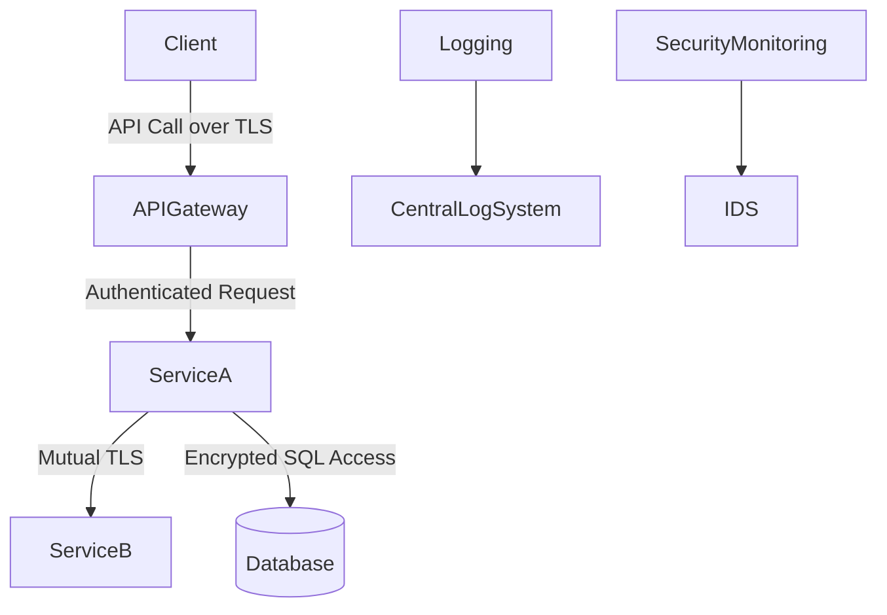

## Introduction

Security is paramount in distributed systems, especially in a cloud-based microservices architecture. Each component of an application must be safeguarded to prevent vulnerabilities that can be exploited by malicious entities. This article provides an overview of essential security best practices tailored for microservices in the cloud environment, ensuring a comprehensive strategy for protecting distributed applications.

## Best Practices for Securing Microservices

### 1. Container Security
- **Use Official Images**: Always use verified base images from trusted sources like Docker Hub to prevent introducing vulnerabilities from unofficial sources.
- **Run as Non-Root User**: Containers should run as a non-root user to minimize the potential impact of security breaches.
- **Regular Patch Updates**: Ensure that base images and dependencies are frequently updated to address security vulnerabilities.

```yaml
version: '3.8'
services:
  app:
    image: sampleapp:latest
    user: 1001:1001
    ports:
      - "8080:8080"
```

### 2. API Security
- **Implement OAuth 2.0 & OpenID Connect**: Use well-established protocols for authentication and authorization to safeguard APIs.
- **Rate Limiting & Throttling**: Prevent service abuse by implementing rate limiting and throttling mechanisms.
- **Validate Inputs**: Employ strict input validation to prevent injection attacks.

### 3. Secure Communication
- **TLS/SSL Encryption**: Use Transport Layer Security (TLS) to encrypt data in transit between microservices.
- **Mutual TLS Authentication**: Implement mutual TLS for peer-to-peer (P2P) authentication to ensure only authorized services communicate with each other.

### 4. Identity and Access Management (IAM)
- **Principle of Least Privilege**: Ensure that components have minimal access required to perform their tasks.
- **Role-Based Access Control (RBAC)**: Implement RBAC to manage permissions based on roles.

### 5. Monitoring and Logging
- **Centralized Logging**: Implement centralized logging to monitor suspicious activities across all microservices.
- **Intrusion Detection Systems (IDS)**: Deploy IDS to detect and respond to potential breaches proactively.

### 6. Network Security
- **Network Segmentation**: Employ virtual private clouds (VPCs) and network ACLs to segment various microservices, restricting unnecessary communication.
- **Firewall Rules**: Apply strict firewall rules to limit inbound and outbound traffic to necessary sources only.

## Example Architecture Diagram



## Related Patterns and Descriptions
- **Gateway Aggregation Pattern**: Facilitates the concentration of SAAS APIs which can help implement security measures more consistently and universally.
- **Circuit Breaker Pattern**: Prevents cascading failures and focuses on application resiliency which indirectly contributes to security.
- **Sidecar Pattern**: Assists in managing security concerns, such as service discovery and secure communication, in a microservices architecture.

## Additional Resources
- [OWASP Microservices Security](https://owasp.org/www-project-modsecurity-core-rule-set/)
- [Docker Security - Official Documentation](https://docs.docker.com/engine/security/)

## Summary
Incorporating robust security practices in microservices architectures ensures that applications remain resilient against diverse threats. A well-rounded security strategy addresses container security, API protection, secure communication, IAM, and monitoring. By adhering to these practices, developers can safeguard their systems while maintaining seamless and efficient application performance in the cloud.

By following these guidelines, businesses can greatly reduce liability and maintain integrity and availability in their cloud-based distributed systems.
