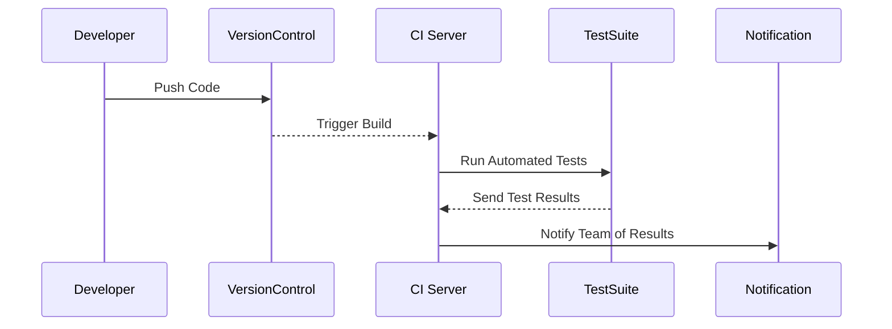

## Detailed Explanation

Continuous Integration (CI) is a vital DevOps practice aimed at improving the software development process. By continuously integrating code changes into a shared repository, CI enables teams to identify and resolve conflicts and issues early, leading to enhanced collaboration, faster delivery, and improved software quality.

Key components of CI include:

1. **Frequent Commits**: Developers are encouraged to commit their changes frequently, ideally multiple times a day, to a version control system such as Git.
  
2. **Automated Build Processes**: Every commit triggers an automated build process. This helps ensure that the latest code is always in a buildable state.

3. **Immediate Testing**: The build process involves executing automated tests. Immediate feedback enables developers to address any issues promptly.

4. **Feedback and Fail Fast**: CI systems provide immediate feedback on the quality of code, allowing the development team to identify failures early and take corrective action quickly.

5. **Integration with Code Quality Tools**: CI integrates with static analysis, code coverage, and other quality tools to provide comprehensive feedback on the code health.

## Architectural Approaches

In cloud environments, CI can be implemented in multiple ways:

- **CI as a Service**: Utilize cloud-based CI services such as Jenkins, CircleCI, Travis CI, or GitHub Actions. These platforms offer scalable, on-demand resources and integrate seamlessly with hosting services like AWS, Azure, and GCP.

- **Containerized Builds**: Use Docker and Kubernetes to containerize the build environment. This ensures consistency across different stages and environments.

- **Serverless CI Pipelines**: Build CI workflows using serverless functions for scalable and cost-effective solutions that only incur charges when builds or tests are running.

## Example Code

An example of a simple CI script using GitHub Actions:

```yaml
name: CI

on:
  push:
    branches: [ main ]
  pull_request:
    branches: [ main ]

jobs:
  build:
    runs-on: ubuntu-latest

    steps:
    - uses: actions/checkout@v2

    - name: Set up JDK 11
      uses: actions/setup-java@v1
      with:
        java-version: '11'

    - name: Build with Gradle
      run: ./gradlew build

    - name: Run tests
      run: ./gradlew test
```

## Diagrams

A CI process can be visualized using Sequence Diagram:



## Related Patterns with Descriptions

- **Continuous Delivery (CD)**: Builds on CI by automating the deployment of applications to staging or production environments following successful integration.

- **Infrastructure as Code (IaC)**: Practice of managing and provisioning infrastructure through code, supporting CI by providing consistent development and production environments.

- **Test-Driven Development (TDD)**: Development practice where test cases are written before the code itself, closely aligning with CI to maintain high code quality.

## Additional Resources

- [Martin Fowler's thoughts on Continuous Integration](https://martinfowler.com/articles/continuousIntegration.html)
- [Jez Humble's Continuous Delivery book](https://www.amazon.com/Continuous-Delivery-Deployment-Automation-Addison-Wesley/dp/0321601912)
- [GitHub Actions Documentation](https://docs.github.com/en/actions)

## Summary

Continuous Integration (CI) is an indispensable practice in modern software development. It streamlines collaboration among developers, identifies issues early, and maintains high software quality. By leveraging cloud-native CI tools and automating build and test activities, teams can enhance their development agility and responsiveness in an ever-evolving software landscape.
