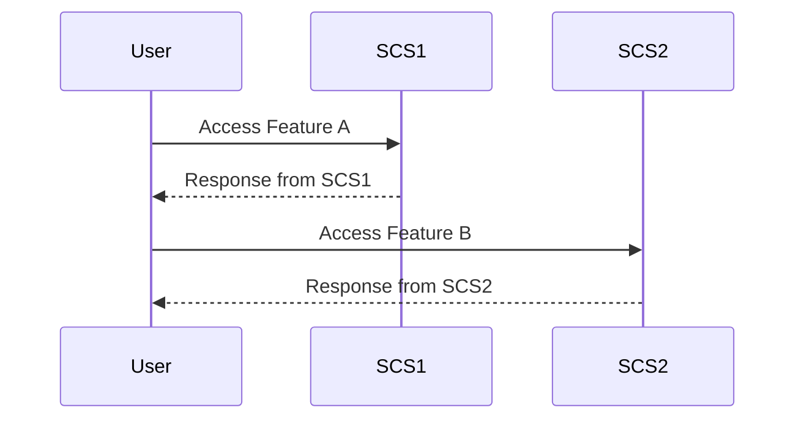

The Self-Contained Systems (SCS) pattern is a design pattern aimed at creating services within a distributed system that possess full functionality and can be deployed independently. This approach highlights the breakdown of monolithic applications into smaller, manageable pieces, each encapsulating its own data, logic, and user interface.

## Detailed Explanation

### Broad Overview

Self-Contained Systems are inspired by microservices but focus significantly on minimizing dependencies between systems, allowing each system to be developed, tested, deployed, and maintained independently. Each system encapsulates a slice of the domain model and typically follows a vertical architecture involving a user interface, logic, and a database.

Key characteristics of SCS include:

1. **Independent Deployment**: Each SCS can be deployed without coordinating with other systems, leveraging independently versioned APIs and isolated computational environments.
2. **Encapsulation of Functionality**: Every SCS should encapsulate a coherent subset of business functionality.
3. **Focus on Domain-Driven Design**: SCS advocates for building systems based on domain-driven design principles, creating systems around business capability.
4. **User Interface Inclusion**: Unlike microservices that may not incorporate a UI, SCS generally have their own UI, which enhances vertical scaling and improves user experience.

### Architectural Approaches

To implement the Self-Contained Systems pattern, certain architectural decisions and technology stacks can be beneficial:

- **Domain-Driven Design (DDD)**: Emphasize breaking down applications into self-contained domains.
- **Technological Diversity**: Allow SCS to choose technologies that suit their specific requirements – a different programming language, database, or framework might be more suitable for each separate concern.
- **API Management**: Use of APIs to communicate between systems and ensure loose coupling.
- **Monitoring & Logging**: Implement comprehensive monitoring and logging to track system health and identify issues independently.

### Best Practices

- **Loose Coupling**: Ensure SCS are loosely coupled with other systems, focusing on clear interfaces and protocols for inter-system communication.
- **High Cohesion**: Keep related functionalities and data models within the same system to reduce the need for external integration.
- **Resilience**: Each SCS should be designed with the capability to handle partial failures in mind to maintain overall system integrity.
- **Scalability**: Leverage cloud-native architectures to scale systems independently as needed.

### Example Code

Here is a basic example illustrating how an SCS might be implemented, utilizing a REST API in a Spring Boot application:

```java
import org.springframework.boot.SpringApplication;
import org.springframework.boot.autoconfigure.SpringBootApplication;
import org.springframework.web.bind.annotation.GetMapping;
import org.springframework.web.bind.annotation.RestController;

@SpringBootApplication
public class SCSApplication {

    public static void main(String[] args) {
        SpringApplication.run(SCSApplication.class, args);
    }
}

@RestController
class HelloController {

    @GetMapping("/api/hello")
    public String sayHello() {
        return "Hello from a Self-Contained System!";
    }
}
```

### Diagrams

Below is UML Sequence Diagram illustrating a high-level interaction between Self-Contained Systems:



## Related Patterns and Paradigms

- **Microservices Architecture**: SCS is a specialized form of microservices, with a heavier focus on complete autonomy, including the UI component.
- **Service-Oriented Architecture (SOA)**: Like SCS, SOA emphasizes services, though often at a larger scope and without the same independence.
- **Modular Monoliths**: In cases where full microservices are too complex, modular monoliths can be an interim step, providing discrete modules within a single application.

## Additional Resources

- **Books**: "Building Microservices" by Sam Newman for broader microservices context.
- **Articles**: "Self-Contained Systems" by Eberhard Wolff for deeper insights into SCS patterns.
- **Courses**: Online courses on distributed system design, such as those offered by Coursera or Udemy.

## Summary

The Self-Contained Systems pattern offers a strategic approach to crafting complex distributed systems with a focus on autonomy and independent deployability. By encapsulating data, logic, and user interfaces within each system, organizations can achieve tighter control and better scalability of their applications. This pattern provides an effective means of achieving flexibility and resilience in an evolving technical landscape.
