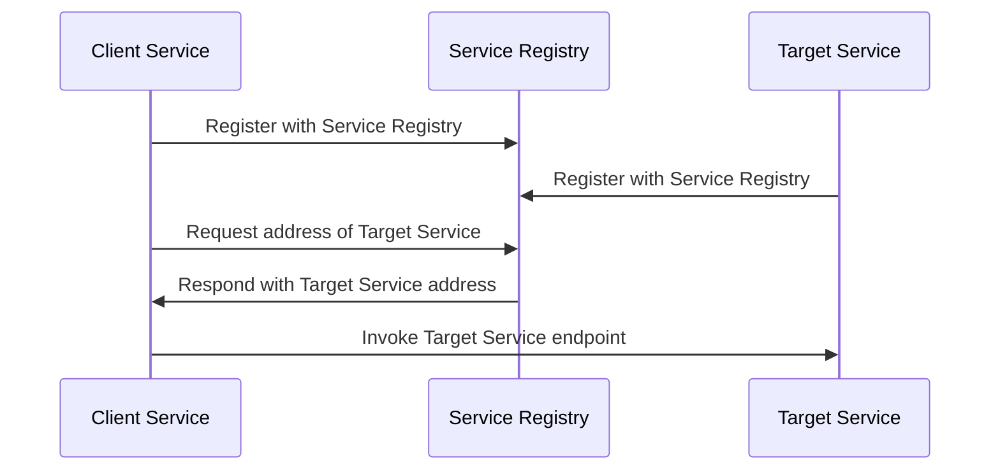

## Introduction

In a microservices architecture, services need to communicate with each other. However, as the number of services grows, managing the network locations of these services becomes increasingly complex. The **Service Registry** design pattern provides a solution by introducing a centralized service repository that allows for the registration and discovery of service instances.

## Problem Description

Services that need to interact must know the whereabouts and availability of other services. In dynamic cloud environments where instances may scale up or down, static IP or DNS-based location tracking becomes unreliable. 

## Solution

A **Service Registry** serves as a dynamic directory of network locations for service instances. 

- **Service Registration:** Each service instance registers itself with the registry upon startup, providing its address and other necessary metadata.
- **Service Discovery:** When a service wants to communicate with another service, it queries the registry to obtain the current location of the desired service instance.

## Architectural Requirements

1. **Centralized Directory:** A robust and highly available registry to ensure service discovery does not become a single point of failure.
2. **Self-registration/Unregistration:** Services must be capable of automatically registering and unregistering themselves.
3. **Health Checks:** The registry should support health checks to avoid routing traffic to failed instances.
4. **Scalability:** As the number of services increases, the registry should scale appropriately.

## Example Code

Here is an example of how a simple service registration and discovery might look in Java using Spring Cloud and Netflix Eureka.

```java
// Service Registration Configuration
@SpringBootApplication
@EnableEurekaServer
public class EurekaServerApplication {
    public static void main(String[] args) {
        SpringApplication.run(EurekaServerApplication.class, args);
    }
}

// Client Service Configuration
@SpringBootApplication
@EnableEurekaClient
public class ClientServiceApplication {
    public static void main(String[] args) {
        SpringApplication.run(ClientServiceApplication.class, args);
    }
    
    @Autowired
    private RestTemplateBuilder restTemplateBuilder;
    
    @Bean
    public RestTemplate restTemplate() {
        return restTemplateBuilder.build();
    }
    
    @RequestMapping("/invoke")
    public String invokeService() {
        return this.restTemplate()
            .getForObject("http://other-service/endpoint", String.class);
    }
}
```

## Diagram



## Related Patterns

- **Client-Side Discovery Pattern:** Relies on the client to keep track of available service instances.
- **Server-Side Discovery Pattern:** A proxy or router serves as an intermediary that handles service discovery.
- **Service Mesh:** Provides advanced traffic management, security, and observability for service-to-service communication.

## Additional Resources

- [Spring Cloud Netflix Documentation](https://spring.io/projects/spring-cloud-netflix)
- [Eureka: Service Discovery and Registration](https://cloud.spring.io/spring-cloud-netflix/multi/multi_spring-cloud-eureka-server.html)
- [Consul by HashiCorp](https://www.consul.io/)

## Summary

The **Service Registry** is essential to effectively managing microservice communications in dynamic cloud environments. By centralizing the registration and discovery of service instances, the pattern ensures efficient service interactions, scales to accommodate service growth, and supports high availability via built-in health checks. Understanding and implementing a Service Registry can significantly enhance the robustness and flexibility of distributed systems.
