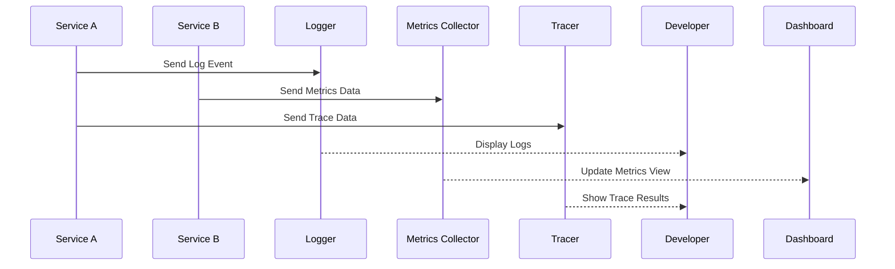

Observability is a crucial pattern in the realm of distributed systems and microservices, providing a comprehensive framework for understanding and interpreting system states based on telemetry data. This includes metrics, logs, and traces, allowing engineers to effectively monitor, debug, and optimize complex systems.

## Design Pattern Overview

### Definition

**Observability** in cloud-native environments entails a systematic approach to instrument systems so that any state can be inferred just by observing their outputs. It allows engineers to monitor the inner workings of a software system without the need to modify it.

### Core Components

1. **Metrics**: Numeric values that measure specific characteristics of a component or service over time. Common examples include CPU usage, request counts, and response times.
  
2. **Logs**: Textual entries that capture discrete events that occur within a service or system lifecycle, useful for error reporting and debugging.
  
3. **Tracing**: The record of the flow of requests from start to end across various services, enabling deep insights into latency issues and dependency tracking.

### Architectural Approach

Implementing observability in a cloud-native architecture typically involves:

- **Instrumenting Code**: Using specialized libraries and frameworks to emit metrics, logs, and traces.
  
- **Centralized Aggregation**: Systems like Prometheus, Elasticsearch, Kibana, and Grafana are used to collect, store, and visualize telemetry data.

- **Alerting and Visualization**: Setting up dashboards and alerts to react to system behaviors efficiently.

- **Analyzing and Acting**: Integrating machine learning and automated analysis to predict potential issues or optimizations.

## Best Practices

1. **Instrumentation at Design Time**: Plan for observability during the design phase of your service or application to ensure all critical operations are monitored.
   
2. **Consistent and Standardized Data**: Ensure your telemetry data maintains a consistent format across services for streamlined aggregation and analysis.
   
3. **Automated Dashboards and Alerts**: Automate the creation of alerting systems and dashboards to ease lifecycle management and response times.
   
4. **Vendor-Agnostic Tools**: Utilize open-source and vendor-neutral observability tools to avoid vendor lock-in and allow flexibility in your architecture.
   
5. **Security and Privacy**: Pay attention to how observability data is handled to ensure compliance with privacy laws and company policies.

## Example Code

Here's an example code snippet showcasing how to implement distributed tracing with OpenTelemetry in a microservice:

```java
import io.opentelemetry.api.GlobalOpenTelemetry;
import io.opentelemetry.api.trace.Span;
import io.opentelemetry.api.trace.Tracer;

public class OrderService {

  private static final Tracer tracer = GlobalOpenTelemetry.getTracer("OrderService");

  public void createOrder() {
    Span span = tracer.spanBuilder("createOrder").startSpan();
    try {
      // Logic for creating an order
      span.addEvent("Order Created");
    } finally {
      span.end();
    }
  }
}
```

## Diagrams

### Sequence Diagram

This sequence diagram demonstrates how an observability system processes data from various microservices:



## Related Patterns

- **Monitoring-as-a-Service**: Provides a comprehensive solution for monitoring and alerting without managing underlying infrastructure.
  
- **Metrics Aggregation**: Centralized collection and management of metrics from distributed sources.
  
- **Dynamic Scaling**: React to metrics and alerts to scale resources dynamically.

## Additional Resources

- [OpenTelemetry Documentation](https://opentelemetry.io/docs/)
- [Prometheus and Grafana Documentation](https://prometheus.io/)
- [Elasticsearch and Kibana Documentation](https://www.elastic.co/)

## Summary

Incorporating observability into cloud-native architectures allows developers and engineers to gain real-time insights into system performance, detect anomalies, and efficiently troubleshoot issues. By leveraging comprehensive telemetry data and implementing best practices, organizations can maintain robust, scalable, and resilient distributed systems. Understanding and implementing observability is a quintessential skill in managing modern microservice architectures effectively.
