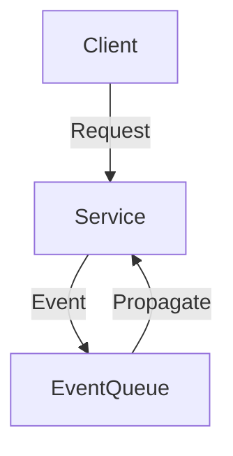
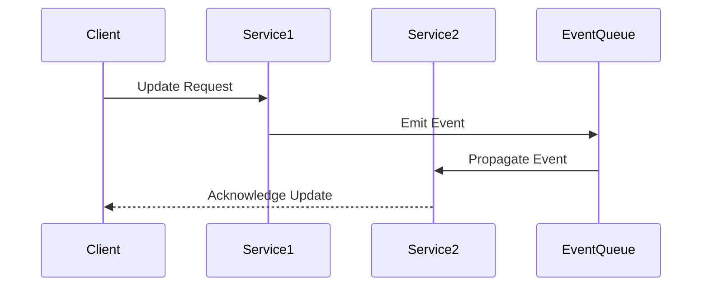

## Introduction

In distributed systems and microservices architecture, achieving immediate consistency is challenging due to the CAP theorem, which states that a distributed data store can only provide two of the following three guarantees: Consistency, Availability, and Partition Tolerance. Eventual Consistency Acceptance is a design pattern that acknowledges these limitations and focuses on maintaining high availability and partition tolerance by accepting a delay in consistency.

## Architectural Approach

This pattern involves:

- **Decoupling Services**: Services operate independently, updating their state asynchronously to eventual consistency.
- **Asynchronous Communication**: Using message queues and event streams to propagate changes across systems.
- **Versioning and Conflict Resolution**: Handling data conflicts using vector clocks, timestamps, or other mechanisms to ensure convergence.
- **Read Repair and Anti-Entropy**: Techniques to synchronize state gradually through background processes.

## Best Practices

- **Understand Domain Requirements**: Ensure the business logic can tolerate temporary inconsistencies.
- **Design for Idempotency**: Ensure repeated operations produce the same effect, helping in conflict resolution.
- **Implement Conflict Resolution Strategies**: Clearly define how conflicts are resolved, such as last-write-wins or merge strategies.
- **Monitoring and Alerting**: Implement tools to detect and alert on prolonged inconsistency periods.
- **Document Data Guarantees**: Clearly explain the guarantees your system offers to stakeholders.

## Example Code

Here is a simplified Scala example using Akka for asynchronous message passing:

```scala
import akka.actor.{Actor, ActorSystem, Props}
import akka.event.Logging

case object UpdateState
case object GetState
case class State(value: Int)

class EventuallyConsistentService extends Actor {
  val log = Logging(context.system, this)
  var state: State = State(0)

  def receive = {
    case UpdateState =>
      // Simulated asynchronous state update
      context.system.scheduler.scheduleOnce(100.milliseconds, self, GetState)(context.dispatcher)
      log.info("State update scheduled")
    
    case GetState =>
      state = State(state.value + 1)
      log.info(s"State updated to $state")
  }
}

object Main extends App {
  val system: ActorSystem = ActorSystem("EventualConsistencyExample")
  val service = system.actorOf(Props[EventuallyConsistentService], "service")

  service ! UpdateState
  Thread.sleep(500)
  system.terminate()
}
```

## Diagrams

### System Architecture Diagram



### Sequence Diagram



## Related Patterns

- **CQRS (Command Query Responsibility Segregation)**: Separates read and write concerns to improve scalability.
- **Saga Pattern**: Manages distributed transactions with eventual consistency by coordinating complex workflows.
- **Publish/Subscribe**: Decouples message producers and consumers, improving system responsiveness.

## Additional Resources

- [CAP Theorem](https://en.wikipedia.org/wiki/CAP_theorem)
- [Eventual Consistency](https://en.wikipedia.org/wiki/Eventual_consistency)
- Book: *Designing Data-Intensive Applications* by Martin Kleppmann

## Summary

Eventual Consistency Acceptance is a critical pattern for building highly available, partition-tolerant distributed systems. By understanding the trade-offs and implementing best practices, organizations can build robust microservices architectures that can tolerate temporary inconsistencies while ensuring overall system reliability.
