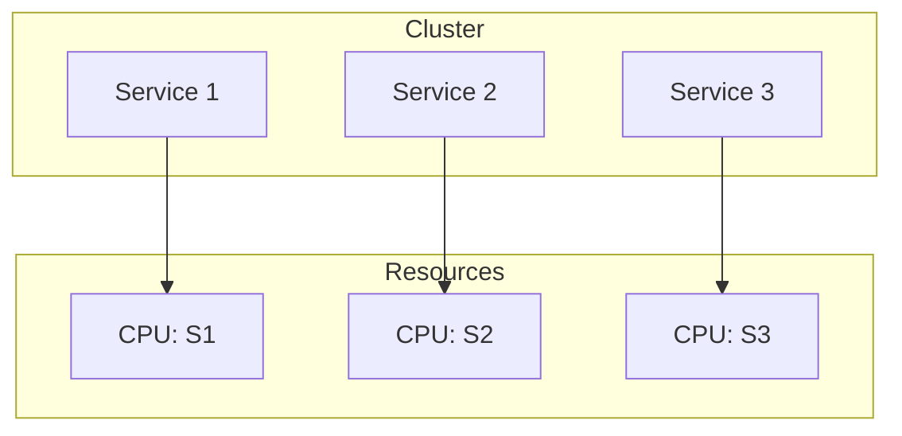

## Introduction

In a cloud-based distributed system, applications are often composed of multiple microservices, each handling a distinct business function. Effective resource management is crucial to maintain service reliability and performance. The Resource Isolation pattern addresses this challenge by allocating separate computational resources for each service to prevent resource contention.

## Design Pattern Description

The Resource Isolation design pattern ensures that each microservice or component within a distributed system is provided with its own dedicated resources. This approach prevents one service's behavior from negatively impacting others, particularly when resource demands fluctuate or spike.

### Key Principles

- **Dedicated Resources:** Allocate specific resources (CPU, memory, storage) to each microservice to avoid contention.
- **Service Independence:** Ensure that each service operates independently with minimized risk of being impacted by others.
- **Performance Stability:** Maintain consistent performance levels even under varying load conditions by isolating resources.

## Architectural Approaches

1. **Containerization:** Leveraging container technologies like Docker and Kubernetes can be instrumental in implementing Resource Isolation. Each service runs within its own container, with specific resource limits defined.

2. **Virtual Machines (VMs) and Serverless Architectures:** VMs provide hardware level isolation, while serverless computing abstracts infrastructure concerns, automatically allocating and managing resource limits.

3. **Isolation Within Cloud Provider Services:** Utilize cloud provider tools like AWS ECS/Fargate, Azure Container Instances, or GCP Cloud Run to orchestrate and manage isolated environments.

## Best Practices

- **Resource Quotas and Limits:** Set clear quotas and limits for CPU and memory usage for each service to ensure they do not exceed allocated resources.
- **Monitoring and Alerts:** Implement robust monitoring solutions to detect and alert on resource usage anomalies.
- **Automated Scaling:** Use horizontal and vertical scaling strategies to dynamically adjust resource allocation based on demand.
- **Regular Audits:** Conduct regular audits of resource usage to optimize allocation and efficiency.

## Example Code

### Kubernetes Example

```yaml
apiVersion: v1
kind: Pod
metadata:
  name: isolated-service-pod
spec:
  containers:
  - name: isolated-service-container
    image: example-image
    resources:
      requests:
        memory: "256Mi"
        cpu: "500m"
      limits:
        memory: "512Mi"
        cpu: "1"
```

This example configuration isolates a service within a Kubernetes Pod, defining specific memory and CPU limits to ensure isolation.

## Diagrams

### Resource Isolation with Containers



## Related Patterns

- **Circuit Breaker Pattern:** Prevents cascading failures by isolating failures in a single service from spreading across the system.
- **Bulkhead Pattern:** Similar to resource isolation, this pattern restricts resources for each service path to mitigate overload.
  
## Additional Resources

- [Kubernetes Resource Management](https://kubernetes.io/docs/concepts/configuration/manage-resources-containers/)
- [Understanding Cloud-Native Applications](https://aws.amazon.com/what-is/cloud-native/)
- [Serverless Computing and Resource Isolation](https://www.serverless.com/resources/)

## Summary

Resource Isolation is a fundamental pattern for maintaining high availability and performance in cloud-based distributed systems. By dedicating specific resources to each service, it ensures that fluctuations in demand do not lead to resource contention and service instability. This pattern is particularly effective when combined with container orchestration platforms like Kubernetes, leveraging their capabilities to manage resource allocation efficiently.
