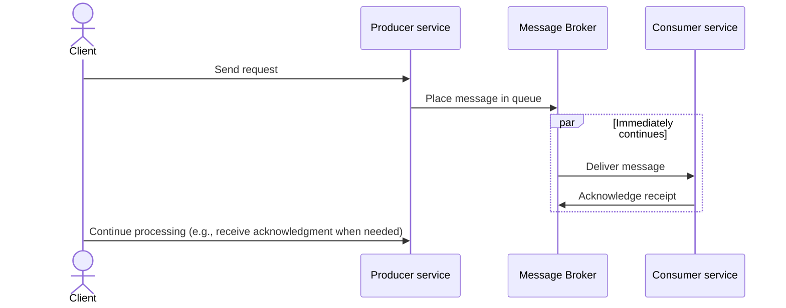

---

linkTitle: "Asynchronous Communication"
title: "Asynchronous Communication: Decoupling Services via Queues or Events"
category: "Distributed Systems and Microservices in Cloud"
series: "Cloud Computing: Essential Patterns & Practices"
description: "Explore how asynchronous communication facilitates the decoupling of services in distributed systems and microservices through the use of queues and events. This pattern helps enhance system reliability, scalability, and maintainability."
categories:
- Distributed Systems
- Microservices
- Cloud Computing
tags:
- Asynchronous Communication
- Event-Driven Architecture
- Decoupling
- Scalability
- Reliability
date: 2024-07-07
type: docs

canonical: "https://softwarepatternslexicon.com/18/22/4"
license: "© 2024 Tokenizer Inc. CC BY-NC-SA 4.0"
---

## Introduction

In distributed systems and microservices architectures, asynchronous communication is key to building scalable and resilient systems. Unlike synchronous communication, where services wait for a response, asynchronous communication allows for message exchange without blocking, letting services continue processing other tasks. This is achieved using queues, topics, or event buses.

## Benefits of Asynchronous Communication

1. **Decoupling**: By using asynchronous communication, services are decoupled from direct interactions, allowing changes or failures in one service to minimally affect others.
   
2. **Scalability**: Queues buffer requests, allowing backend services to handle load at their own pace, which supports better scalability.
   
3. **Resilience**: Systems can tolerate failures better because the messages are persisted in queues until processed, helping in handling intermittent failures gracefully.

4. **Responsiveness**: Clients are not blocked waiting for responses and can handle other operations concurrently, improving the perceived responsiveness.

## Architectural Approaches

### Messaging Systems

Messaging systems like Kafka, RabbitMQ, and AWS SQS facilitate asynchronous communication by serving as the middle layer where services produce and consume messages.

### Event-Driven Architecture

This uses events as a conceptual core where changes in state or significant events trigger reactions in other parts of the system. Tools used can include AWS SNS, Azure Event Grid, or Apache Kafka.

### Publish/Subscribe Systems

These systems, like MQTT or Google Cloud Pub/Sub, allow services to subscribe to specific topics and react when messages are published, enabling a flexible communication pattern where multiple subscribers can react to a single event.

## Example Code

### Producer and Consumer with Kafka

```java
// Producer
Properties props = new Properties();
props.put("bootstrap.servers", "localhost:9092");
props.put("key.serializer", "org.apache.kafka.common.serialization.StringSerializer");
props.put("value.serializer", "org.apache.kafka.common.serialization.StringSerializer");
Producer<String, String> producer = new KafkaProducer<>(props);
producer.send(new ProducerRecord<>("topic-name", "key", "message"));
producer.close();

// Consumer
Properties props = new Properties();
props.put("bootstrap.servers", "localhost:9092");
props.put("group.id", "test-group");
props.put("key.deserializer", "org.apache.kafka.common.serialization.StringDeserializer");
props.put("value.deserializer", "org.apache.kafka.common.serialization.StringDeserializer");
KafkaConsumer<String, String> consumer = new KafkaConsumer<>(props);
consumer.subscribe(Collections.singletonList("topic-name"));
while (true) {
    ConsumerRecords<String, String> records = consumer.poll(Duration.ofMillis(100));
    for (ConsumerRecord<String, String> record : records) {
        System.out.printf("offset = %d, key = %s, value = %s%n", record.offset(), record.key(), record.value());
    }
}
```

## Diagrams

### Asynchronous Communication Sequence Diagram



## Related Patterns

- **CQRS**: Segregates command and query responsibilities, often leveraging asynchronous messaging to handle commands and update view models asynchronously.
- **Saga Pattern**: Coordinates distributed transactions using events; each step in a saga sends a follow-up event that describes the result for the next step.

## Additional Resources

- [Building Scalable Applications with Asynchronous Messaging](https://aws.amazon.com/blogs/architecture/building-scalable-applications-with-asynchronous-messaging/)
- [Event-Driven Microservices: Concepts and Benefits](https://developers.redhat.com/articles/event-driven-microservices)

## Final Summary

Adopting asynchronous communication in your architecture provides several advantages, including improved decoupling, scalability, and system resilience. By allowing services to interact via queues or events, you can design systems that efficiently handle load and faults, leading to more robust cloud-native applications. Whether through messaging systems or full-fledged event-driven designs, asynchronous communication is a fundamental pattern in modern distributed systems.


