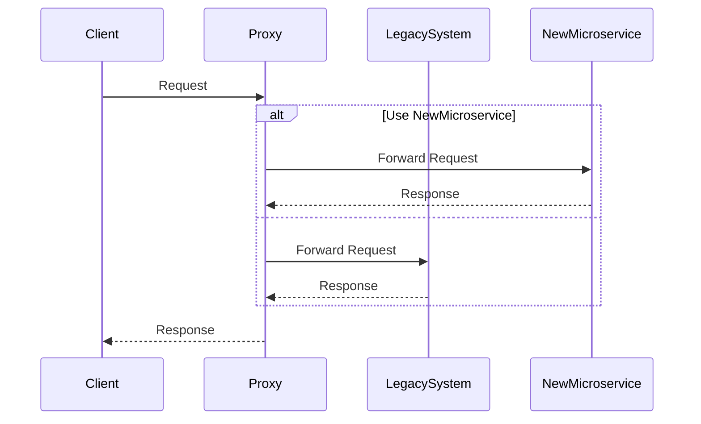

The **Strangler Pattern** is a software design approach aimed at incrementally transforming and modernizing legacy systems by gradually replacing specific components or functionalities with new microservice-based implementations. This pattern offers a seamless transition from monolithic architectures to more modular and flexible systems while preserving the existing functionality.

## Detailed Explanation
Legacy systems often pose challenges due to their monolithic design, outdated technologies, and high maintenance costs. The Strangler Pattern facilitates the gradual evolution of these systems into modern architectures by wrapping and replacing legacy components one at a time.

The name derives from the concept of a strangler vine that grows around a tree, replicating its nutrient uptake pathways. Over time, the vine can completely replace the tree's function. Similarly, this pattern involves building a new system around the existing one, gradually replacing the old functionality.

### Architectural Approach
1. **Identify Candidate Components**: Identify and prioritize legacy components or functionalities that need modernization.
   
2. **Create a Facade or Proxy**: Introduce a facade or proxy layer that intercepts calls to the legacy system, directing them to either the existing system or to the new microservices.
   
3. **Develop Functionality in Microservices**: Gradually develop and deploy new components as microservices, ensuring they replicate the behavior of the legacy components.
   
4. **Redirect Traffic**: Start directing traffic from the legacy system to the new microservices as they are developed.
   
5. **Decommission Legacy Components**: Once all features of a legacy component are implemented in the new system, retire the old component.

### Best Practices
- **Use Incremental Steps**: Break down the overhaul into manageable, incremental steps to reduce risk and complexity.
- **Ensure Backward Compatibility**: Maintain backward compatibility at all stages to avoid disruptions.
- **Continuous Monitoring and Testing**: Implement automated testing and monitoring to ensure the new microservices replicate the functionality and performance of the legacy system.
- **Clear Dependency Mapping**: Understand dependencies within the legacy system to effectively decouple components.

### Example Code
Here is a simplified example using Java and Spring Boot for creating a proxy.

```java
@RestController
public class LegacyProxyController {

    private final LegacyService legacyService;
    private final NewService newService;

    public LegacyProxyController(LegacyService legacyService, NewService newService) {
        this.legacyService = legacyService;
        this.newService = newService;
    }

    @GetMapping("/api/legacy-function")
    public ResponseEntity<String> handleRequest() {
        // Logic to decide if legacy or new service should handle the request
        boolean useNewService = determineServiceUsage();
        if (useNewService) {
            return newService.handleFunction();
        }
        return legacyService.handleFunction();
    }

    private boolean determineServiceUsage() {
        // Business logic to determine service usage
        return true; // Placeholder for example
    }
}
```

### Diagrams
Here's a simple illustration of the Strangler Pattern using Mermaid:



### Related Patterns
- **Anti-Corruption Layer**: Helps to prevent new components from being corrupted by legacy paradigms.
- **Adapter Pattern**: Facilitates communication between new and old components by adapting interfaces.

### Additional Resources
- [Migrating to Microservices with the Strangler Pattern](https://martinfowler.com/articles/strangler-fig.html)
- [Building Microservices: Designing Fine-Grained Systems by Sam Newman](https://www.oreilly.com/library/view/building-microservices/9781491950340/)

## Final Summary
The Strangler Pattern provides an organized, incremental approach to modernize legacy systems without causing significant disruptions. By strategically decomposing the monolithic architecture into microservices, organizations can enhance flexibility, scalability, and maintainability. As a result, companies can leverage newer technologies and architectures more effectively, setting the foundation for innovation and growth in a cloud-enabled future.
