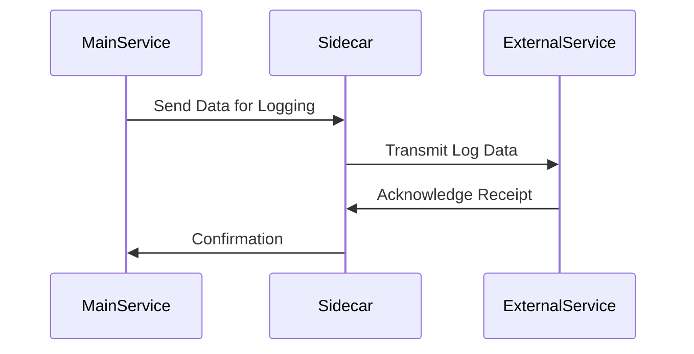

## Introduction

The **Sidecar Pattern** is a design pattern often used in microservices and distributed systems to extend or enhance the functionality of a service without altering its code. It involves deploying an auxiliary service ('sidecar') alongside the primary application service, typically within the same deployment unit or environment container.

## Purpose and Benefits

The primary goal of the Sidecar Pattern is to introduce additional functionalities like logging, configuration, service discovery, and networking capabilities without the need to modify the original service code. This pattern is beneficial for seamlessly implementing cross-cutting concerns.

### Key Benefits:
- **Encapsulation of Development Concerns:** Allows separation of main application logic from auxiliary tasks.
- **Improved Maintainability and Scalability:** Facilitates independent updates and scaling of sidecars without affecting the primary service.
- **Decoupling Enhancements:** Enhances functionalities such as monitoring and networking separately from the service logic, maintaining clean architecture.
- **Flexibility:** Easy to integrate and decommission services and third-party components.

## Implementation

The Sidecar Pattern is typically implemented in container orchestration environments like Kubernetes, where each pod can host a primary application container alongside one or more sidecar containers.

### Example Code

**Step 1:** Define a Kubernetes Pod with Sidecar:

```yaml
apiVersion: v1
kind: Pod
metadata:
  name: example-pod
spec:
  containers:
  - name: main-app
    image: main-app-image
    ports:
    - containerPort: 8080
  - name: logging-sidecar
    image: logging-agent-image
    ports:
    - containerPort: 12201
```

**Step 2:** Configure the sidecar to interact with the main application, such as through shared volume mounts or environment variables.

### UML Sequence Diagram



## Best Practices

- **Isolation:** Ensure that the sidecar and main application have clear delineations in responsibilities.
- **Resource Management:** Allocate appropriate resources to each sidecar to avoid contention with the primary service.
- **Consistency:** Ensure sidecars are consistently configured across different deployments to maintain uniform behavior.
- **Monitoring:** Implement adequate monitoring within sidecars to observe their impact on system performance.

## Related Patterns

- **Service Mesh:** A broader architectural model that typically includes the sidecar pattern to manage communications between microservices through a dedicated infrastructure layer.
- **Adapter Pattern:** Allows disparate systems to communicate by adding a compatible interface, often used in conjunction with sidecars.
- **Ambassador Pattern:** Similar to sidecar but focuses more on handling communication between services and external entities.

## Additional Resources

- [Istio Documentation](https://istio.io/latest/docs/concepts/what-is-istio/)
- [Kubernetes Documentation on Sidecars](https://kubernetes.io/docs/concepts/workloads/pods/#using-pods)
- [Service Mesh Patterns](https://www.infoq.com/articles/understanding-service-mesh)

## Summary

The Sidecar Pattern is a powerful tool in the cloud architect's toolkit, offering a means to extend application functionality without impacting the service's core codebase. By decoupling features such as monitoring, configuration, and networking, teams can effectively manage and scale their services within distributed systems and microservices-oriented architectures. Its application is best suited in environments where modularity, scalability, and seamless integration are paramount.
