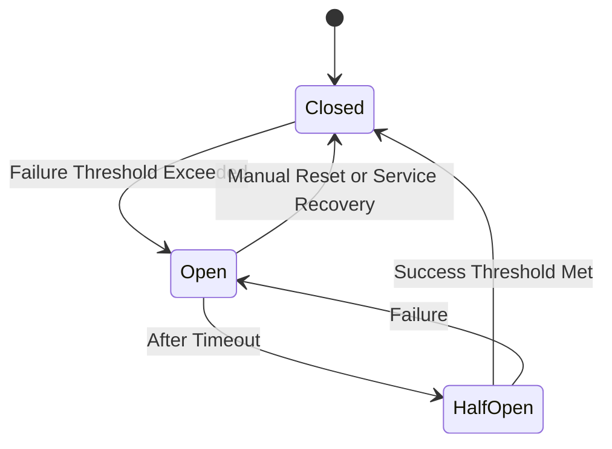

## Overview

In a microservices architecture, dependencies on other services are inevitable. Whenever one of these services fails, it can create a cascading effect, leading to widespread outages. The Circuit Breaker pattern is a resilience pattern that prevents such failure propagation by automatically detecting when a service is failing and halting requests to it until it's restored. This ensures that the overall system remains responsive and failures are isolated.

## Design Pattern Concept

The Circuit Breaker design pattern acts like an electrical circuit breaker that prevents the flow of electricity when there is an issue. In software, the Circuit Breaker works by automatically tracking failures in a service and preventing requests to that service when the failure threshold is exceeded. It transitions between different states to manage the flow of requests:

- **Closed**: Requests are allowed to pass through. If failures reach a specified threshold, it transitions to the open state.
- **Open**: Requests are immediately blocked, and an error is returned. After a timeout period, it transitions to a half-open state.
- **Half-Open**: A limited number of test requests are allowed through. If they succeed, the circuit transitions back to the closed state. If they fail, it transitions back to the open state.

## Best Practices

1. **Appropriate Thresholds**: Set failure thresholds and timeouts based on your system’s tolerance to prevent unnecessary service interruptions.
2. **Monitoring & Logging**: Continuously monitor the status of the circuit breaker and maintain logs to understand service health and performance.
3. **Fallback Mechanisms**: Implement fallback methods to provide alternative responses to service requests when the circuit is open.
4. **Fine-Tuning**: Adjust circuit breaker settings based on the varying load during peak and off-peak hours.
5. **Integration with Load Balancers**: Combine with load balancers to redirect traffic away from unhealthy services.

## Example Code

Here is a simple example in Java using the Resilience4j library:

```java
import io.github.resilience4j.circuitbreaker.CircuitBreaker;
import io.github.resilience4j.circuitbreaker.CircuitBreakerConfig;
import io.github.resilience4j.circuitbreaker.CircuitBreakerRegistry;
import java.time.Duration;

public class CircuitBreakerExample {
    public static void main(String[] args) {
        CircuitBreakerConfig config = CircuitBreakerConfig.custom()
                .failureRateThreshold(50)
                .waitDurationInOpenState(Duration.ofSeconds(10))
                .permittedNumberOfCallsInHalfOpenState(3)
                .build();

        CircuitBreakerRegistry registry = CircuitBreakerRegistry.of(config);

        CircuitBreaker circuitBreaker = registry.circuitBreaker("sampleCircuitBreaker");

        // Function call wrapped with Circuit Breaker
        String result = circuitBreaker.executeSupplier(() -> {
            // Implement service call here
            return "All Good!";
        });

        System.out.println(result);
    }
}
```

## Diagram



## Related Patterns

- **Retry Pattern**: Automatically retry failed operations at regular intervals.
- **Timeout Pattern**: Define time limits for operations to avoid prolonged waiting times.

## Additional Resources

- [Resilience4j Documentation](https://resilience4j.readme.io/)
- [Microservices Patterns: With examples in Java by Chris Richardson](https://www.manning.com/books/microservices-patterns)

## Summary

The Circuit Breaker pattern is an essential tool in developing resilient software systems, particularly in microservices environments. By preventing the propagation of failures, it ensures better resource management, reduces downtime, and contributes to a system's overall robustness. Implementing Circuit Breaker effectively requires careful consideration of system dynamics and consistent monitoring to adjust thresholds and settings as needed.
