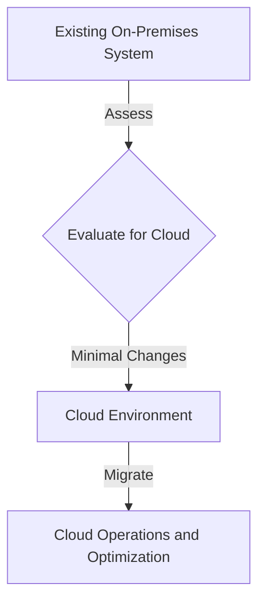

## Introduction

The **Lift and Shift** pattern is a cloud migration strategy that involves moving applications to the cloud with minimal or no changes to the architecture. This approach is often used by businesses seeking to quickly take advantage of cloud benefits, such as scalability and cost optimization, without the high initial investment required for a full redesign or re-architecture of their legacy systems.

## Detailed Explanation

### Characteristics of the Lift and Shift Pattern

- **Minimal Change Required:** The primary focus is on replicating the existing on-premises environment in the cloud.
- **Speed of Migration:** It allows for faster migration compared to other methods that require detailed redesign and refactoring.
- **Initial Cost Efficiency:** Reduces upfront costs since applications do not require redevelopment to conform to cloud-native architectures.
- **Risk Reduction:** Limits the risk involved as the application logic and dependencies remain largely unchanged.

### When to Use Lift and Shift

The Lift and Shift strategy is optimal in scenarios such as:
- **Urgent Need for Cloud Migration:** When there's a compelling event such as data center lease expiration.
- **Cost Optimization Efforts:** Quickly reducing operational costs by moving to a more cost-efficient cloud environment.
- **Resource Constraints:** Organizations with limited resources to conduct extensive redesign efforts.
- **Regulatory or Compliance Requirements:** Where cloud compliance is rapidly becoming a necessity.

### Architectural Approach

- **Infrastructure as a Service (IaaS):** Applications are deployed in virtual machines, similar to their existing on-premises setup.
- **Containerization (Optional):** While traditional VMs are used, there's potential for using containers to achieve easier management and orchestration.
- **Replication of the Environment:** Mirror existing network, security settings, and other infrastructural components.

### Best Practices

- **Assessment and Inventory:** Conduct a thorough assessment of applications to identify those suitable for lift and shift.
- **Dependency Mapping:** Map out all application dependencies and ensure they are mirrored in the cloud environment.
- **Performance Monitoring:** Set up monitoring to ensure that performance is consistent post-migration.
- **Security Audit:** Conduct a security audit to adapt existing policies to cloud configurations.

## Example Code

Here's an example of using Terraform to lift and shift a VM to AWS:

```hcl
provider "aws" {
  region = "us-west-2"
}

resource "aws_instance" "lift_and_shift_example" {
  ami           = "ami-0c55b159cbfafe1f0"
  instance_type = "t2.micro"

  tags = {
    Name = "LiftAndShiftInstance"
  }
}
```

## Diagrams

### Lift and Shift Flow



## Related Patterns

- **Replatform:** Similar to Lift and Shift but involves altering certain components for better performance in the cloud.
- **Refactor:** Requires substantial code changes to leverage cloud-native benefits like serverless computing.
- **Hybrid Cloud Pattern:** Combining on-premises and cloud resources for specific applications.

## Additional Resources

- [Azure's Lift and Shift Strategy](https://azure.microsoft.com/en-ca/blog/what-is-cloud-lift-and-shift-strategy/)
- [AWS Lift and Shift Guide](https://aws.amazon.com/cloud-migration/lift-shift/)
- [Google Cloud Migration Guide](https://cloud.google.com/migrate)

## Summary

The Lift and Shift pattern is an efficient strategy for companies needing rapid migration to the cloud without significant disruption or resource investment. While it may not take full advantage of cloud-native features, it facilitates cost reduction, increases availability, and acts as a stepping stone for future modernization.

By understanding and applying the Lift and Shift pattern strategically, businesses can make the transition to cloud computing seamlessly while setting an agenda for future improvements.
