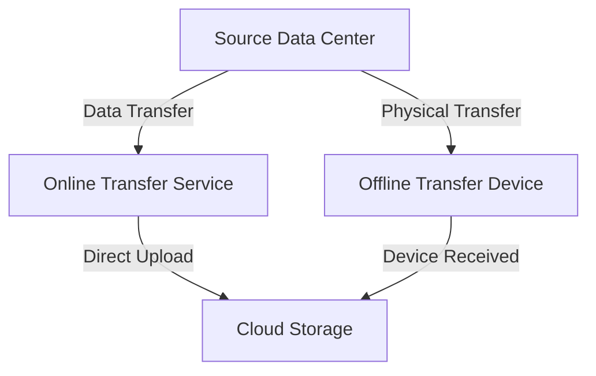

## Introduction

As organizations migrate to the cloud, transferring large volumes of data becomes a complex challenge. Simply using the internet for such massive data transfers can be slow, costly, and impractical. To address this, cloud providers offer specialized **Data Transfer Services** that enable efficient and secure transfer of large data sets. This design pattern explores these services, offering guidance on best practices and providing examples of how to effectively incorporate them into a cloud migration strategy.

## Design Pattern Description

The **Data Transfer Services** pattern involves utilizing specialized cloud provider services or physical devices to transfer large amounts of data between on-premises infrastructure and cloud environments. This pattern addresses the limitations of conventional internet-based data transfers, providing solutions that are tailored for high-volume and high-velocity data transport.

### Key Characteristics

1. **High-throughput Transfer**: Designed to handle large-scale data efficiently, reducing the time required for data migration.
2. **Secure Transmission**: Ensures that data is encrypted and protected during transit, mitigating the risk of data breaches.
3. **Cost-effective Solutions**: Optimizes costs compared to traditional internet-based transfers, especially for massive data sets.
4. **Scalability**: Accommodates the growth in data volume and transfer needs as organizations expand their digital footprint.

## Architectural Approaches

1. **Online Transfer Services**: Utilize cloud-native services, like AWS Snowcone, Azure Data Box Online, or Google Transfer Appliance, which offer dedicated bandwidth and secure connections for data upload.
   
2. **Offline Transfer Devices**: Deploy physical devices provided by cloud providers, such as AWS Snowball or Azure Data Box, that you can fill on-premises and send to the provider for direct upload to the cloud.

3. **Hybrid Approaches**: Combine online and offline techniques to optimize transfer speed and cost based on the specific needs and constraints of your data.

## Best Practices

- **Plan and Estimate**: Thoroughly plan your data transfer by estimating data volume, transfer time, and understanding cost implications.
- **Data Segmentation**: Divide data into manageable segments to facilitate faster transfer and tracking.
- **Network Considerations**: Evaluate network bandwidth and reliability to choose an appropriate transfer method.
- **Security Protocols**: Implement strong encryption methodologies for data in transit and at rest.
- **Testing and Validation**: Conduct a pilot transfer to identify and remediate potential issues before executing full-scale data migrations.

## Example Code

Suppose you are using AWS Snowball for offline data transfer. Here's an example of initializing a data transfer job:

```python
import boto3

client = boto3.client('snowball', region_name='us-west-2')

response = client.create_job(
    JobType='IMPORT',
    Resources={
        'S3Resources': [
            {
                'BucketArn': 'arn:aws:s3:::my-data-bucket',
                'KeyRange': {
                    'BeginMarker': 'example-begin',
                    'EndMarker': 'example-end',
                }
            },
        ]
    },
    RoleARN='arn:aws:iam::123456789012:role/SnowballS3LambdaRole'
)

print("Job created with ID:", response['JobId'])
```

## Diagrams

### Data Transfer Services Architecture



## Related Patterns

1. **Cloud Data Migration**: Strategies and tools to plan and execute cloud migrations.
2. **Data Pipeline Optimization**: Enhancements to ensure data flows are robust and efficient across platforms.
3. **Hybrid Cloud Deployment**: Utilizing both on-premise and cloud solutions for flexible infrastructure.

## Additional Resources

- AWS Snowball Documentation: [AWS Snowball](https://aws.amazon.com/snowball/)
- Azure Data Box Documentation: [Azure Data Box](https://azure.microsoft.com/en-us/services/databox/)
- Google Cloud Transfer Appliance: [GCP Transfer Appliance](https://cloud.google.com/storage/transfer-appliance/)

## Summary

The **Data Transfer Services** design pattern provides critical infrastructure for transferring large-scale data to cloud environments efficiently and securely. By leveraging both online and offline data transfer solutions, organizations can significantly reduce the complexity, cost, and time involved in cloud migrations, all while ensuring data security and integrity. By following best practices and understanding the specific services offered by cloud providers, enterprises can create a robust data migration strategy that aligns with their digital transformation goals.
