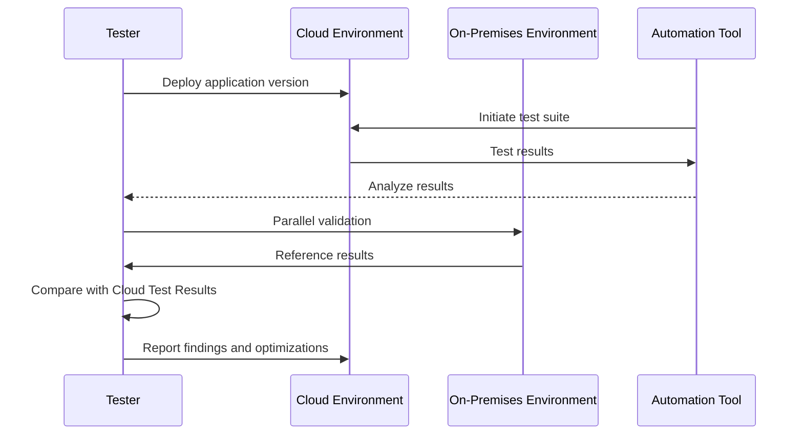

Migration Testing is a crucial pattern within the broader domain of cloud migration strategies. It involves validating applications in cloud environments before proceeding with a full cutover. This approach helps identify potential issues and discrepancies that may arise during the migration of applications and services from on-premises data centers to cloud platforms.

## Detailed Explanation

Migration testing aims to ensure that applications perform as expected in the new cloud environment. It serves several purposes:

1. **Verification of Functionality**: Ensures that applications work as intended after migration.
2. **Performance Assessment**: Evaluates application performance on the cloud to identify potential bottlenecks.
3. **Integration Checks**: Verifies that integrations with other systems operate smoothly in the cloud framework.
4. **Security and Compliance Assessment**: Ensures data security and regulatory compliance standards are met.
5. **User Acceptance Testing (UAT)**: Involves end-users in testing to confirm that the application serves its intended purpose in the cloud environment.

### Architectural Approaches and Best Practices

1. **Incremental Testing**:
   - Break down the migration into smaller, manageable parts.
   - Perform testing at each stage to resolve issues early and reduce overall risk.

2. **Environment Replication**:
   - Create a mirrored cloud environment that replicates the production setup.
   - Test applications in this environment to gain insights into expected performance and potential disruptions.

3. **Automation of Test Cases**:
   - Use automated testing tools to quickly and efficiently run comprehensive test suites.
   - Automate regression testing to ensure that existing functionality remains intact post-migration.

4. **Parallel Testing**:
   - Run applications simultaneously in both the original and cloud environments.
   - Compare outputs and performance metrics to ensure consistency and reliability.

5. **Load and Stress Testing**:
   - Simulate high-load scenarios to assess how applications perform under stress in the cloud.
   - Use these tests to fine-tune application configurations and scaling policies.

6. **Security and Compliance Checks**:
   - Embed security testing throughout the migration process.
   - Conduct compliance assessments to ensure adherence to industry regulations.

## Example Code

Here's a simple example of using a tool like JUnit for automated migration testing in Java:

```java
import static org.junit.Assert.*;
import org.junit.Test;

public class MigrationTest {

    @Test
    public void testApplicationFunctionality() {
        // Simulate an application feature
        int result = application.add(2, 3);
        assertEquals("Simple addition should return 5", 5, result);
    }

    @Test
    public void testPerformance() {
        long startTime = System.nanoTime();
        // Run a performance-heavy feature
        application.processLargeDataset();
        long endTime = System.nanoTime();
        long duration = (endTime - startTime) / 1_000_000; // Convert to milliseconds
        assertTrue("Performance should complete within acceptable time frame", duration < 2000);
    }
}
```

## Diagrams

### Sequence Diagram for Migration Testing



## Related Patterns

- **Blue-Green Deployment**: Used for smooth transitions from one version to another, minimizing downtime and reducing risks.
- **Canary Release**: Gradually rolling out new versions to a subset of users for testing and feedback before a full-scale deployment.

## Additional Resources

- [AWS Cloud Migration Testing Strategy](https://aws.amazon.com)
- [Azure Migration Guide](https://azure.microsoft.com/migration)
- [Google Cloud Migration Best Practices](https://cloud.google.com)

## Summary

Migration Testing is a strategic approach to ensure seamless application transitions to cloud environments. By prioritizing functionality, performance, and compliance checks, organizations can confidently migrate applications with minimized risks and optimized performance post-migration. Integrating automated testing and leveraging parallel and incremental testing can significantly bolster the success of cloud migrations.
