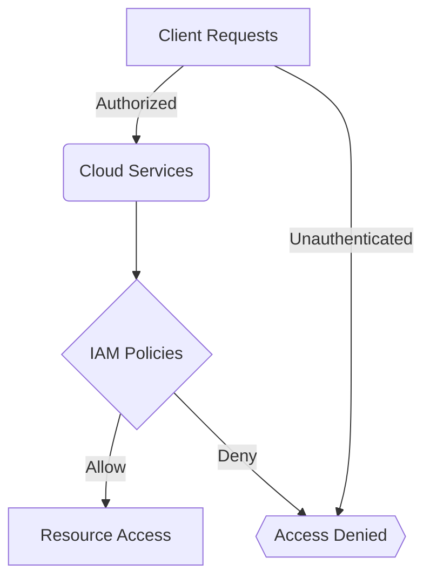

## Introduction

When migrating applications to the cloud, security becomes a pivotal concern that requires careful planning and execution. The dynamic nature of cloud environments introduces new security challenges and considerations that must be addressed to protect data integrity, privacy, and compliance.

## Architectural Approaches

### Zero Trust Architecture

Adopting a Zero Trust model involves never assuming trust. Every request to the cloud resources must be authenticated and authorized, regardless of its origin. This architecture promotes stringent access controls, continuous monitoring, and validation at every stage.

### Encryption

Data encryption, both at rest and in transit, is non-negotiable. Ensure all sensitive data is encrypted using strong cryptographic algorithms. Cloud-native encryption services, such as AWS KMS, Azure Key Vault, or GCP Cloud KMS, can help manage encryption keys securely.

### Identity and Access Management (IAM)

Implement rigorous IAM policies to control user access and privileges in cloud environments. Use roles, groups, and policies to minimize human error and potential access breaches.

### Security Information and Event Management (SIEM)

Implement SIEM solutions that are cloud-ready to collect and analyze security logs, providing real-time visibility into potential threats and security incidents.

## Best Practices

1. **Conduct a Security Assessment**: Before migration, perform a comprehensive security assessment of your current applications to identify vulnerabilities and plan remediation in the cloud context.

2. **Data Protection**: Prioritize data protection mechanisms specific to your data's sensitivity levels. Use cloud provider-specific tools for data classification and protection.

3. **Compliance Management**: Ensure adherence to compliance frameworks such as GDPR, HIPAA, or other industry-specific regulations. Leverage cloud compliance frameworks offered by cloud providers.

4. **Network Security**: Deploy network security groups, firewalls, and VPNs to ensure that data and services are accessible only to authorized entities.

5. **Regular Audits and Penetration Testing**: Continuously monitor and audit your cloud deployment for security posture. Conduct regular penetration tests to identify and mitigate potential vulnerabilities.

## Example Code

Below is an example of setting up a basic IAM policy in AWS to restrict access to an S3 bucket:

```json
{
  "Version": "2012-10-17",
  "Statement": [
    {
      "Effect": "Allow",
      "Action": "s3:GetObject",
      "Resource": "arn:aws:s3:::example-bucket/*",
      "Condition": {
        "IpAddress": {
          "aws:SourceIp": "203.0.113.0/24"
        }
      }
    }
  ]
}
```

## Diagrams

### Security Reference Architecture



## Related Patterns

- **Data Sovereignty**: Ensures data storage and processing comply with regional legal requirements.
- **Multi-Factor Authentication (MFA)**: Adds an extra layer of security by requiring more than one form of verification.

## Additional Resources

- [AWS Security Best Practices](https://aws.amazon.com/whitepapers/security/)
- [Azure Security Documentation](https://docs.microsoft.com/en-us/azure/security/)
- [Google Cloud Security Overview](https://cloud.google.com/security/)

## Summary

Migration to the cloud requires a paradigm shift in security strategies and practices. By adopting robust security architectures, employing best practices, and leveraging cloud-native security tools and services, organizations can create a secure cloud environment that safeguards against evolving threats and complies with regulation. Prioritize security throughout the cloud migration lifecycle to ensure business continuity and protect critical assets.
