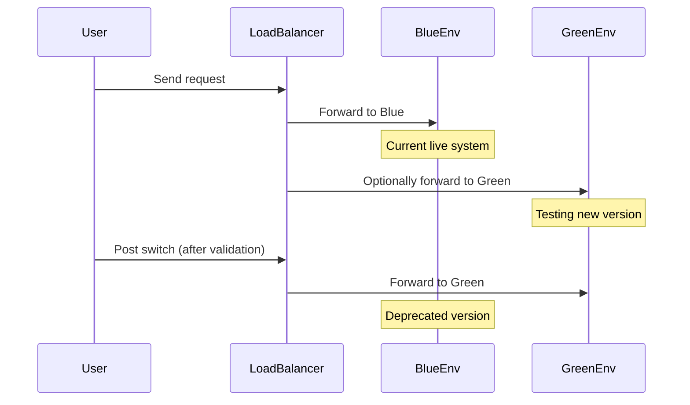

When a cloud migration is executed, one of the key concerns is minimizing downtime to ensure that applications remain available and users are not adversely affected. Several strategies can be employed to minimize downtime, including parallel running, blue-green deployment, the use of feature toggles, and more. This article delves into these strategies, laying out the steps and considerations for effectively reducing downtime during migration processes.

## Key Strategies for Minimizing Downtime

### 1. Parallel Running

**Parallel Running** involves operating both the old and new systems concurrently. This method allows for thorough testing in real environments to ensure the new system performs as expected before decommissioning the old one.

**Advantages:**
- Mitigates risk by having a fallback option.
- Provides a safety net to address unforeseen issues that arise post-migration.

**Challenges:**
- Requires synchronization mechanisms to ensure data consistency across systems.
- Higher resource usage by running two systems simultaneously.

### 2. Blue-Green Deployment

In **Blue-Green Deployment**, two environments are maintained: one currently serving all production traffic (e.g., "Blue") and another where the next release can be deployed and tested (e.g., "Green"). Once the new environment is validated, traffic is switched over with minimal downtime.

**Advantages:**
- Enables zero-downtime deployments.
- Swift rollback to the previous version if issues are detected.

**Challenges:**
- Duplicates infrastructure costs until the switch-over.
- Requires robust load balancing and traffic management solutions.

### 3. Feature Toggles

Using **Feature Toggles**, specific features can be turned on or off dynamically, enabling features to be deployed in production without making them visible to users immediately. This approach allows controlled feature rollouts and facilitates seamless integration testing.

**Advantages:**
- Decouples deployment from release.
- Enables gradual feature evaluation in production.

**Challenges:**
- Increases code complexity.
- Requires robust tracking and management of feature states.

### 4. Canary Releases

**Canary Releases** involve deploying the new version to a small subset of users to evaluate its performance under real conditions before full deployment.

**Advantages:**
- Provides incremental feedback, allowing for early detection of issues.
- Minimizes impact on the overall user base in case of failure.

**Challenges:**
- Requires implementation of sophisticated monitoring to assess canary performance.
- Potential inconsistency in user experience during the rollout phase.

## Example Code for Blue-Green Deployment in Kubernetes

Here is a simple example of how you might implement a blue-green deployment strategy using Kubernetes:

```yaml
apiVersion: apps/v1
kind: Deployment
metadata:
  name: web-app-blue
spec:
  replicas: 3
  selector:
    matchLabels:
      app: web-app
      version: blue
  template:
    metadata:
      labels:
        app: web-app
        version: blue
    spec:
      containers:
      - name: web-app
        image: web-app:blue-latest
        
---

apiVersion: apps/v1
kind: Deployment
metadata:
  name: web-app-green
spec:
  replicas: 3
  selector:
    matchLabels:
      app: web-app
      version: green
  template:
    metadata:
      labels:
        app: web-app
        version: green
    spec:
      containers:
      - name: web-app
        image: web-app:green-latest
```

## Diagrams

### Blue-Green Deployment Architecture



## Related Patterns

- **Circuit Breaker**: Prevents operations that are likely to fail from being executed, allowing your system to remain responsive.
- **Bulkhead**: Isolates different parts of services to avoid cascading failures.
- **Strangler Fig**: Gradually replaces legacy systems by creating a coexisting parallel system.

## Additional Resources

- *Cloud Native Patterns: Designing change-tolerant software* by Cornelia Davis.
- *Site Reliability Engineering: How Google Runs Production Systems* by Niall Richard Murphy et al.
- [Kubernetes Patterns](https://k8spatterns.io/) - A comprehensive guide on managing containerized application patterns.

## Summary

Downtime Minimization Strategies are pivotal in maintaining business continuity during cloud migrations. By employing techniques such as parallel running, blue-green deployments, feature toggles, and canary releases, organizations can ensure that user impact is minimized, and system integrity is maintained. By understanding and implementing these methodologies, cloud migrations become more predictable and less disruptive, ultimately driving successful digital transformation.
