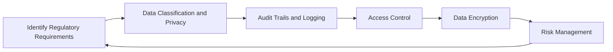

## Overview

As enterprises continue to migrate their operations to the cloud, maintaining compliance with industry regulations and governance frameworks becomes critical. The "Compliance and Governance Adherence" pattern ensures that your data and operations remain within the legal boundaries and organizational guidelines during cloud migration. This pattern provides a structured approach to addressing the unique regulatory challenges faced during migration.

## Design Pattern Details

### Key Considerations

1. **Identify Regulatory Requirements**:
   - Catalog all pertinent regulations such as GDPR, HIPAA, or PCI-DSS relevant to your industry and region.

2. **Data Classification and Privacy**:
   - Classify data based on sensitivity and ensure that personally identifiable information (PII) is handled and migrated securely.
   
3. **Audit Trails and Logging**:
   - Implement systems to ensure comprehensive logging and monitoring are in place to maintain records for audits.

4. **Access Control**:
   - Enforce strict Identity and Access Management (IAM) policies to restrict data access during migration.

5. **Data Encryption**:
   - Utilize data encryption at rest and in transit to protect sensitive information.

6. **Risk Management**:
   - Conduct risk assessments to identify potential compliance breaches during the migration process.

### Architectural Diagram



## Implementation Strategies

### Example Code Snippet

Below is a basic example using AWS IAM to enforce access control:

```javascript
// Define IAM policy for data migration
const migrationPolicy = {
  Version: "2012-10-17",
  Statement: [
    {
      Effect: "Allow",
      Action: [
        "s3:GetObject",
        "s3:PutObject"
      ],
      Resource: "arn:aws:s3:::example-bucket/*",
      Condition: {
        StringEquals: {
          "aws:RequestTag/team": "migration"
        }
      }
    }
  ]
};

// Applying IAM policy to a user/role
const applyIAMPolicy = (iam, role) => {
  iam.attachRolePolicy({
    RoleName: role,
    PolicyDocument: JSON.stringify(migrationPolicy)
  });
};
```

## Related Patterns

- **Data Masking**: Protect sensitive information by masking data as it is migrated to the cloud.
- **Secure Communication Design**: Ensure secure transmission of data during migration with the adoption of TLS/SSL protocols.
- **Identity Federation**: Utilize identity federation mechanisms to extend your existing access controls to cloud environments.

## Additional Resources

- [AWS Compliance Center](https://aws.amazon.com/compliance/)
- [Azure Compliance Offerings](https://azure.microsoft.com/en-us/overview/trusted-cloud/compliance/)
- [GDPR Compliance Implementation](https://gdpr-info.eu/)

## Summary

Applying the "Compliance and Governance Adherence" pattern during cloud migration ensures enterprises meet regulatory obligations and governance frameworks. By adopting a structured approach for compliance, organizations can mitigate risks, maintain data integrity, and avoid costly legal repercussions. The integration of robust IAM, encryption, data classification, and audit trail mechanisms are pivotal to this pattern's success in maintaining compliance through the migration journey.
