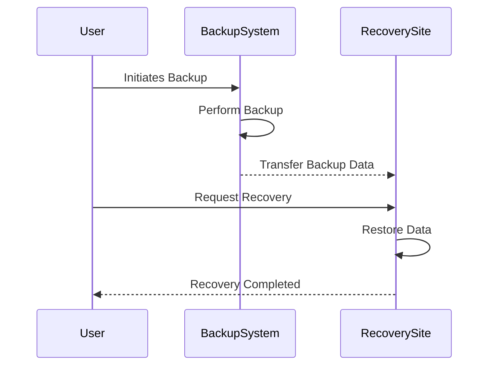

## Introduction

In today's digital landscape, ensuring business continuity and data protection is critical. Disaster Recovery Planning (DRP) is a fundamental aspect of maintaining your organization's IT infrastructure. It involves a set of policies and procedures designed to keep operations running smoothly in the event of a disaster, be it natural, technical, or human-induced.

## Design Pattern Overview

Disaster Recovery Planning is a strategic framework designed to mitigate the impact of potential disruptions by ensuring that an organization's critical processes and operations can continue with minimal downtime.

### Key Objectives

1. **Minimize Downtime**: Ensure quick restoration of services.
2. **Data Protection**: Safeguard against data loss and maintain data integrity.
3. **Cost Efficiency**: Provide cost-effective recovery solutions.
4. **Compliance and Risk Management**: Meet legal and regulatory requirements.

## Architectural Approaches

To effectively design a disaster recovery plan, follow these architectural approaches:

### 1. **Redundancy and Replication**
   - Utilize multiple data centers across geographically diverse locations.
   - Implement data replication strategies such as synchronous or asynchronous replication.

### 2. **Automated Failover**
   - Deploy automation for immediate failover to backup systems using orchestration tools.
   - Leverage cloud provider services that offer built-in failover mechanisms.

### 3. **Data Backup Strategies**
   - Regularly perform incremental and full backups.
   - Store backups in diverse locations, both on-premises and in the cloud.

### 4. **Business Impact Analysis (BIA)**
   - Identify critical business functions and the impact of their loss.
   - Prioritize resources and recovery plans according to business value.

## Best Practices

- **Regular Testing and Drills**: Periodically test your disaster recovery plans to ensure effectiveness.
- **Documentation**: Keep detailed documentation of recovery processes and procedures.
- **Communication Plan**: Establish clear communication protocols for stakeholders during a disaster.
- **Continuous Improvement**: Regularly update and improve the DRP based on testing outcomes and technological advancements.

## Example Code

Below is a Python script example using AWS Boto3 for backing up a database:

```python
import boto3
from datetime import datetime

def create_rds_snapshot(instance_id, snapshot_id):
    client = boto3.client('rds')
    response = client.create_db_snapshot(
        DBSnapshotIdentifier=snapshot_id,
        DBInstanceIdentifier=instance_id
    )
    print("Snapshot creation started:", response)

if __name__ == "__main__":
    instance_id = 'mydb-instance'
    snapshot_id = f'mydb-snapshot-{datetime.now().strftime("%Y%m%d%H%M%S")}'
    create_rds_snapshot(instance_id, snapshot_id)
```

## Diagrams

Mermaid sequence diagram illustrating a typical DR process:



## Related Patterns

- **Fault Tolerance**: Ensures continued system operation despite failures.
- **High Availability**: Maximizes uptime by minimizing service disruptions.
- **Scalability Patterns**: Adapts to changing workloads efficiently.

## Additional Resources

- [AWS Disaster Recovery Solutions](https://aws.amazon.com/disaster-recovery/)
- [GCP Disaster Recovery Planning](https://cloud.google.com/solutions/disaster-recovery-cookbook)
- [Azure Disaster Recovery](https://azure.microsoft.com/en-us/solutions/disaster-recovery/)

## Summary

Disaster Recovery Planning is vital for any organization relying on IT infrastructure. By following best practices and employing thorough testing, automation, and robust communication, businesses can safeguard their operations against unforeseen disruptions, ensuring continuity and resilience in a digital-first world.
