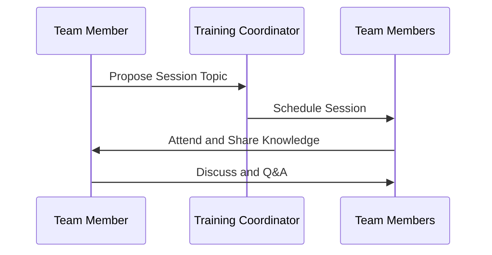

## Overview

In the rapidly evolving landscape of cloud computing, the **Staff Training and Upskilling** pattern emphasizes the critical need for organizations to equip their teams with the necessary skills and knowledge to succeed in cloud environments. This pattern focuses on strategically educating and enabling teams to handle cloud technologies proficiently, ensuring that the cloud migration process is smooth and sustainable.

## Problem Statement

One of the primary challenges enterprises face during cloud adoption is the skills gap in understanding and utilizing cloud technologies. Without sufficient knowledge, teams can struggle with basic tasks, leading to project delays, cost overruns, security vulnerabilities, and ineffective use of cloud resources.

## Solution Strategy

To address this challenge, organizations must implement a structured staff training and upskilling strategy. This approach includes:

1. **Needs Assessment**: Identify the skills gap by evaluating the current competencies of your staff against the skills required to manage cloud projects effectively.

2. **Customized Training Programs**: Develop training modules tailored to different roles within the organization, such as developers, operations, security, and management, ensuring each group gets relevant cloud use knowledge.

3. **Certification and Continuous Learning**: Encourage staff to pursue industry-recognized certifications (such as AWS Certified Solutions Architect or Google Cloud Certified Professional) and foster a culture of continuous learning.

4. **Hands-on Workshops and Labs**: Conduct practical workshops and labs to give staff hands-on experience with cloud tools and platforms.

5. **Mentorship and Knowledge Sharing**: Establish mentorship programs and encourage frequent knowledge sharing sessions where staff can present findings and best practices.

## Best Practices

- **Leadership Buy-in**: Secure commitment from leadership to invest in training resources and provide time for employees to focus on learning.
- **Integrated Learning Paths**: Embed learning paths into career development plans to ensure alignment with organizational objectives.
- **Leverage Online Platforms**: Utilize online learning platforms like Coursera, Udemy, and vendor-specific training (AWS Training and Certification, Google Cloud Training) for flexibility.
- **Internal Training Champions**: Designate internal champions who can drive the training efforts and inspire others.

## Example Code and Scenarios

Below is an example scenario where an organization implements a training strategy using an online learning management system (LMS):

```shell
#!/bin/bash

users=("alice@example.com" "bob@example.com" "charlie@example.com")

for user in "${users[@]}"
do
  echo "Enrolling $user in AWS Cloud Practitioner Essentials course"
  enroll_user_in_course --userEmail "$user" --courseId "AWS-Cloud-Practitioner"
done
```

This script demonstrates automating the enrollment of team members in essential cloud training courses, illustrating how technology can facilitate training initiatives.

## Diagrams

Below is a sample Mermaid sequence diagram showing the knowledge-sharing session process.



## Related Patterns

- **Cloud Center of Excellence (CCoE)**: Establishes a cross-functional team to drive cloud initiatives and provide subject matter expertise.
- **Cloud Governance Pattern**: Ensures policies and procedures are in place to manage cloud resources effectively.

## Additional Resources

- [AWS Training and Certification](https://aws.amazon.com/training/)
- [Google Cloud Certification](https://cloud.google.com/certification)
- [Microsoft Learn | Microsoft Certifications](https://learn.microsoft.com/en-us/certifications/)

## Summary

The **Staff Training and Upskilling** pattern is essential for organizations transitioning to the cloud. By focusing on equipping teams with the necessary skills and knowledge, organizations can mitigate risks associated with cloud adoption, enhance operational efficiency, and fully leverage cloud technologies for competitive advantage. Investing in people through structured training programs not only facilitates successful cloud migrations but also fosters a culture of continuous learning and innovation.
