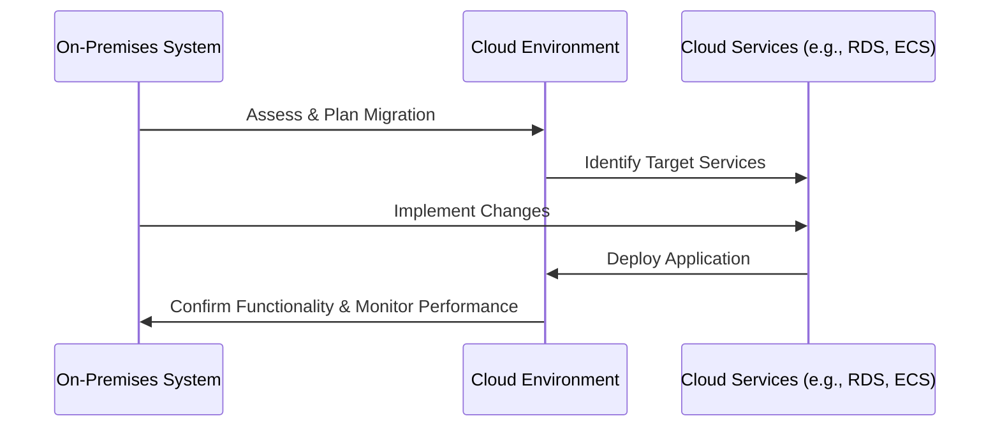

## Introduction

Replatforming, often referred to as "lift-tinker-and-shift," is a cloud migration strategy aimed at optimizing applications for cloud environments while making minimal code changes. This approach strikes a balance between rehosting (lift and shift) and refactoring, offering scalability, improved performance, and cost-effectiveness without the significant investment of time and resources required for a complete overhaul.

## Detailed Explanation

Replatforming is particularly beneficial for organizations looking to leverage cloud capabilities such as managed services, while minimizing risks associated with extensive application rewrite. This involves:

- Slightly modifying the application's infrastructure components.
- Introducing cloud-native capabilities to enhance performance and reduce operational overhead.
- Applying changes to optimize the application for cloud-based platforms, like replacing database services.

### Key Steps:

1. **Assessment and Planning**: 
   - Evaluate current applications to identify opportunities for optimization.
   - Choose cloud services that complement existing application components.

2. **Target Infrastructure Identification**:
   - Determine the appropriate managed services (e.g., RDS, DynamoDB).
   - Consider compute options that best fit existing application needs (e.g., EC2 for scale or ECS for containerization).

3. **Migration and Adaptation**:
   - Implement necessary changes to code and configurations.
   - Leverage cloud tools to aid migration, such as AWS Database Migration Service or Azure App Service Migration Assistant.

4. **Testing and Validation**:
   - Conduct thorough testing to ensure application stability and performance in the new environment.
   - Validate that the optimized solution meets desired objectives (e.g., improved response times, cost reduction).

5. **Deployment and Monitoring**:
   - Deploy the replatformed application to the cloud.
   - Establish monitoring and logging practices to ensure ongoing performance and efficiency.

## Architectural Diagram



## Example Code

Consider a simple code update during replatforming. Suppose you have a legacy application that interacts with a relational database. You could replatform it by modifying database connection settings to leverage Amazon RDS.

Original Database Connection:
```java
Connection conn = DriverManager.getConnection("jdbc:mysql://localhost:3306/mydb", "user", "password");
```

Replatformed for AWS RDS:
```java
Connection conn = DriverManager.getConnection("jdbc:mysql://your-rds-endpoint:3306/mydb", "user", "password");
```

## Advantages of Replatforming

- **Cost Efficiency**: Reduces the need for extensive re-coding while still optimizing resources.
- **Performance Gains**: By leveraging managed services, performance can be significantly improved.
- **Scalability**: Cloud-native services inherently offer scalability that on-prem systems may lack.

## Related Patterns

- **Rehosting**: Moving applications as-is to the cloud, without modifications.
- **Refactoring**: Redesigning applications to fully utilize cloud paradigms.
- **Microservices Architecture**: Often a target state post replatforming for scaling specific functionalities.

## Additional Resources

- [AWS Cloud Migration Strategy](https://aws.amazon.com/cloud-migration/)
- [Azure Database Migration Guide](https://docs.microsoft.com/en-us/azure/dms/dms-overview)
- [Google Cloud Migrate for Compute Engine](https://cloud.google.com/migrate)

## Summary

Replatforming provides a pragmatic approach to cloud migration, enabling organizations to gain cloud advantages with minimal changes. By adjusting infrastructure and slightly modifying code to utilize cloud-native resources, systems can achieve improved efficiency, scalability, and cost savings, offering a strategic middle ground within the cloud migration spectrum.
