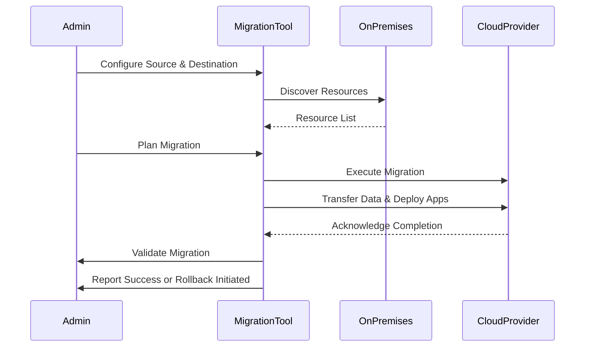

## Introduction

Migrating applications, data, and infrastructure to the cloud can be an arduous and risky process, often fraught with errors and time-consuming tasks. **Automated Migration Tools** have emerged as a vital strategy in the realm of cloud migration, enabling organizations to transition smoothly by leveraging software solutions that automate the migration process. This pattern minimizes manual effort, curtails errors, and ensures a high level of efficiency and reliability during the migration.

## Design Pattern: Automated Migration Tools

### Overview

Automated Migration Tools are software applications that assist in migrating workloads from on-premises environments to cloud platforms, or even between cloud platforms. These tools streamline the migration process by automating key tasks such as data transfer, application deployment, configuration, testing, and validation.

### Key Components

1. **Discovery and Assessment**: Automates the inventory of existing resources and applications to assess cloud-readiness and identify dependencies.
   
2. **Planning and Design**: Provides templates and resources for planning the migration strategy and designing the architecture for the cloud environment.
   
3. **Data Migration**: Automates the transfer of data from source to destination, often using data replication or batch processing to ensure consistency.
   
4. **Application Migration**: Handles the packaging, transfer, and deployment of applications, automating the setup and configuration of necessary services and dependencies.
   
5. **Testing and Validation**: Automates the execution of tests to verify that applications function correctly in the new environment, including load testing and security verifications.
   
6. **Rollback Procedures**: Facilitates automated rollback in case of migration failures, ensuring business continuity and data integrity.

### Advantages

- **Efficiency**: Reduces the time and effort required to perform migrations.
- **Cost-Effective**: Minimizes labor costs associated with manual migration tasks.
- **Reliability**: Lowers the risk of human error and improves the success rate of migrations.
- **Scalability**: Easily adjusts to handle large-scale migrations involving numerous applications and data sets.

### Disadvantages

- **Initial Setup Costs**: May require significant initial investment to configure the tools.
- **Complexity**: Complex environments may introduce challenges requiring additional validation.
- **Dependency on Tools**: Over-reliance on a specific tool might limit flexibility in some migration scenarios.

## Example Code

Here's a simplified example of using a hypothetical automated migration tool in a Python script:

```python
import automated_migration_tool as amt

source = amt.SourceConfiguration(type='on-premise', host='192.168.1.10', user='admin')
destination = amt.DestinationConfiguration(type='aws', region='us-west-1')

migration_tool = amt.MigrationTool(source, destination)

resources = migration_tool.discover_resources()

migration_plan = migration_tool.create_plan(resources)
migration_tool.execute_plan(migration_plan)

if migration_tool.validate_migration():
    print("Migration completed successfully!")
else:
    migration_tool.rollback()
    print("Migration failed, rollback initiated.")
```

## Diagrams

### UML Sequence Diagram for Automated Migration Process



## Related Patterns

- **Lift and Shift**: Quickly moving applications from on-premises to the cloud with minimal changes.
- **Hybrid Cloud Integration**: Balancing resources between on-premises and cloud environments during migration.
- **Data Replication**: Ensures data consistency and availability across environments.

## Additional Resources

- [AWS Migration Hub](https://aws.amazon.com/migration-hub/)
- [Azure Migrate](https://azure.microsoft.com/en-us/services/azure-migrate/)
- [Google Cloud Migrate for Compute Engine](https://cloud.google.com/migrate/compute-engine)

## Summary

Automated Migration Tools are indispensable assets in cloud migration strategies. By automating data transfer, application deployment, and validation processes, these tools significantly ease the burden of migration, providing a streamlined, efficient, and secure pathway to the cloud. While they require careful setup and validation, the benefits of reduced manual labor, minimized errors, and improved reliability make them a critical component in achieving successful cloud transformations.
