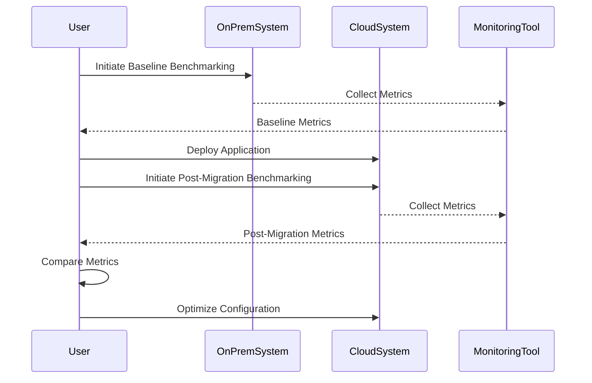

### Introduction

In the realm of cloud computing, ensuring optimal performance of applications post-migration is crucial. **Performance Benchmarking** serves as an essential practice to compare and evaluate application performance before and after cloud migration. This pattern aids in identifying potential performance issues and optimizations needed to leverage the cloud environment efficiently.

### Detailed Explanation

Performance Benchmarking is a critical process in cloud migration strategies. It involves comprehensive measurement and analysis of an application's key performance indicators (KPIs) both before and after the migration. By doing so, you can ensure that the migrated application maintains, or exceeds, its original performance standards while harnessing the benefits of cloud infrastructure.

#### Key Steps:

1. **Define Key Metrics**: Establish performance metrics that are most relevant to your application's success. Common metrics include response time, throughput, resource utilization, latency, and error rates.

2. **Baseline Performance Testing**: Conduct performance tests on the existing on-premises application to capture baseline metrics. This provides a reference point for post-migration comparison.

3. **Replicate Environment**: Ensure that the cloud environment replicates necessary conditions of the existing environment as closely as possible, considering factors like configuration, network latency, and geographic distribution.

4. **Conduct Post-Migration Testing**: Once the application is running in the cloud, perform the same performance tests to gather data for comparison.

5. **Analyze and Optimize**: Compare the before-and-after data to identify changes. Optimize the cloud deployment based on findings; this may involve scaling resources, adjusting configurations, or making code-level changes.

6. **Continuous Monitoring**: Implement ongoing monitoring to detect and address performance variations in real-time and continue leveraging cloud-native features for performance enhancement.

### Example Code

Below is a simplified example illustrating performance benchmarking using a cloud provider's monitoring tools. The code performs load testing and measures response time pre- and post-migration.

```javascript
const loadTest = require('loadtest');
const options = {
  url: 'http://www.example.com',
  maxRequests: 1000,
  concurrency: 10,
  timeouts: 30,
};

// Benchmark pre-migration
loadTest.loadTest(options, (error, result) => {
  if (error) {
    return console.error('Error during test:', error);
  }
  console.log('Pre-migration response time:', result.meanLatencyMs, 'ms');
});

// Benchmark post-migration
options.url = 'http://cloud.example.com';
loadTest.loadTest(options, (error, result) => {
  if (error) {
    return console.error('Error during test:', error);
  }
  console.log('Post-migration response time:', result.meanLatencyMs, 'ms');
});
```

### Diagrams

#### Sequence Diagram

Here is a basic sequence diagram illustrating the performance benchmarking process:



### Related Patterns

- **Disaster Recovery**: Ensures a robust recovery strategy, closely linked with benchmarking post-migration to validate scalability.
- **Cloud Load Balancing**: Aids in distributing incoming requests efficiently, crucial when addressing performance benchmark results that indicate bottleneck issues.
- **Cost Management in Cloud**: Post-benchmarking optimization might align closely with cost management for ensuring performance doesn't result in unnecessary scaling expenses.

### Additional Resources

- [AWS Well-Architected Framework - Performance Efficiency Pillar](https://aws.amazon.com/architecture/well-architected/)
- [Google Cloud - Performance Testing](https://cloud.google.com/solutions/performance-testing)
- [Azure - Cloud Migration Best Practices](https://docs.microsoft.com/en-us/azure/cloud-adoption-framework/migrate/azure-best-practices/assessment)

### Summary

Performance Benchmarking is an indispensable pattern in cloud migration strategies, ensuring that applications not only function correctly in their new environment but also capitalize on the performance opportunities that the cloud offers. By systematically evaluating pre-and post-migration metrics, this pattern allows for comprehensive analysis and optimization of applications to meet user expectations and business objectives.
