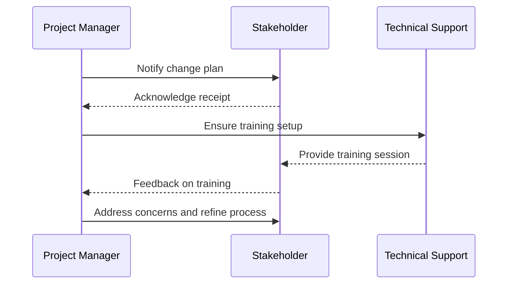

Change Management in cloud computing encompasses strategies and processes used to manage the transition of an organization from traditional IT environments to cloud-based solutions. It involves communicating changes clearly, managing stakeholders' expectations, and ensuring that all teams are aligned with the goals of the migration process. Effective change management minimizes resistance, enhances engagement, and facilitates smoother adoption of new technologies.


Cloud migration often involves significant changes to business processes, IT infrastructure, and individual roles. Change Management is crucial to align organizations' operational models with new cloud environments. Its core principles include effective communication planning, comprehensive training programs, stakeholder engagement, and continuous feedback loops.

Key components of Change Management include:

1. **Communication Plan**: Establish a clear communication strategy to inform all stakeholders about upcoming changes, benefits, potential impacts, and timelines.
   
2. **Stakeholder Engagement**: Identify all stakeholders and involve them in the migration process to gain insights, reduce resistance, and build buy-in through workshops and collaborative planning sessions.

3. **Training and Support**: Provide training sessions tailored to different user groups to ensure they understand new systems and processes. Create easy-to-access resources and support channels for ongoing assistance.

4. **Feedback Mechanisms**: Implement regular feedback loops to gather insights from users about their experience and challenges, enabling iterative improvements to the migration process.

5. **Cultural Shift**: Foster a culture that is open to change by recognizing and rewarding adaptability, promoting the long-term benefits of cloud adoption, and encouraging innovation.


While change management does not involve coding, implementing automated tools for monitoring and communication can assist in the process.

```javascript
// Example of a notification system using JavaScript to inform stakeholders about changes
function notifyStakeholders(stakeholderList, message) {
  stakeholderList.forEach((stakeholder) => {
    sendEmail(stakeholder.email, message);
    console.log(`Notification sent to ${stakeholder.name}`);
  });
}

const stakeholders = [
  { name: 'Alice', email: 'alice@example.com' },
  { name: 'Bob', email: 'bob@example.com' },
];

const changeMessage = "We are transitioning our HR systems to the cloud. Please expect limited access on Friday afternoon.";

notifyStakeholders(stakeholders, changeMessage);
```


Here’s Sequence diagram illustrating change management communication flow:




- **Continuous Integration/Continuous Deployment (CI/CD)**: Ensures ongoing improvements and immediate value delivery which alleviates the impact of change.
- **Service Management**: Establishes a framework for both delivering and managing IT services effectively post-migration.
- **DevOps Culture**: Encourages aligning development and operations processes which naturally complements change management practices.


1. [Prosci Change Management Research](https://www.prosci.com)
2. [AWS Cloud Adoption Framework](https://aws.amazon.com/professional-services/cloud-adoption-framework/)
3. [Google Cloud Adoption Framework](https://cloud.google.com/adoption-framework)
4. [Azure Adoption Framework](https://docs.microsoft.com/en-us/azure/cloud-adoption-framework/)
5. [ACMP Global](https://www.acmpglobal.org)


Effective Change Management is pivotal for successful cloud adoption. It involves a blend of strategic communication, stakeholder involvement, training, and cultural adaptation, which helps manage risks and ensure a smooth transition to cloud services. By prioritizing these components, organizations can mitigate resistance, reduce operational disruption, and expedite the realization of cloud benefits.
