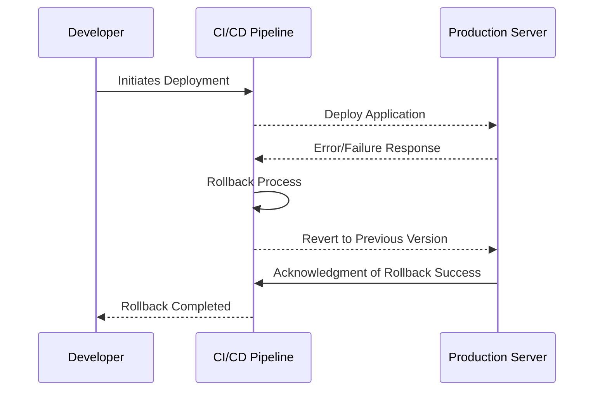

In the realm of cloud computing, seamless service and minimal downtime are critical. Whether deploying new services, upgrading existing systems, or migrating workloads to the cloud, there’s always a risk of unforeseen errors or failures. **Rollback plans** serve as a strategic safety net, allowing organizations to revert to a previous stable state quickly and efficiently, minimizing disruptions and ensuring continued service availability.

## Detailed Explanation

### Importance of Rollback Plans

Rollback plans are vital because they offer a structured approach to undo changes when deployment or migration processes do not go as planned. Key advantages include:

- **Mitigation of Risks**: Rollback plans are crucial when integrating new changes, allowing reverting processes quickly to avoid prolonged downtime.
- **Compliance and Security**: Inadvertent exposure or security misconfigurations can be swiftly corrected by reverting to a previous compliant state.
- **Operational Continuity**: Ensures retention of business operations continuity by preventing critical failures from affecting end-users.

### Architectural Approaches

1. **Version Control Systems (VCS)**: Implementing version tracking to facilitate rollback mechanisms by managing infrastructure as code (IAC) using tools such as Git.
   
2. **Immutable Infrastructure**: Creating servers and infrastructure components that are replaceable and immutable reduces rollback complexity by deploying previous instances.
   
3. **Blue-Green Deployments**: A staging environment runs alongside the production environment to switch traffic between the two versions seamlessly. If the new version fails, traffic routes back to the original one.

4. **Canary Releases**: Gradually deploying changes to a small user group before full-scale rollout, providing an opportunity to judge changes and roll back if necessary.

### Paradigms and Best Practices

- **Automated Script-Based Rollbacks**: Automate rollback processes using scripts in CI/CD pipelines to ensure rapid execution.
- **Database Backups and Restore Points**: Regular data backups are critical for database changes, allowing recovery to previous data states.
- **Continuous Testing and Monitoring**: Implement continuous integration testing and real-time monitoring to detect and alert potential issues preemptively, aiding rollback decisions.

### Example Code

Here is a basic example of how a rollback might be automated using a CI/CD pipeline script in a tool like Jenkins:

```groovy
pipeline {
    agent any

    stages {
        stage('Deploy') {
            steps {
                script {
                    try {
                        echo 'Deploying application...'
                        // deployment script or tool calls
                        
                    } catch (DeploymentFailureException e) {
                        currentBuild.result = 'FAILURE'
                        echo 'Deployment failed, initiating rollback...'
                        rollback()
                    }
                }
            }
        }
    }
}

def rollback() {
    echo 'Rolling back to previous stable version...'
    // Define rollback commands or pipeline
    // For example, using Docker:
    sh 'docker tag myapp:previous-stable myapp:current'
    sh 'docker push myapp:current'
}
```

### Diagram Representation



### Related Patterns

- **Blue-Green Deployment**: Helps minimize rollback needs by maintaining parallel operating environments.
- **Canary Deployment**: Allows risk assessment and rollback in a minimally impactful way.

### Additional Resources

- [AWS Deployment Strategies](https://docs.aws.amazon.com/architecture/whitepapers/latest/aws-deployment-strategies/introduction.html)
- [Google Cloud Deployment Guides](https://cloud.google.com/deployment-manager/docs)
- [Azure DevOps Rollback Strategies](https://learn.microsoft.com/en-us/azure/devops/learn/devops-at-microsoft/use-feature-flags)

## Summary

Rollback plans are integral to the robust and reliable operation of cloud services. By preparing rollback strategies during deployments and migrations, organizations can ensure operational resilience and customer satisfaction. Whether using version control, automated scripts, or deployment paradigms like blue-green and canary, effective rollback plans reduce risks and help maintain seamless service delivery in cloud environments.
