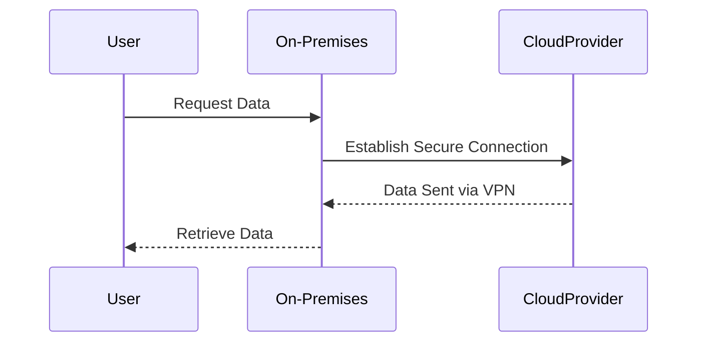

## Introduction

The **Network Configuration Adjustments** pattern focuses on modifying network configurations to enhance connectivity with cloud environments. As organizations transition services and applications to the cloud, adjusting network settings is key to ensuring optimal performance, security, and cost-efficiency. This pattern covers best practices, including VPN setups, DNS adjustments, subnet configurations, and more, for creating reliable and secure cloud connectivity.

## Detailed Explanations

### Key Considerations

1. **Security**: Implement robust security measures such as VPNs, firewalls, and security groups to protect data in transit and maintain privacy across network channels.

2. **Performance Optimization**: Optimize latency and bandwidth by configuring Content Delivery Networks (CDNs), load balancers, and direct connections like AWS Direct Connect or Azure ExpressRoute.

3. **Scalability**: Configure networks to support horizontal scaling, ensuring resources can handle increased loads without compromising performance.

4. **Cost Management**: Monitor and manage data transfer costs by configuring efficient routing and leveraging cost-effective network solutions.

### Architectural Approaches

- **Virtual Network (VNet) and Virtual Private Cloud (VPC)**: Establish isolated network segments within cloud environments, facilitating secure and controlled data flow between on-premises and cloud systems.

- **Subnetting**: Organize resources across various subnets to enhance security and manage traffic flow effectively.

- **DNS Management**: Adjust DNS settings for high availability and fault tolerance, ensuring quick resolution and minimal downtime during migrations.

### Best Practices

- **Redundant Connectivity**: Configure multiple paths to ensure network redundancy and failover capabilities, enhancing reliability and uptime.

- **Regular Audits**: Perform regular network audits to identify bottlenecks, security risks, and opportunities for improvement.

- **Automated Configuration Tools**: Utilize infrastructure as code (IaC) tools for automated network configuration and deployment processes.

## Example Code

```yaml
Resources:
  MyVPC:
    Type: 'AWS::EC2::VPC'
    Properties: 
      CidrBlock: '10.0.0.0/16'
      EnableDnsSupport: true
      EnableDnsHostnames: true
      Tags:
        - Key: Name
          Value: MyVPC
```

## Diagrams



## Related Patterns

- **Cloud Bursting**: Dynamically provision cloud resources during peak demands to maintain performance and cost-effectiveness.

- **Hybrid Networking**: Combine on-premises infrastructure with the cloud for a unified networking experience that optimizes both environments.

## Additional Resources

- [AWS Networking Best Practices](https://docs.aws.amazon.com/whitepapers/latest/aws-vpc-connectivity-options/introduction.html)
- [Azure Virtual Network Documentation](https://docs.microsoft.com/en-us/azure/virtual-network/virtual-network-manage-network)
- [Google Cloud Networking Documentation](https://cloud.google.com/docs/enterprise/best-practices-for-enterprise-organizations)

## Summary

The **Network Configuration Adjustments** pattern is fundamental for organizations transitioning to the cloud, ensuring seamless, secure, and cost-efficient cloud connectivity. By optimizing network configurations, businesses can achieve enhanced performance and reliability, aligning with modern cloud deployment strategies. Adopting these best practices will help organizations leverage the full potential of cloud services during and post-migration.
