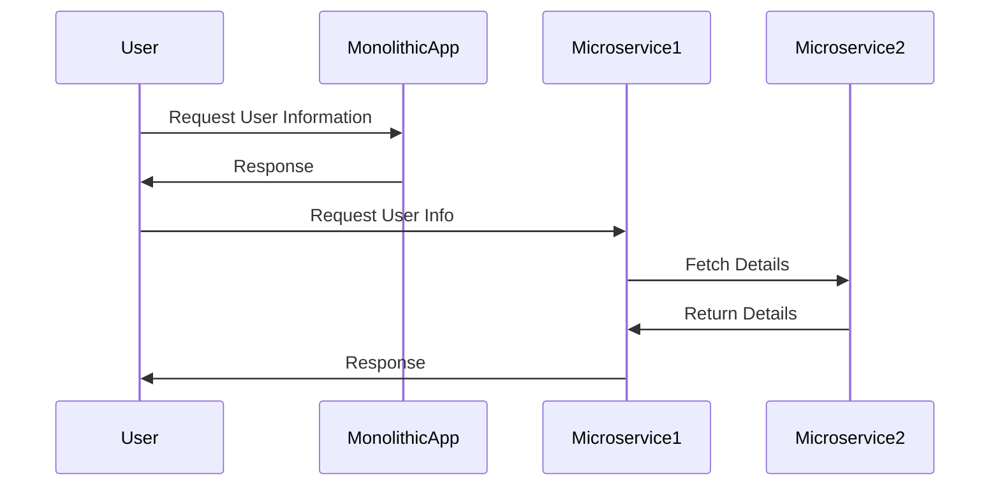

## Introduction to Application Modernization

Application Modernization is the process of transforming legacy systems and applications to align with current technology standards, business needs, and customer expectations. It involves re-architecting, re-platforming, re-hosting, and re-implementing applications to improve their functionality and performance.

### Goals of Application Modernization
- **Enhanced Performance:** Improve application speed and responsiveness.
- **Scalability and Agility:** Enable applications to scale according to demand with cloud-native capabilities.
- **Cost Optimization:** Reduce operational costs by adopting modern cloud services.
- **Improved User Experience:** Enhance the user interface and interactions for better engagement.

## Key Architectural Approaches

### 1. Rehosting (Lift and Shift)
Rehosting involves migrating an application to a modern infrastructure or cloud platform with minimal changes. This is often the first step in modernization for organizations looking to move quickly and reduce immediate costs.

### 2. Re-platforming (Lift, Tinker, and Shift)
This approach involves making a few cloud optimizations to achieve tangible benefits without changing the core architecture of the application. Examples include moving databases to managed cloud services or using container technology.

### 3. Refactoring (Re-architecting)
Refactoring is about re-architecting and rewriting parts of the application to unlock significant benefits such as improved scalability, performance, and agility. This often involves adopting microservices architectures.

### 4. Rebuilding
Rebuilding refers to the process of discarding the existing application and redesigning it from scratch with modern technologies and practices, ensuring it meets current and future needs effectively.

### 5. Replacing
This is utilized when a legacy application is no longer meeting the requirements cost-effectively. In this case, the application is replaced with a commercially available software solution or a completely new development.

## Best Practices

- **Assessment and Planning:** Conduct a thorough assessment of existing applications, and plan the modernization journey carefully to identify the best approaches.
- **Incremental Transformation:** Prioritize modernization efforts based on business value and complexity, and execute in incremental phases.
- **Automation and DevOps:** Leverage DevOps practices and automation tools to streamline and accelerate the modernization process.
- **Cloud-Native Design:** When possible, design applications to be cloud-native to maximize benefits such as auto-scaling, self-healing, and continuous deployment.

## Example Code Snippet

Below is a simple example showcasing a refactor from a monolithic application method to a microservices approach using Kubernetes for deployment.

```yaml
apiVersion: apps/v1
kind: Deployment
metadata:
  name: user-service
spec:
  replicas: 3
  selector:
    matchLabels:
      app: user-service
  template:
    metadata:
      labels:
        app: user-service
    spec:
      containers:
      - name: user-service
        image: myregistry/user-service:latest
        ports:
        - containerPort: 8080
```

## Diagrams

Below is UML Sequence diagram illustrating the changes within an application's architecture from monolithic to microservices:



## Related Patterns

- **Microservices Architecture:** Decompose applications into small, independent services to increase flexibility and scalability.
- **API Gateway:** Simplify client access to microservices by routing requests through a unified gateway.
- **Service Mesh:** Use a dedicated infrastructure layer to handle service-to-service communication.

## Additional Resources

- [AWS Application Modernization](https://aws.amazon.com/application-modernization/)
- [Microsoft Azure: Modernize Applications](https://azure.microsoft.com/en-us/solutions/modernize/)
- [Google Cloud: Application Modernization](https://cloud.google.com/solutions/application-modernization)

## Summary

Application Modernization is essential for businesses aiming to stay competitive and responsive to digital transformation challenges. By adopting appropriate modernization strategies, organizations can reap significant benefits in terms of cost-efficiency, scalability, and improved user experience. Using cloud-native architectures, DevOps practices, and microservices, businesses can turn their legacy systems into agile and robust technology solutions.

By aligning modernization efforts with business goals, companies can ensure a smoother transition, unlocking new capabilities and greater value from their IT investments.
