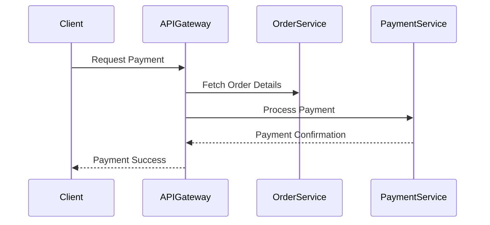

## Introduction

API Integration Updates are critical in today's cloud-driven initiatives. As organizations transition their on-premises applications to the cloud, updating APIs to ensure compatibility and maximize cloud-specific advantages becomes crucial. This process involves understanding design patterns and architectural strategies tailored for cloud environments.

## Design Patterns

### 1. Adapter Pattern

The Adapter Pattern is useful when dealing with existing APIs that require changes to match the expected interfaces of new cloud services. By creating an adapter, you can bridge the gap between the old and new interfaces, facilitating smooth communication.

**Example Code:**

```java
// Legacy interface
interface OnPremiseService {
    void execute();
}

// Cloud service
class CloudService {
    void run() {
        // Cloud-specific operations
    }
}

// Adapter
class CloudServiceAdapter implements OnPremiseService {
    private CloudService cloudService;

    CloudServiceAdapter(CloudService cloudService) {
        this.cloudService = cloudService;
    }

    @Override
    public void execute() {
        cloudService.run();
    }
}
```

### 2. Facade Pattern

When complexity arises due to multiple APIs, the Facade Pattern simplifies interaction. It provides a unified interface to a set of interfaces in a subsystem, making subsystems easier to use.

**Example Code:**

```scala
class CloudService1 {
    def operation1(): Unit = {
        // Operation details
    }
}

class CloudService2 {
    def operation2(): Unit = {
        // Operation details
    }
}

class CloudFacade {
    private val service1 = new CloudService1()
    private val service2 = new CloudService2()

    def performOperations(): Unit = {
        service1.operation1()
        service2.operation2()
    }
}
```

## Architectural Approaches

### API Gateway

An API Gateway acts as a single entry point for client requests to hit various backend services. It's vital for managing traffic, authentication, and routing requests to the appropriate backend services.

**Benefits:**
- Simplifies client-server architecture.
- Supports cross-cutting concerns like logging, throttling, and transformations.

### Microservices Architecture

Transitioning to microservices necessitates breaking monolithic APIs into smaller, more manageable APIs. This approach enhances scalability and allows independent deployment and development.

## Paradigms and Best Practices

- **Versioning:** Implement API versioning to maintain backward compatibility as you update APIs.
- **Security:** Leverage cloud-native security features to ensure secure communication and data protection.
- **Monitoring and Logging:** Utilize cloud monitoring tools to gain insights into API performance and detect anomalies.

## Example Scenario

Suppose an e-commerce platform is migrating to the cloud. The platform's payment and order management APIs undergo adaptation using the Adapter Pattern to work seamlessly with cloud-specific payment gateways and databases. An API Gateway is deployed to manage cross-cutting concerns and aggregate services.

## Diagram



## Related Patterns

- **Service Mesh:** Enhance service communication, security, and observability in conjunction with API integration.
- **Event-Driven Architecture:** Use event-driven mechanisms to decouple services and enhance scalability.

## Additional Resources

- [AWS API Gateway](https://aws.amazon.com/api-gateway/)
- [Google Cloud Endpoints](https://cloud.google.com/endpoints)
- [Azure API Management](https://azure.microsoft.com/en-us/services/api-management/)

## Summary

Updating APIs for cloud compatibility is imperative as organizations push forward with cloud migration. By leveraging design patterns such as Adapter and Facade, and adopting architectural strategies like API Gateway and Microservices Architecture, developers can ensure that their APIs are well-optimized for cloud environments, enabling enhanced scalability, security, and performance. These practices, paired with best standards, provide a robust framework for API integration in a cloud-centric world.
