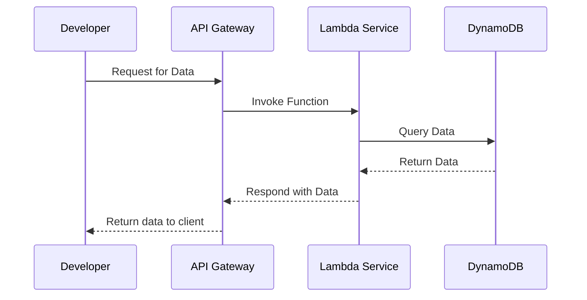

## Introduction

Refactoring is an essential strategy in cloud migration that involves re-engineering applications to move them from a traditional infrastructure to a cloud environment, optimized to leverage cloud-native features. This process often includes altering the application's architecture to improve its performance, scalability, and maintenance capabilities using the unique services and features offered by cloud platforms.

## Detailed Explanation of the Refactoring Pattern

Refactoring in cloud computing goes beyond simple lift-and-shift techniques. It requires altering the application's core architecture to benefit from cloud-native services such as serverless computing, microservices, managed databases, and container orchestration platforms.

### Key Steps in Refactoring:

1. **Understand the Existing Architecture**:
   - Assess the current state of your application and its dependencies.
   - Identify performance bottlenecks and scaling challenges.

2. **Define Target Cloud Architecture**:
   - Determine the best cloud-native architecture based on application needs, such as microservices or serverless models.
   - Choose appropriate managed services and tools offered by the cloud provider.

3. **Decompose Monolithic Applications**:
   - Break down monolithic structures into smaller, manageable components or microservices.
   - Utilize APIs and messaging systems for communication between services.

4. **Implement Cloud-Native Features**:
   - Replace traditional services with cloud-native counterparts like serverless functions (AWS Lambda, Google Cloud Functions).
   - Implement cloud storage, managed databases, and distributed caching solutions.

5. **Testing and Continuous Integration/Continuous Deployment (CI/CD)**:
   - Establish automated testing and CI/CD pipelines to ensure robustness.
   - Deploy changes incrementally and monitor performance continuously.

### Example Code

Below is a basic example of a refactored application using AWS Lambda and DynamoDB for a serverless architecture:

```javascript
const AWS = require('aws-sdk');
const dynamoDb = new AWS.DynamoDB.DocumentClient();

exports.handler = async (event) => {
  const params = {
    TableName: 'ExampleTable',
    Key: { id: event.id }
  };
  
  try {
    const data = await dynamoDb.get(params).promise();
    return {
      statusCode: 200,
      body: JSON.stringify(data.Item)
    };
  } catch (error) {
    return {
      statusCode: error.statusCode || 501,
      headers: { 'Content-Type': 'text/plain' },
      body: 'Couldn\'t fetch the item.'
    };
  }
};
```

## Best Practices

- **Modular Design**: Favor modular architecture to facilitate flexibility and updates.
- **Use Managed Services**: Capitalize on cloud provider's managed services to reduce operational overhead.
- **Scalability**: Design for horizontal scalability by using stateless application components.
- **Security**: Incorporate security best practices throughout your design and coding.

## Diagrams

### Refactoring Process Flow



## Related Patterns

- **Microservices Architecture**: Facilitates increasing application resilience and scalability.
- **Serverless Architecture**: Focus on event-driven computing for flexible scaling.

## Additional Resources

- [AWS Cloud Design Patterns](https://docs.aws.amazon.com/solutions/latest/well-architected-framework/welcome.html)
- [Google Cloud Architecture Framework](https://cloud.google.com/architecture)
- [Microsoft Azure Well-Architected Framework](https://docs.microsoft.com/en-us/azure/architecture/framework/)

## Summary

Refactoring is a transformative process aiming to revolutionize how traditional applications operate in the cloud. By leveraging cloud-native architecture, businesses can significantly enhance application scalability, performance, and cost efficiency. Implementing thoughtful refactoring strategies ensures that cloud environments are used to their fullest potential, optimizing resource use and providing scalable, resilient solutions.
