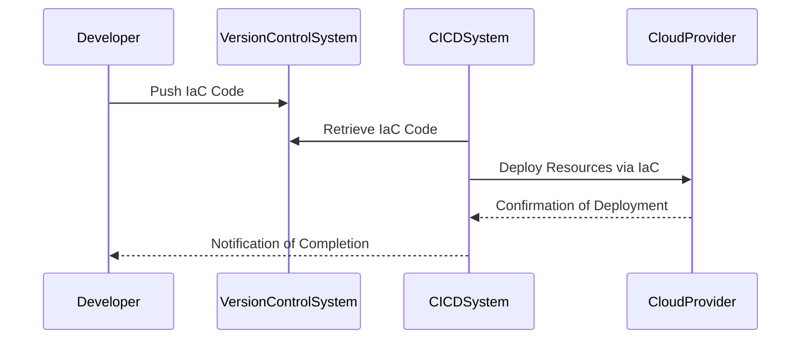

## Introduction

Cloud computing has transformed the way IT infrastructures are designed and managed. One of the key strategies in this domain is **Resource Provisioning Automation**, a process that leverages Infrastructure as Code (IaC) tools to automate the setup and management of cloud resources. This approach accelerates cloud migration, ensures infrastructure consistency, and reduces human error.

## Architectural Approaches

Resource Provisioning Automation focuses on defining infrastructure configurations in human-readable code files. These configurations are generally stored in version control systems (VCS), ensuring traceability and versioning. This process involves three main architectural steps:

1. **Define Infrastructure as Code**: Use declarative or imperative IaC tools to describe the desired state of cloud resources.
2. **Version Control**: Store the IaC definitions in a VCS like Git to ensure history tracking and collaboration.
3. **Automated Deployment**: Leverage continuous integration/continuous deployment (CI/CD) pipelines to automate the deployment and management processes.

## Paradigms and Best Practices

- **Idempotency**: Ensure that your IaC scripts are idempotent, meaning running the scripts multiple times does not change the final state beyond the initial application.
- **Modularity**: Organize IaC configurations into reusable modules for easier management and scalability.
- **Environment Consistency**: Maintain identical environments across development, testing, and production by using the same base IaC scripts, customized through parameterization if necessary.
- **Security and Compliance**: Integrate security checks and compliance audits within the IaC deployment workflows.

## Example Code

Here’s an example of using Terraform, a popular IaC tool, to provision an AWS EC2 instance:

```hcl
provider "aws" {
  region = "us-west-2"
}

resource "aws_instance" "example" {
  ami           = "ami-0c55b159cbfafe1f0"
  instance_type = "t2.micro"

  tags = {
    Name = "Terraform-Example"
  }
}
```

## Diagrams

To illustrate the process of Resource Provisioning Automation, consider the following Mermaid sequence diagram:



## Related Patterns

- **Immutable Infrastructure**: Aligns well with provisioning automation due to its emphasis on creating new infrastructure for deployments rather than modifying existing resources.
- **Continuous Integration/Continuous Deployment (CI/CD)**: Integrating IaC into CI/CD pipelines ensures consistent and automatic updates of infrastructure.

## Additional Resources

- [Terraform Documentation](https://www.terraform.io/docs)
- [AWS CloudFormation User Guide](https://docs.aws.amazon.com/AWSCloudFormation/latest/UserGuide/)
- [Azure Resource Manager Templates](https://docs.microsoft.com/en-us/azure/azure-resource-manager/templates/overview)

## Summary

Resource Provisioning Automation is a foundational practice in modern cloud computing, enabling efficient, reliable, and repeatable infrastructure management. By leveraging IaC tools, organizations can swiftly transition to cloud environments while maintaining strong control over their infrastructure's evolution and state. This strategy not only accelerates cloud adoption but also embeds best practices of software development into infrastructure management, enhancing both agility and quality.
