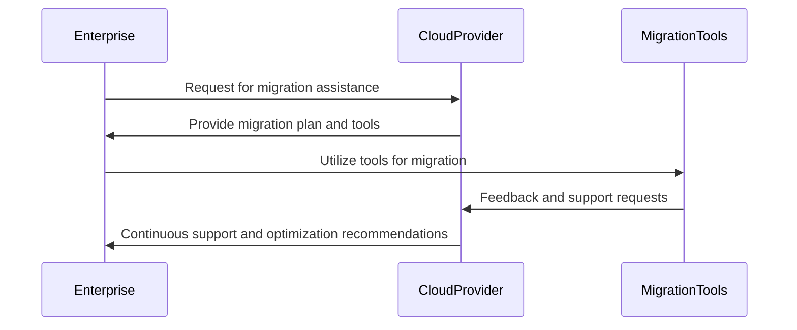

## Overview

The **Vendor Support and Partnerships** pattern focuses on leveraging the expertise and resources of cloud providers to facilitate a seamless migration process. Engaging with vendors not only provides technical support but also ensures access to best practices, specialized training, and innovative migration tools. This pattern is essential for organizations aiming to modernize their infrastructure and operations through cloud adoption.

## Detailed Explanation

### Key Components

1. **Technical Assistance:** Cloud vendors offer comprehensive support services, from initial migration planning to ongoing management. This assistance includes troubleshooting, performance optimization, and cloud resource management.

2. **Training and Certification:** Vendors provide various training programs and certifications for teams to build in-house cloud expertise, ensuring that employees are well-versed in cloud technologies and can handle future cloud challenges independently.

3. **Co-development Opportunities:** Partnerships often extend to collaborative projects where both parties contribute to developing new solutions or optimizing existing applications for the cloud.

4. **Cost Management Tools:** Cloud vendors offer analytics and tools to track usage and optimize costs, ensuring the migration meets budget expectations.

5. **Resource Access:** Engaging vendors provides access to proprietary migration tools and resources, accelerating the migration process and reducing the risk of complications.

## Best Practices

- **Early Engagement:** Involve cloud vendors early in the migration planning phase to fully understand the tools and resources available.

- **Custom Partnerships:** Tailor your vendor partnership models to suit your specific business needs, ensuring both parties are aligned on outcomes and expectations.

- **Continuous Feedback:** Maintain open communication with your cloud provider to adapt the migration process according to feedback and changing requirements.

- **Leverage Sandboxes:** Use vendor-provided sandboxes and testing environments to prototype and validate migrations without impacting production systems.

## Example Code

While this pattern is more about strategy than code, implementing vendor APIs for resource management can be part of the process:

```javascript
// Example: AWS SDK for Node.js to manage EC2 instances
const AWS = require('aws-sdk');
AWS.config.update({ region: 'us-west-2' });
const ec2 = new AWS.EC2();

const params = {
  InstanceIds: ['i-12345abcd', 'i-67890efgh']
};

ec2.describeInstances(params, (err, data) => {
  if (err) console.log(err, err.stack);
  else console.log(data);
});
```

## Diagrams

Here is a simple sequence diagram to represent the interaction between an enterprise and a cloud provider during the migration process:



## Related Patterns

- **Lift and Shift**: A straightforward migration strategy where applications are moved to the cloud with minimal changes.
- **Hybrid Cloud Strategy**: Combines private and public clouds and leverages vendor support for integration and management.

## Additional Resources

- [AWS Cloud Adoption Framework](https://aws.amazon.com/professional-services/CAF/)
- [Azure Migration Program](https://azure.microsoft.com/en-us/migration/)
- [Google Cloud Migration Center](https://cloud.google.com/migration-center)

## Summary

The **Vendor Support and Partnerships** pattern is pivotal for organizations migrating to the cloud. By collaborating with cloud providers, companies can access critical support and tools, reduce risks, optimize costs, and ensure their teams are prepared for cloud operations. This strategy not only simplifies the migration process but also establishes a foundation for future innovation and agility in the cloud environment.
