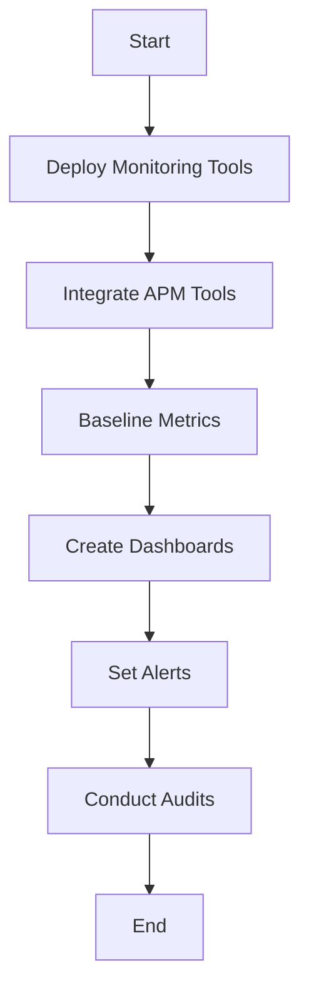

## Introduction

Post-Migration Monitoring is a critical pattern in the cloud migration journey. Once applications have been successfully migrated to the cloud, the next step is to ensure their stability, performance, and security in the new environment. This pattern involves setting up comprehensive monitoring mechanisms to detect issues early, optimize performance, and enhance cloud operations.

## Design Pattern Explanation

Post-Migration Monitoring includes various components essential for maintaining an application's health and performance after migration. It involves using cloud-native monitoring tools, integrating performance dashboards, setting benchmarks for service-level objectives (SLOs), and employing automated alerts and notifications.

Key considerations include:

- **Proactive Issue Detection**: Utilize real-time monitoring tools to identify and address performance bottlenecks, scalability challenges, abnormal latency, and downtime.
  
- **Performance Analytics**: Analyze performance metrics to optimize resource allocation and application configurations according to workload demands.
  
- **Security Monitoring**: Implement security measures like intrusion detection systems and vulnerability assessments to protect the application against malicious activities.

- **User Experience Monitoring**: Leverage end-user experience monitoring tools to gather insights into how users perceive the application performance in the cloud.

## Architectural Approach

1. **Set Up Monitoring Tools**: Deploy cloud-native monitoring solutions like AWS CloudWatch, Azure Monitor, Google Cloud Operations Suite, or third-party tools such as DataDog, New Relic, and Prometheus.

2. **Integrate with Application Performance Management (APM) Tools**: Use APM tools to track application performance at a granular level, including transaction tracing and error logging.

3. **Baseline Performance Metrics**: Establish baseline metrics pre-and post-migration for comparison and continuous improvement of performance standards.

4. **Create Dashboards and Reports**: Generate real-time dashboards and automated reports to visualize key metrics and trends over time for executive and technical stakeholders.

5. **Automated Alerts and Notifications**: Set up alerts for anomalies and thresholds that deviate from expected performance metrics to take immediate action.

6. **Regular Audits and Health Checks**: Conduct regular audits and checks to validate the monitoring setup and ensure it captures all critical application and infrastructure components.

## Example Code

Here is a sample script for setting up a basic cloud monitoring alert using AWS CloudWatch:

```javascript
// AWS SDK for JavaScript
const AWS = require('aws-sdk');
const cloudwatch = new AWS.CloudWatch();

// Create a new alarm
const params = {
  AlarmName: 'HighCPUUtilization',
  ComparisonOperator: 'GreaterThanThreshold',
  EvaluationPeriods: 1,
  MetricName: 'CPUUtilization',
  Namespace: 'AWS/EC2',
  Period: 300,
  Statistic: 'Average',
  Threshold: 80.0,
  ActionsEnabled: true,
  AlarmActions: ['<your-sns-topic-arn>'],
  Dimensions: [
    {
      Name: 'InstanceId',
      Value: '<your-instance-id>'
    }
  ],
  AlarmDescription: 'Alarm when server CPU exceeds 80%',
};

cloudwatch.putMetricAlarm(params, (err, data) => {
  if (err) console.log(err, err.stack);
  else console.log('Alarm successfully created:', data);
});
```

## Diagrams

### Post-Migration Monitoring Workflow



## Related Patterns

- **Cloud Migration Strategy**: A broader framework for planning and executing the migration of applications to the cloud.
- **Continuous Deployment**: Automating the deployment of applications with minimal manual intervention, which complements monitoring for reliability.

## Additional Resources

- [AWS CloudWatch Documentation](https://docs.aws.amazon.com/cloudwatch/)
- [Azure Monitor Overview](https://docs.microsoft.com/en-us/azure/azure-monitor/)
- [Google Cloud Operations Suite Overview](https://cloud.google.com/products/operations)

## Summary

Post-Migration Monitoring is an indispensable pattern for maintaining application reliability, performance, and security following a cloud migration. It helps cloud engineers and administrators to preemptively tackle issues, continually optimize applications, and ensure they meet user expectations in the cloud. Implementing robust monitoring is crucial for achieving sustained success and operational efficiency in cloud computing environments.
